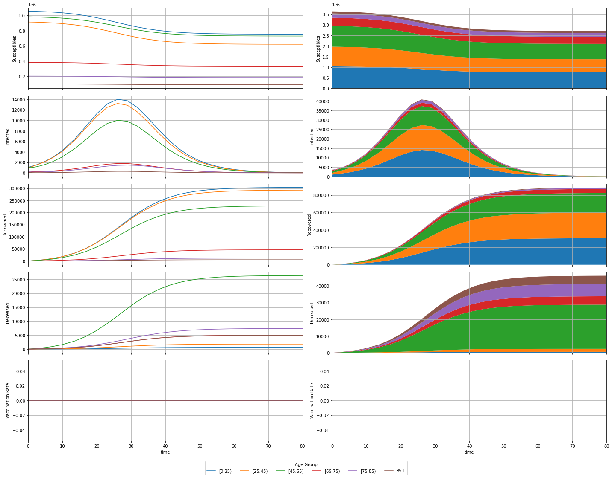
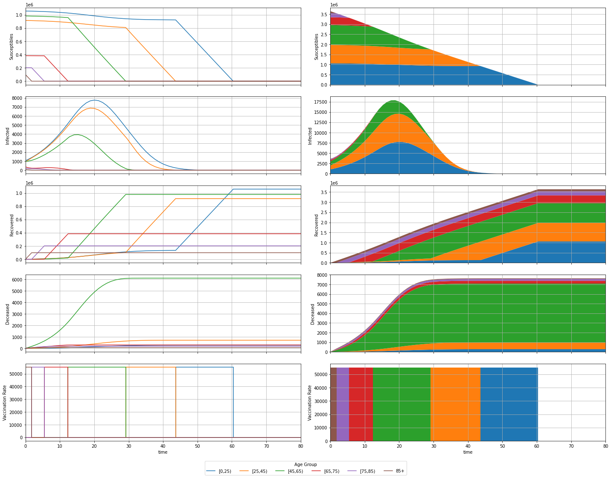
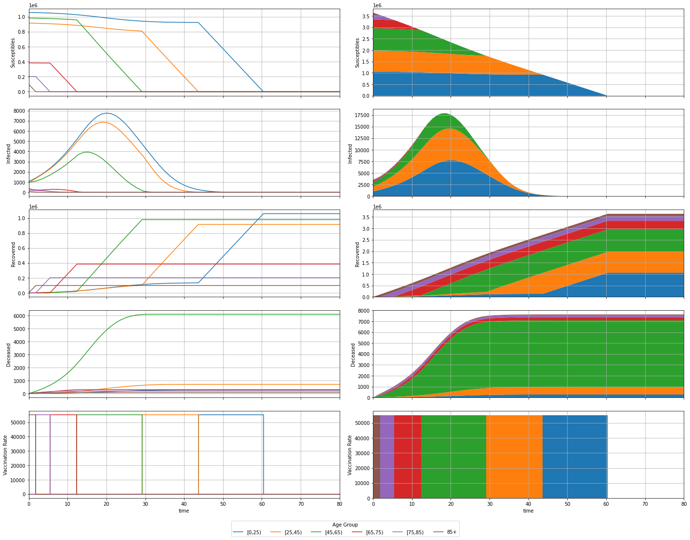
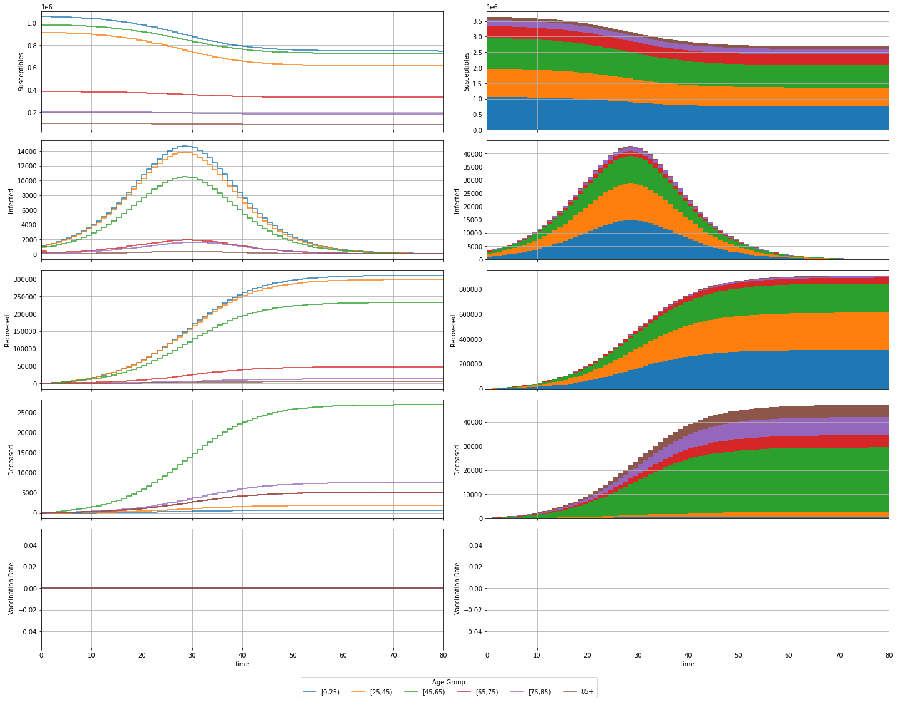

# MPC COVID-19

Modelling and simulation of a COVID-19 compartmental system.

## Modelling

### Variables

| Variable       | Description                                 |
|:--------------:|:-------------------------------------------:|
| $P_k$          | Total individuals in age group $k$          |
| $S_k$          | Susceptible individuals from age group $k$  |
| $I_k$          | Infected individuals from age group $k$     |
| $R_k$          | Recovered individuals from age group $k$    |
| $D_k$          | Deceased individuals from age group $k$     |
| $U_k$          | Vaccination rate for age group $k$          |
| $\lambda_k$    | Infection rate for age group $k$            |
| $C_{j,k}$      | Contact rate between age groups $j$ and $k$ |
| $\gamma_{R,k}$ | Recovery rate for age group $k$             |
| $\gamma_{D,k}$ | Decease rate for age group $k$              |
| $n_a$          | Number of age groups                        |
| $\Delta_t$     | Sampling Period                             |

### Continous Model

$$
\left\{\begin{aligned}
\frac{d \, S_k(t)}{dt} &= -\lambda_k \, S_k(t) \, \sum_{j=1}^{n_a} C_{j,k} \, I_j(t) - U_k(t)
\\
\frac{d \, I_k(t)}{dt} &= \lambda_k \, S_k(t) \, \sum_{j=1}^{n_a} C_{k,j} \, I_j(t) - (\gamma_{R,k} + \gamma_{D,k}) \, I_k(t)
\\
\frac{d \, R_k(t)}{dt} &= \gamma_{R,k} \, I_k(t) + U_k(t)
\\
\frac{d \, D_k(t)}{dt} &= \gamma_{D,k} \, I_k(t)
\end{aligned}\right.
\;,\, k = 1, \dotsc, n_a
$$

### Discrete Model

$$
\left\{\begin{aligned}
S_k(n+1) &= S_k(n) + \Delta_t \, \left( -\lambda_k \, S_k(n) \, \sum_{j=1}^{n_a} C_{j,k} \, I_j(n) - U_k(n) \right)
\\
I_k(n+1) &= I_k(n) + \Delta_t \, \left( \lambda_k \, S_k(n) \, \sum_{j=1}^{n_a} C_{k,j} \, I_j(n) - (\gamma_{R,k} + \gamma_{D,k}) \, I_k(n) \right)
\\
R_k(n+1) &= R_k(n) + \Delta_t \, \left( \gamma_{R,k} \, I_k(n) + U_k(n) \right)
\\
D_k(n+1) &= D_k(n) + \Delta_t \, \left( \gamma_{D,k} \, I_k(n) \right)
\end{aligned}\right.
\;,\, k = 1, \dotsc, n_a
$$
Considering $\Delta_t = 1$
$$
\left\{\begin{aligned}
S_k(n+1) &= S_k(n) - \lambda_k \, S_k(n) \, \sum_{j=1}^{n_a} C_{j,k} \, I_j(n) - U_k(n)
\\
I_k(n+1) &= I_k(n) + \lambda_k \, S_k(n) \, \sum_{j=1}^{n_a} C_{k,j} \, I_j(n) - (\gamma_{R,k} + \gamma_{D,k}) \, I_k(n)
\\
R_k(n+1) &= R_k(n) + \gamma_{R,k} \, I_k(n) + U_k(n)
\\
D_k(n+1) &= D_k(n) + \gamma_{D,k} \, I_k(n)
\end{aligned}\right.
\;,\, k = 1, \dotsc, n_a
$$

## Pre-Simulation

### Definitions


```python
import numpy as np
from helpers import *

P, I_0, S_0, R_0, D_0, l, C, g_R, g_D, u_max = definitions()
y_0 = wrap(S_0, I_0, R_0, D_0)
n_a = len(P)

t_span = [0, 80]

def system_continuous(t, y, u, u_max, l, C, g_R, g_D):
  S, I, R, D = unwrap(y)
  dSdt = - l * S * (C @ I) - u(t, y, u_max)
  dIdt = l * S * (C @ I) - (g_R + g_D) * I
  dRdt = g_R * I + u(t, y, u_max)
  dDdt = g_D * I
  return wrap(dSdt, dIdt, dRdt, dDdt)

def system_discrete(t, y, u, u_max, l, C, g_R, g_D):
  S, I, R, D = unwrap(y)
  S_ = S - l * S * (C @ I) - u(t, y, u_max)
  I_ = I + l * S * (C @ I) - (g_R + g_D) * I
  R_ = R + g_R * I + u(t, y, u_max)
  D_ = D + g_D * I
  return wrap(S_, I_, R_, D_)

print(f'Population Total: {sum(P):.0f}')
```

    Population Total: 3645243


## Continous Simulation

### No Vaccination


```python
from scipy.integrate import solve_ivp

def control(t, y, max):
  return np.zeros(n_a)

sol = solve_ivp(system_continuous, t_span, y_0, args=(control, u_max, l, C, g_R, g_D))
assert(sol.success)

t = sol.t
y = sol.y
S, I, R, D = unwrap(y)
u = recover_control(t, y, control, u_max)

plot(t, y, u)
print(f'Deceased Total: {sum(D[:,-1]):.0f}')
```





    Deceased Total: 46089


### Vaccination of Older Groups with Exclusivity


```python
from scipy.integrate import solve_ivp

def control(t, y, u_max):
  S, I, R, D = unwrap(y)
  u = np.zeros(n_a)
  for i in reversed(range(n_a)):
    if S[i] > 0:
      u[i] = u_max
      break
  return u

sol = solve_ivp(system_continuous, t_span, y_0, args=(control, u_max, l, C, g_R, g_D))
assert(sol.success)

t = sol.t
y = sol.y
S, I, R, D = unwrap(y)
u = recover_control(t, y, control, u_max)

plot(t, y, u)
print(f'Deceased Total: {sum(D[:,-1]):.0f}')
```





    Deceased Total: 7633


### Vaccination of Older Groups with Intersection


```python
from scipy.integrate import solve_ivp

def control(t, y, u_max):
  S, I, R, D = unwrap(y)
  u = np.zeros(n_a)
  remaining = u_max
  for i in reversed(range(n_a)):
    u[i] = min([S[i], remaining])
    remaining = remaining - u[i]
  return u

sol = solve_ivp(system_continuous, t_span, y_0, args=(control, u_max, l, C, g_R, g_D))
assert(sol.success)

t = sol.t
y = sol.y
S, I, R, D = unwrap(y)
u = recover_control(t, y, control, u_max)

plot(t, y, u)
print(f'Deceased Total: {sum(D[:,-1]):.0f}')
```





    Deceased Total: 7616


## Discrete Simulation

### No Vaccination


```python
def control(t, y, u_max):
  return np.zeros(n_a)

t, y = solve_ivp_discrete(system_discrete, t_span, y_0, args=(control, u_max, l, C, g_R, g_D))

S, I, R, D = unwrap(y)
u = recover_control(t, y, control, u_max)

plot(t, y, u, discrete=True)
print(f'Deceased Total: {sum(D[:,-1]):.0f}')
```





    Deceased Total: 47115


### Vaccination of Older Groups


```python
def control(t, y, u_max):
  S, I, R, D = unwrap(y)
  u = np.zeros(n_a)
  remaining = u_max
  for i in reversed(range(n_a)):
    u[i] = min([S[i], remaining])
    remaining = remaining - u[i]
  return u

t, y = solve_ivp_discrete(system_discrete, t_span, y_0, args=(control, u_max, l, C, g_R, g_D))

S, I, R, D = unwrap(y)
u = recover_control(t, y, control, u_max)

plot(t, y, u, discrete=True)
print(f'Deceased Total: {sum(D[:,-1]):.0f}')
```


    Deceased Total: 7593

