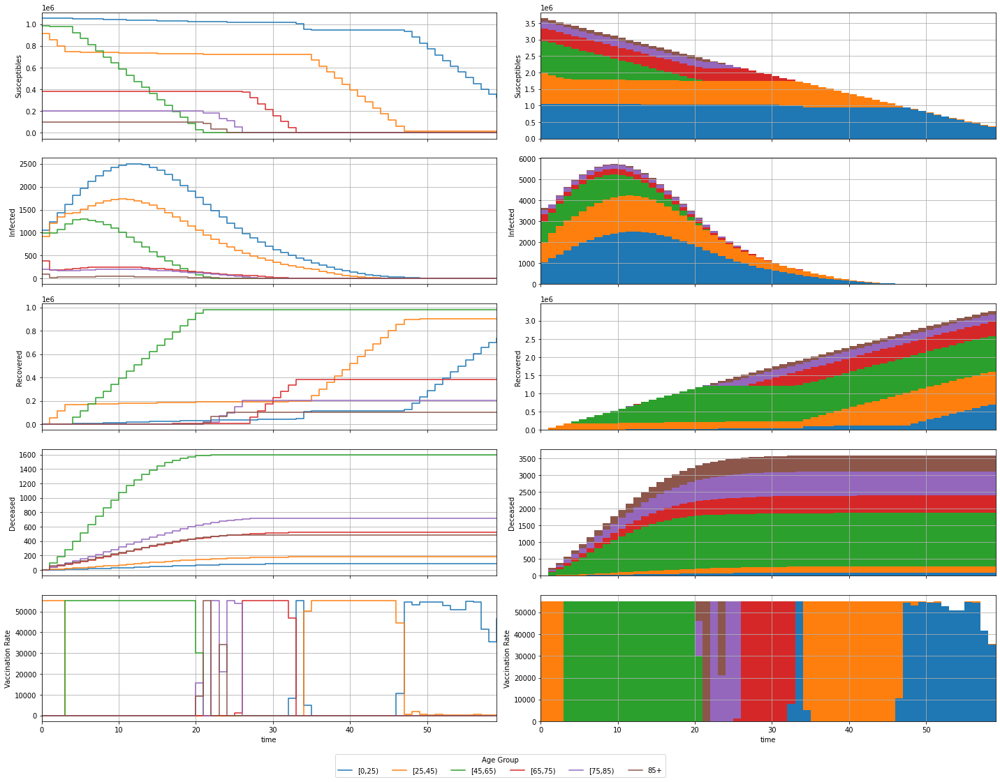

# MPC COVID-19

Modelling and simulation of a COVID-19 compartmental system.

## Modelling

### Variables

| Variable       | Description                                 |
|:--------------:|:-------------------------------------------:|
| $P_k$          | Total individuals in age group $k$          |
| $S_k$          | Susceptible individuals from age group $k$  |
| $I_k$          | Infected individuals from age group $k$     |
| $R_k$          | Recovered individuals from age group $k$    |
| $D_k$          | Deceased individuals from age group $k$     |
| $U_k$          | Vaccination rate for age group $k$          |
| $\lambda_k$    | Infection rate for age group $k$            |
| $C_{j,k}$      | Contact rate between age groups $j$ and $k$ |
| $\gamma_{R,k}$ | Recovery rate for age group $k$             |
| $\gamma_{D,k}$ | Decease rate for age group $k$              |
| $n_a$          | Number of age groups                        |
| $\Delta_t$     | Sampling Period                             |

### Continous Model

$$
\left\{\begin{aligned}
\frac{d S_k(t)}{dt} &= -\lambda_k \cdot S_k(t) \cdot \sum_{j=1}^{n_a} C_{j,k} \cdot I_j(t) - U_k(t)
\\
\frac{d I_k(t)}{dt} &= \lambda_k \cdot S_k(t) \cdot \sum_{j=1}^{n_a} C_{k,j} \cdot I_j(t) - (\gamma_{R,k} + \gamma_{D,k}) \cdot I_k(t)
\\
\frac{d R_k(t)}{dt} &= \gamma_{R,k} \cdot I_k(t) + U_k(t)
\\
\frac{d D_k(t)}{dt} &= \gamma_{D,k} \cdot I_k(t)
\end{aligned}\right.
, k = 1, \dotsc, n_a
$$

### Discrete Model

$$
\left\{\begin{aligned}
S_k(n+1) &= S_k(n) + \Delta_t \cdot \left( -\lambda_k \cdot S_k(n) \cdot \sum_{j=1}^{n_a} C_{j,k} \cdot I_j(n) - U_k(n) \right)
\\
I_k(n+1) &= I_k(n) + \Delta_t \cdot \left( \lambda_k \cdot S_k(n) \cdot \sum_{j=1}^{n_a} C_{k,j} \cdot I_j(n) - (\gamma_{R,k} + \gamma_{D,k}) \cdot I_k(n) \right)
\\
R_k(n+1) &= R_k(n) + \Delta_t \cdot \left( \gamma_{R,k} \cdot I_k(n) + U_k(n) \right)
\\
D_k(n+1) &= D_k(n) + \Delta_t \cdot \left( \gamma_{D,k} \cdot I_k(n) \right)
\end{aligned}\right.
, k = 1, \dotsc, n_a
$$
Considering $\Delta_t = 1$
$$
\left\{\begin{aligned}
S_k(n+1) &= S_k(n) - \lambda_k \cdot S_k(n) \cdot \sum_{j=1}^{n_a} C_{j,k} \cdot I_j(n) - U_k(n)
\\
I_k(n+1) &= I_k(n) + \lambda_k \cdot S_k(n) \, \sum_{j=1}^{n_a} C_{k,j} \cdot I_j(n) - (\gamma_{R,k} + \gamma_{D,k}) \cdot I_k(n)
\\
R_k(n+1) &= R_k(n) + \gamma_{R,k} \cdot I_k(n) + U_k(n)
\\
D_k(n+1) &= D_k(n) + \gamma_{D,k} \cdot I_k(n)
\end{aligned}\right.
, k = 1, \dotsc, n_a
$$

## Pre-Simulation

### Definitions


```python
import numpy as np
from helpers import *

P, S_0, I_0, R_0, D_0, l, C, g_R, g_D, u_max = definitions()
y_0 = wrap(S_0, I_0, R_0, D_0)
n_a = len(P)

t_span = [0, 80]

print(f'Population Total: {sum(P):.0f}')
```

    Population Total: 3645243


## Continous Simulation


```python
def system_continuous(t, y, u, u_max, l, C, g_R, g_D):
  S, I, R, D = unwrap(y)
  dSdt = - l * S * (C @ I) - u(t, y, u_max)
  dIdt = l * S * (C @ I) - (g_R + g_D) * I
  dRdt = g_R * I + u(t, y, u_max)
  dDdt = g_D * I
  return wrap(dSdt, dIdt, dRdt, dDdt)
```

### No Vaccination


```python
from scipy.integrate import solve_ivp

def control(t, y, max):
  return np.zeros(n_a)

sol = solve_ivp(system_continuous, t_span, y_0, args=(control, u_max, l, C, g_R, g_D))
assert(sol.success)

t = sol.t
y = sol.y
S, I, R, D = unwrap(y)
u = recover_control(t, y, control, u_max)

plot(t, y, u)
print(f'Deceased Total: {sum(D[:,-1]):.0f}')
```


    Deceased Total: 46089


### Vaccination of Older Groups with Exclusivity


```python
from scipy.integrate import solve_ivp

def control(t, y, u_max):
  S, I, R, D = unwrap(y)
  u = np.zeros(n_a)
  for i in reversed(range(n_a)):
    if S[i] > 0:
      u[i] = u_max
      break
  return u

sol = solve_ivp(system_continuous, t_span, y_0, args=(control, u_max, l, C, g_R, g_D))
assert(sol.success)

t = sol.t
y = sol.y
S, I, R, D = unwrap(y)
u = recover_control(t, y, control, u_max)

plot(t, y, u)
print(f'Deceased Total: {sum(D[:,-1]):.0f}')
```


    Deceased Total: 7633


### Vaccination of Older Groups with Intersection


```python
from scipy.integrate import solve_ivp

def control(t, y, u_max):
  S, I, R, D = unwrap(y)
  u = np.zeros(n_a)
  remaining = u_max
  for i in reversed(range(n_a)):
    u[i] = min([S[i], remaining])
    remaining = remaining - u[i]
  return u

sol = solve_ivp(system_continuous, t_span, y_0, args=(control, u_max, l, C, g_R, g_D))
assert(sol.success)

t = sol.t
y = sol.y
S, I, R, D = unwrap(y)
u = recover_control(t, y, control, u_max)

plot(t, y, u)
print(f'Deceased Total: {sum(D[:,-1]):.0f}')
```


    Deceased Total: 7616


## Discrete Simulation


```python
def system_discrete(t, y, u, u_max, l, C, g_R, g_D):
  S, I, R, D = unwrap(y)
  S_ = S - l * S * (C @ I) - u(t, y, u_max)
  I_ = I + l * S * (C @ I) - (g_R + g_D) * I
  R_ = R + g_R * I + u(t, y, u_max)
  D_ = D + g_D * I
  return wrap(S_, I_, R_, D_)
```

### No Vaccination


```python
def control(t, y, u_max):
  return np.zeros(n_a)

t, y = solve_ivp_discrete(system_discrete, t_span, y_0, args=(control, u_max, l, C, g_R, g_D))

S, I, R, D = unwrap(y)
u = recover_control(t, y, control, u_max)

plot(t, y, u, discrete=True)
print(f'Deceased Total: {sum(D[:,-1]):.0f}')
```


    Deceased Total: 47115


### Vaccination of Older Groups


```python
def control(t, y, u_max):
  S, I, R, D = unwrap(y)
  u = np.zeros(n_a)
  remaining = u_max
  for i in reversed(range(n_a)):
    u[i] = min([S[i], remaining])
    remaining = remaining - u[i]
  return u

t, y = solve_ivp_discrete(system_discrete, t_span, y_0, args=(control, u_max, l, C, g_R, g_D))

S, I, R, D = unwrap(y)
u = recover_control(t, y, control, u_max)

plot(t, y, u, discrete=True)
print(f'Deceased Total: {sum(D[:,-1]):.0f}')
```


    Deceased Total: 7593


## MPC

### Definitions


```python
import numpy as np
import casadi
from helpers import *

P, S_0, I_0, R_0, D_0, l, C, g_R, g_D, u_max = definitions()
X_0 = wrap(S_0, I_0, R_0, D_0)
n_a = len(P)

S = casadi.MX.sym('S', n_a)
I = casadi.MX.sym('I', n_a)
R = casadi.MX.sym('R', n_a)
D = casadi.MX.sym('D', n_a)
U = casadi.MX.sym('U', n_a)
X = wrap(S, I, R, D)

def system_discrete(X, U):
  S, I, R, D = unwrap(X)
  S_ = S - l * S * (C @ I) - U
  I_ = I + l * S * (C @ I) - (g_R + g_D) * I
  R_ = R + g_R * I + U
  D_ = D + g_D * I
  return wrap(S_, I_, R_, D_)

f = casadi.Function('f',[X, U],[system_discrete(X, U)],['X', 'U'],['X+'])
print(f)
```

    f:(X[24],U[6])->(X+[24]) MXFunction


### Optimization


```python
opti = casadi.Opti()

N = 60 # prediction horizon

s = opti.variable(n_a, N + 1)
i = opti.variable(n_a, N + 1)
r = opti.variable(n_a, N + 1)
d = opti.variable(n_a, N + 1)
u = opti.variable(n_a, N)
x = wrap(s, i, r, d)

s_0 = opti.parameter(n_a,1)
i_0 = opti.parameter(n_a,1)
r_0 = opti.parameter(n_a,1)
d_0 = opti.parameter(n_a,1)
x_0 = wrap(s_0, i_0, r_0, d_0)

opti.minimize(0.1*casadi.sumsqr(i) + 0.9*casadi.sumsqr(d))

opti.subject_to(x[:,0] == x_0) # initial conditions
for k in range(N):
  opti.subject_to(x[:,k + 1] == f(x[:,k], u[:,k])) # dynamics
  opti.subject_to(u[:,k] <= s[:,k]) # dynamic control bound
opti.subject_to(opti.bounded(0,u,u_max)) # individual control bounds
opti.subject_to(opti.bounded(0,casadi.sum1(u),u_max)) # joint control bounds

opti.set_value(x_0, X_0)

opti.solver('ipopt', {}, {
  'print_level': 0,
})

sol = opti.solve()

t_grid = range(N + 1)
x_grid = sol.value(x)
u_grid = np.hstack((sol.value(u), np.nan*np.ones((n_a,1))))
plot(t_grid, x_grid, u_grid, discrete=True)

print(f'Deceased Total: {sum(x_grid[3*n_a:4*n_a,-1]):.0f}')
```

    
    ******************************************************************************
    This program contains Ipopt, a library for large-scale nonlinear optimization.
     Ipopt is released as open source code under the Eclipse Public License (EPL).
             For more information visit https://github.com/coin-or/Ipopt
    ******************************************************************************
    
          solver  :   t_proc      (avg)   t_wall      (avg)    n_eval
           nlp_f  |   3.00ms (  4.95us)   2.12ms (  3.50us)       606
           nlp_g  |  46.00ms ( 75.91us)  59.97ms ( 98.96us)       606
      nlp_grad_f  |  16.00ms ( 27.92us)   4.74ms (  8.27us)       573
      nlp_hess_l  | 356.00ms (624.56us) 428.94ms (752.52us)       570
       nlp_jac_g  | 650.00ms (  1.13ms) 578.44ms (  1.01ms)       574
           total  |   9.20 s (  9.20 s)   9.20 s (  9.20 s)         1


    Deceased Total: 3590


### MPC


```python
O = opti.to_function('M',[x_0],[u[:,0]],['x_0'],['u'])
print(O)

M = 1 # control horizon [?]

x_ = X_0
x_log = np.empty((0, x_0.shape[0]))
u_log = np.empty((0, u.shape[0]))
for i in range(N):
  if i % M == 0:
    u_ = np.array(O(x_))[:,0]

  x_log = np.vstack((x_log, x_))
  u_log = np.vstack((u_log, u_))

  x_ = np.array(f(x_,u_))[:,0]

t_log = range(N)
x_log = x_log.T
u_log = u_log.T
plot(t_log, x_log, u_log, discrete=True)

print(f'Deceased Total: {sum(x_log[3*n_a:4*n_a,-1]):.0f}')
```

    M:(x_0[24])->(u[6]) MXFunction
          solver  :   t_proc      (avg)   t_wall      (avg)    n_eval
           nlp_f  |  17.00ms ( 28.05us)   2.07ms (  3.41us)       606
           nlp_g  |  63.00ms (103.96us)  60.09ms ( 99.15us)       606
      nlp_grad_f  |   2.00ms (  3.49us)   5.02ms (  8.75us)       573
      nlp_hess_l  | 493.00ms (864.91us) 452.48ms (793.82us)       570
       nlp_jac_g  | 641.00ms (  1.12ms) 602.22ms (  1.05ms)       574
           total  |   9.66 s (  9.66 s)   9.67 s (  9.67 s)         1
          solver  :   t_proc      (avg)   t_wall      (avg)    n_eval
           nlp_f  |  17.00ms ( 14.77us)   3.83ms (  3.33us)      1151
           nlp_g  | 132.00ms (114.68us) 110.59ms ( 96.08us)      1151
        nlp_grad  |        0 (       0) 167.00us (167.00us)         1
      nlp_grad_f  |   2.00ms (  1.82us)   9.37ms (  8.52us)      1099
      nlp_hess_l  | 831.00ms (759.60us) 843.99ms (771.47us)      1094
       nlp_jac_g  |   1.11 s (  1.01ms)   1.11 s (  1.01ms)      1102
           total  |   8.92 s (  8.92 s)   8.91 s (  8.91 s)         1
          solver  :   t_proc      (avg)   t_wall      (avg)    n_eval
           nlp_f  |  18.00ms ( 10.63us)   5.67ms (  3.35us)      1693
           nlp_g  | 220.00ms (129.95us) 162.58ms ( 96.03us)      1693
        nlp_grad  |   1.00ms (500.00us) 552.00us (276.00us)         2
      nlp_grad_f  |   2.00ms (  1.23us)  13.60ms (  8.38us)      1623
      nlp_hess_l  |   1.19 s (737.20us)   1.25 s (772.76us)      1621
       nlp_jac_g  |   1.62 s (993.88us)   1.66 s (  1.01ms)      1635
           total  |   9.19 s (  9.19 s)   9.20 s (  9.20 s)         1
          solver  :   t_proc      (avg)   t_wall      (avg)    n_eval
           nlp_f  |  34.00ms ( 15.13us)   7.68ms (  3.42us)      2247
           nlp_g  | 288.00ms (128.17us) 219.24ms ( 97.57us)      2247
        nlp_grad  |   1.00ms (333.33us) 696.00us (232.00us)         3
      nlp_grad_f  |   2.00ms (932.84ns)  17.98ms (  8.39us)      2144
      nlp_hess_l  |   1.59 s (743.59us)   1.66 s (775.22us)      2145
       nlp_jac_g  |   2.07 s (957.51us)   2.20 s (  1.02ms)      2165
           total  |   9.20 s (  9.20 s)   9.18 s (  9.18 s)         1
          solver  :   t_proc      (avg)   t_wall      (avg)    n_eval
           nlp_f  |  36.00ms ( 13.26us)   9.30ms (  3.42us)      2715
           nlp_g  | 330.00ms (121.55us) 264.97ms ( 97.60us)      2715
        nlp_grad  |   1.00ms (250.00us) 845.00us (211.25us)         4
      nlp_grad_f  |   5.00ms (  1.93us)  22.00ms (  8.50us)      2588
      nlp_hess_l  |   1.90 s (735.21us)   2.02 s (779.40us)      2587
       nlp_jac_g  |   2.60 s (996.94us)   2.67 s (  1.02ms)      2611
           total  |   7.87 s (  7.87 s)   7.88 s (  7.88 s)         1
          solver  :   t_proc      (avg)   t_wall      (avg)    n_eval
           nlp_f  |  37.00ms ( 10.85us)  11.73ms (  3.44us)      3409
           nlp_g  | 418.00ms (122.62us) 338.23ms ( 99.22us)      3409
        nlp_grad  |   1.00ms (200.00us) 989.00us (197.80us)         5
      nlp_grad_f  |  14.00ms (  4.47us)  27.41ms (  8.74us)      3135
      nlp_hess_l  |   2.49 s (793.38us)   2.51 s (797.90us)      3141
       nlp_jac_g  |   3.27 s (  1.03ms)   3.33 s (  1.05ms)      3173
           total  |  11.10 s ( 11.10 s)  11.09 s ( 11.09 s)         1
          solver  :   t_proc      (avg)   t_wall      (avg)    n_eval
           nlp_f  |  53.00ms ( 13.43us)  13.62ms (  3.45us)      3945
           nlp_g  | 500.00ms (126.74us) 390.49ms ( 98.98us)      3945
        nlp_grad  |   1.00ms (166.67us)   1.25ms (208.17us)         6
      nlp_grad_f  |  15.00ms (  4.11us)  31.88ms (  8.74us)      3650
      nlp_hess_l  |   2.89 s (788.86us)   2.91 s (794.73us)      3661
       nlp_jac_g  |   3.80 s (  1.03ms)   3.86 s (  1.04ms)      3699
           total  |   9.79 s (  9.79 s)   9.79 s (  9.79 s)         1
          solver  :   t_proc      (avg)   t_wall      (avg)    n_eval
           nlp_f  |  54.00ms ( 12.18us)  15.45ms (  3.49us)      4432
           nlp_g  | 536.00ms (120.94us) 441.58ms ( 99.63us)      4432
        nlp_grad  |   1.00ms (142.86us)   1.40ms (199.43us)         7
      nlp_grad_f  |  17.00ms (  4.13us)  35.96ms (  8.74us)      4112
      nlp_hess_l  |   3.23 s (784.76us)   3.28 s (795.84us)      4121
       nlp_jac_g  |   4.10 s (985.58us)   4.35 s (  1.04ms)      4161
           total  |   8.79 s (  8.79 s)   8.78 s (  8.78 s)         1
          solver  :   t_proc      (avg)   t_wall      (avg)    n_eval
           nlp_f  |  54.00ms ( 11.08us)  17.03ms (  3.49us)      4874
           nlp_g  | 543.00ms (111.41us) 484.76ms ( 99.46us)      4874
        nlp_grad  |   1.00ms (125.00us)   1.66ms (207.37us)         8
      nlp_grad_f  |  17.00ms (  3.75us)  39.53ms (  8.71us)      4537
      nlp_hess_l  |   3.49 s (767.83us)   3.61 s (794.50us)      4544
       nlp_jac_g  |   4.46 s (972.09us)   4.78 s (  1.04ms)      4586
           total  |   8.20 s (  8.20 s)   8.21 s (  8.21 s)         1
          solver  :   t_proc      (avg)   t_wall      (avg)    n_eval
           nlp_f  |  54.00ms ( 10.26us)  18.45ms (  3.50us)      5265
           nlp_g  | 553.00ms (105.03us) 522.84ms ( 99.31us)      5265
        nlp_grad  |   1.00ms (111.11us)   1.80ms (199.67us)         9
      nlp_grad_f  |  32.00ms (  6.49us)  42.73ms (  8.67us)      4929
      nlp_hess_l  |   3.83 s (776.85us)   3.91 s (792.04us)      4934
       nlp_jac_g  |   4.76 s (955.40us)   5.17 s (  1.04ms)      4978
           total  |   7.19 s (  7.19 s)   7.18 s (  7.18 s)         1
          solver  :   t_proc      (avg)   t_wall      (avg)    n_eval
           nlp_f  |  54.00ms (  9.56us)  19.77ms (  3.50us)      5648
           nlp_g  | 570.00ms (100.92us) 560.02ms ( 99.15us)      5648
        nlp_grad  |   1.00ms (100.00us)   2.01ms (201.10us)        10
      nlp_grad_f  |  35.00ms (  6.60us)  45.91ms (  8.65us)      5307
      nlp_hess_l  |   4.10 s (771.37us)   4.19 s (789.89us)      5310
       nlp_jac_g  |   5.33 s (995.15us)   5.54 s (  1.03ms)      5356
           total  |   7.02 s (  7.02 s)   7.02 s (  7.02 s)         1
          solver  :   t_proc      (avg)   t_wall      (avg)    n_eval
           nlp_f  |  54.00ms (  8.96us)  21.08ms (  3.50us)      6027
           nlp_g  | 607.00ms (100.71us) 596.89ms ( 99.04us)      6027
        nlp_grad  |   1.00ms ( 90.91us)   2.22ms (201.91us)        11
      nlp_grad_f  |  35.00ms (  6.16us)  49.08ms (  8.64us)      5682
      nlp_hess_l  |   4.42 s (778.11us)   4.49 s (789.45us)      5683
       nlp_jac_g  |   5.74 s (  1.00ms)   5.92 s (  1.03ms)      5731
           total  |   7.11 s (  7.11 s)   7.11 s (  7.11 s)         1
          solver  :   t_proc      (avg)   t_wall      (avg)    n_eval
           nlp_f  |  54.00ms (  8.45us)  22.31ms (  3.49us)      6390
           nlp_g  | 687.00ms (107.51us) 630.85ms ( 98.72us)      6390
        nlp_grad  |   1.00ms ( 83.33us)   2.39ms (199.42us)        12
      nlp_grad_f  |  35.00ms (  5.80us)  52.04ms (  8.62us)      6034
      nlp_hess_l  |   4.72 s (782.86us)   4.76 s (788.22us)      6033
       nlp_jac_g  |   6.08 s (999.51us)   6.27 s (  1.03ms)      6083
           total  |   6.48 s (  6.48 s)   6.47 s (  6.47 s)         1
          solver  :   t_proc      (avg)   t_wall      (avg)    n_eval
           nlp_f  |  55.00ms (  8.16us)  23.58ms (  3.50us)      6739
           nlp_g  | 725.00ms (107.58us) 665.85ms ( 98.81us)      6739
        nlp_grad  |   1.00ms ( 76.92us)   2.57ms (198.08us)        13
      nlp_grad_f  |  35.00ms (  5.48us)  54.95ms (  8.61us)      6384
      nlp_hess_l  |   5.03 s (788.43us)   5.02 s (787.07us)      6381
       nlp_jac_g  |   6.41 s (997.05us)   6.62 s (  1.03ms)      6433
           total  |   6.66 s (  6.66 s)   6.67 s (  6.67 s)         1
          solver  :   t_proc      (avg)   t_wall      (avg)    n_eval
           nlp_f  |  55.00ms (  7.76us)  24.71ms (  3.49us)      7086
           nlp_g  | 761.00ms (107.39us) 698.32ms ( 98.55us)      7086
        nlp_grad  |   1.00ms ( 71.43us)   2.75ms (196.57us)        14
      nlp_grad_f  |  36.00ms (  5.36us)  57.63ms (  8.59us)      6712
      nlp_hess_l  |   5.34 s (796.72us)   5.27 s (785.65us)      6705
       nlp_jac_g  |   6.74 s (996.30us)   6.94 s (  1.03ms)      6763
           total  |   6.24 s (  6.24 s)   6.23 s (  6.23 s)         1
          solver  :   t_proc      (avg)   t_wall      (avg)    n_eval
           nlp_f  |  58.00ms (  7.84us)  25.79ms (  3.49us)      7395
           nlp_g  | 789.00ms (106.69us) 727.80ms ( 98.42us)      7395
        nlp_grad  |   1.00ms ( 66.67us)   3.33ms (221.73us)        15
      nlp_grad_f  |  36.00ms (  5.14us)  60.09ms (  8.58us)      7007
      nlp_hess_l  |   5.53 s (790.23us)   5.50 s (785.73us)      6998
       nlp_jac_g  |   6.98 s (989.66us)   7.25 s (  1.03ms)      7058
           total  |   5.61 s (  5.61 s)   5.60 s (  5.60 s)         1
          solver  :   t_proc      (avg)   t_wall      (avg)    n_eval
           nlp_f  |  58.00ms (  7.52us)  26.89ms (  3.49us)      7714
           nlp_g  | 807.00ms (104.61us) 758.28ms ( 98.30us)      7714
        nlp_grad  |   1.00ms ( 62.50us)   3.49ms (218.44us)        16
      nlp_grad_f  |  36.00ms (  4.91us)  62.74ms (  8.56us)      7325
      nlp_hess_l  |   5.80 s (792.86us)   5.74 s (784.62us)      7314
       nlp_jac_g  |   7.24 s (982.10us)   7.56 s (  1.03ms)      7376
           total  |   6.14 s (  6.14 s)   6.13 s (  6.13 s)         1
          solver  :   t_proc      (avg)   t_wall      (avg)    n_eval
           nlp_f  |  59.00ms (  7.38us)  27.91ms (  3.49us)      7995
           nlp_g  | 822.00ms (102.81us) 785.73ms ( 98.28us)      7995
        nlp_grad  |   2.00ms (117.65us)   3.67ms (215.88us)        17
      nlp_grad_f  |  37.00ms (  4.86us)  65.05ms (  8.55us)      7606
      nlp_hess_l  |   5.97 s (785.99us)   5.94 s (782.54us)      7593
       nlp_jac_g  |   7.49 s (978.71us)   7.84 s (  1.02ms)      7657
           total  |   5.07 s (  5.07 s)   5.08 s (  5.08 s)         1
          solver  :   t_proc      (avg)   t_wall      (avg)    n_eval
           nlp_f  |  59.00ms (  7.12us)  29.04ms (  3.50us)      8291
           nlp_g  | 839.00ms (101.19us) 817.06ms ( 98.55us)      8291
        nlp_grad  |   2.00ms (111.11us)   3.81ms (211.61us)        18
      nlp_grad_f  |  37.00ms (  4.68us)  67.69ms (  8.56us)      7903
      nlp_hess_l  |   6.13 s (776.62us)   6.17 s (782.68us)      7888
       nlp_jac_g  |   7.83 s (984.79us)   8.15 s (  1.02ms)      7954
           total  |   5.75 s (  5.75 s)   5.74 s (  5.74 s)         1
          solver  :   t_proc      (avg)   t_wall      (avg)    n_eval
           nlp_f  |  59.00ms (  6.90us)  29.95ms (  3.50us)      8555
           nlp_g  | 857.00ms (100.18us) 841.77ms ( 98.39us)      8555
        nlp_grad  |   2.00ms (105.26us)   4.02ms (211.37us)        19
      nlp_grad_f  |  37.00ms (  4.53us)  69.81ms (  8.55us)      8168
      nlp_hess_l  |   6.30 s (772.54us)   6.37 s (781.68us)      8151
       nlp_jac_g  |   8.08 s (982.97us)   8.41 s (  1.02ms)      8219
           total  |   5.01 s (  5.01 s)   5.01 s (  5.01 s)         1
          solver  :   t_proc      (avg)   t_wall      (avg)    n_eval
           nlp_f  |  59.00ms (  6.66us)  31.03ms (  3.50us)      8862
           nlp_g  | 876.00ms ( 98.85us) 871.56ms ( 98.35us)      8862
        nlp_grad  |   2.00ms (100.00us)   4.20ms (210.20us)        20
      nlp_grad_f  |  37.00ms (  4.38us)  72.31ms (  8.55us)      8456
      nlp_hess_l  |   6.52 s (773.38us)   6.59 s (781.64us)      8437
       nlp_jac_g  |   8.44 s (992.36us)   8.71 s (  1.02ms)      8507
           total  |   5.99 s (  5.99 s)   6.00 s (  6.00 s)         1
          solver  :   t_proc      (avg)   t_wall      (avg)    n_eval
           nlp_f  |  74.00ms (  7.92us)  32.67ms (  3.50us)      9342
           nlp_g  | 936.00ms (100.19us) 915.82ms ( 98.03us)      9342
        nlp_grad  |   2.00ms ( 95.24us)   4.39ms (209.05us)        21
      nlp_grad_f  |  38.00ms (  4.29us)  75.70ms (  8.54us)      8866
      nlp_hess_l  |   6.80 s (767.71us)   6.92 s (780.93us)      8864
       nlp_jac_g  |   8.76 s (980.64us)   9.14 s (  1.02ms)      8938
           total  |  10.65 s ( 10.65 s)  10.66 s ( 10.66 s)         1
          solver  :   t_proc      (avg)   t_wall      (avg)    n_eval
           nlp_f  |  74.00ms (  7.58us)  33.92ms (  3.48us)      9759
           nlp_g  | 957.00ms ( 98.06us) 952.17ms ( 97.57us)      9759
        nlp_grad  |   2.00ms ( 90.91us)   4.57ms (207.55us)        22
      nlp_grad_f  |  39.00ms (  4.24us)  78.45ms (  8.53us)      9199
      nlp_hess_l  |   6.95 s (755.93us)   7.17 s (779.50us)      9194
       nlp_jac_g  |   9.06 s (976.92us)   9.47 s (  1.02ms)      9274
           total  |   6.96 s (  6.96 s)   6.96 s (  6.96 s)         1
          solver  :   t_proc      (avg)   t_wall      (avg)    n_eval
           nlp_f  |  74.00ms (  7.36us)  34.91ms (  3.47us)     10060
           nlp_g  | 988.00ms ( 98.21us) 979.45ms ( 97.36us)     10060
        nlp_grad  |   2.00ms ( 86.96us)   4.70ms (204.48us)        23
      nlp_grad_f  |  39.00ms (  4.11us)  80.68ms (  8.51us)      9484
      nlp_hess_l  |   7.16 s (755.72us)   7.38 s (778.41us)      9477
       nlp_jac_g  |   9.37 s (980.33us)   9.74 s (  1.02ms)      9559
           total  |   5.94 s (  5.94 s)   5.94 s (  5.94 s)         1
          solver  :   t_proc      (avg)   t_wall      (avg)    n_eval
           nlp_f  |  74.00ms (  7.14us)  35.93ms (  3.47us)     10357
           nlp_g  |   1.01 s ( 97.04us)   1.01 s ( 97.24us)     10357
        nlp_grad  |   2.00ms ( 83.33us)   4.85ms (202.12us)        24
      nlp_grad_f  |  39.00ms (  3.99us)  82.99ms (  8.49us)      9770
      nlp_hess_l  |   7.30 s (747.82us)   7.59 s (778.15us)      9759
       nlp_jac_g  |   9.64 s (979.08us)  10.03 s (  1.02ms)      9847
           total  |   6.26 s (  6.26 s)   6.26 s (  6.26 s)         1
          solver  :   t_proc      (avg)   t_wall      (avg)    n_eval
           nlp_f  |  74.00ms (  6.92us)  37.10ms (  3.47us)     10692
           nlp_g  |   1.04 s ( 97.08us)   1.04 s ( 97.17us)     10692
        nlp_grad  |   2.00ms ( 80.00us)   5.08ms (203.04us)        25
      nlp_grad_f  |  39.00ms (  3.87us)  85.70ms (  8.50us)     10088
      nlp_hess_l  |   7.49 s (743.72us)   7.84 s (778.18us)     10075
       nlp_jac_g  |   9.97 s (980.82us)  10.34 s (  1.02ms)     10165
           total  |   8.44 s (  8.44 s)   8.44 s (  8.44 s)         1
          solver  :   t_proc      (avg)   t_wall      (avg)    n_eval
           nlp_f  |  74.00ms (  6.76us)  37.97ms (  3.47us)     10943
           nlp_g  |   1.07 s ( 97.41us)   1.06 s ( 97.08us)     10943
        nlp_grad  |   2.00ms ( 76.92us)   5.25ms (201.92us)        26
      nlp_grad_f  |  39.00ms (  3.78us)  87.65ms (  8.49us)     10325
      nlp_hess_l  |   7.62 s (738.80us)   8.01 s (777.22us)     10310
       nlp_jac_g  |  10.29 s (989.14us)  10.57 s (  1.02ms)     10402
           total  |   5.38 s (  5.38 s)   5.38 s (  5.38 s)         1
          solver  :   t_proc      (avg)   t_wall      (avg)    n_eval
           nlp_f  |  74.00ms (  6.60us)  38.90ms (  3.47us)     11205
           nlp_g  |   1.10 s ( 97.99us)   1.09 s ( 97.14us)     11205
        nlp_grad  |   2.00ms ( 74.07us)   5.40ms (200.19us)        27
      nlp_grad_f  |  39.00ms (  3.69us)  89.69ms (  8.49us)     10567
      nlp_hess_l  |   7.82 s (740.85us)   8.20 s (776.94us)     10550
       nlp_jac_g  |  10.54 s (990.70us)  10.82 s (  1.02ms)     10644
           total  |   5.84 s (  5.84 s)   5.85 s (  5.85 s)         1
          solver  :   t_proc      (avg)   t_wall      (avg)    n_eval
           nlp_f  |  74.00ms (  6.45us)  39.85ms (  3.47us)     11475
           nlp_g  |   1.16 s (100.92us)   1.11 s ( 97.09us)     11475
        nlp_grad  |   2.00ms ( 71.43us)   5.54ms (198.00us)        28
      nlp_grad_f  |  39.00ms (  3.60us)  91.92ms (  8.48us)     10836
      nlp_hess_l  |   8.08 s (746.97us)   8.40 s (776.48us)     10817
       nlp_jac_g  |  10.79 s (988.55us)  11.08 s (  1.02ms)     10913
           total  |   7.51 s (  7.51 s)   7.50 s (  7.50 s)         1
          solver  :   t_proc      (avg)   t_wall      (avg)    n_eval
           nlp_f  |  75.00ms (  6.01us)  42.93ms (  3.44us)     12476
           nlp_g  |   1.27 s (101.88us)   1.20 s ( 96.41us)     12476
        nlp_grad  |   2.00ms ( 68.97us)   5.76ms (198.62us)        29
      nlp_grad_f  |  39.00ms (  3.36us)  98.12ms (  8.45us)     11607
      nlp_hess_l  |   8.72 s (752.37us)   8.96 s (773.47us)     11586
       nlp_jac_g  |  11.51 s (985.11us)  11.82 s (  1.01ms)     11684
           total  |  32.04 s ( 32.04 s)  32.04 s ( 32.04 s)         1
          solver  :   t_proc      (avg)   t_wall      (avg)    n_eval
           nlp_f  |  75.00ms (  5.88us)  43.86ms (  3.44us)     12755
           nlp_g  |   1.29 s (101.45us)   1.23 s ( 96.39us)     12755
        nlp_grad  |   2.00ms ( 66.67us)   5.94ms (198.17us)        30
      nlp_grad_f  |  55.00ms (  4.63us) 100.33ms (  8.45us)     11875
      nlp_hess_l  |   8.88 s (749.66us)   9.17 s (773.63us)     11852
       nlp_jac_g  |  11.77 s (984.69us)  12.09 s (  1.01ms)     11952
           total  |   7.92 s (  7.92 s)   7.93 s (  7.93 s)         1
          solver  :   t_proc      (avg)   t_wall      (avg)    n_eval
           nlp_f  |  75.00ms (  5.77us)  44.68ms (  3.44us)     12996
           nlp_g  |   1.30 s ( 99.80us)   1.25 s ( 96.32us)     12996
        nlp_grad  |   2.00ms ( 64.52us)   6.12ms (197.35us)        31
      nlp_grad_f  |  55.00ms (  4.56us) 101.87ms (  8.45us)     12062
      nlp_hess_l  |   9.07 s (750.52us)   9.35 s (773.31us)     12085
       nlp_jac_g  |  11.93 s (978.59us)  12.32 s (  1.01ms)     12189
           total  |   5.25 s (  5.25 s)   5.27 s (  5.27 s)         1
          solver  :   t_proc      (avg)   t_wall      (avg)    n_eval
           nlp_f  |  75.00ms (  5.62us)  45.81ms (  3.43us)     13341
           nlp_g  |   1.34 s (100.74us)   1.28 s ( 96.16us)     13341
        nlp_grad  |   2.00ms ( 62.50us)   6.27ms (195.81us)        32
      nlp_grad_f  |  55.00ms (  4.45us) 104.39ms (  8.44us)     12369
      nlp_hess_l  |   9.36 s (755.21us)   9.58 s (773.07us)     12390
       nlp_jac_g  |  12.25 s (980.63us)  12.62 s (  1.01ms)     12496
           total  |  10.22 s ( 10.22 s)  10.21 s ( 10.21 s)         1
          solver  :   t_proc      (avg)   t_wall      (avg)    n_eval
           nlp_f  |  75.00ms (  5.48us)  47.06ms (  3.44us)     13694
           nlp_g  |   1.41 s (103.11us)   1.32 s ( 96.16us)     13694
        nlp_grad  |  18.00ms (545.45us)   6.60ms (200.15us)        33
      nlp_grad_f  |  55.00ms (  4.33us) 107.15ms (  8.43us)     12706
      nlp_hess_l  |   9.71 s (763.20us)   9.84 s (773.23us)     12724
       nlp_jac_g  |  12.63 s (984.49us)  12.95 s (  1.01ms)     12834
           total  |  10.14 s ( 10.14 s)  10.14 s ( 10.14 s)         1
          solver  :   t_proc      (avg)   t_wall      (avg)    n_eval
           nlp_f  |  75.00ms (  5.39us)  47.93ms (  3.44us)     13924
           nlp_g  |   1.43 s (103.06us)   1.34 s ( 96.23us)     13924
        nlp_grad  |  18.00ms (529.41us)   6.80ms (200.03us)        34
      nlp_grad_f  |  55.00ms (  4.25us) 109.15ms (  8.44us)     12936
      nlp_hess_l  |   9.91 s (765.21us)  10.02 s (773.33us)     12952
       nlp_jac_g  |  12.83 s (981.78us)  13.19 s (  1.01ms)     13064
           total  |   7.00 s (  7.00 s)   7.00 s (  7.00 s)         1
          solver  :   t_proc      (avg)   t_wall      (avg)    n_eval
           nlp_f  |  75.00ms (  5.30us)  48.78ms (  3.45us)     14159
           nlp_g  |   1.49 s (104.95us)   1.36 s ( 96.19us)     14159
        nlp_grad  |  18.00ms (514.29us)   6.97ms (199.03us)        35
      nlp_grad_f  |  55.00ms (  4.18us) 111.13ms (  8.44us)     13166
      nlp_hess_l  |  10.04 s (761.59us)  10.19 s (773.35us)     13179
       nlp_jac_g  |  13.11 s (986.08us)  13.42 s (  1.01ms)     13295
           total  |   6.70 s (  6.70 s)   6.70 s (  6.70 s)         1
          solver  :   t_proc      (avg)   t_wall      (avg)    n_eval
           nlp_f  |  75.00ms (  5.22us)  49.53ms (  3.45us)     14375
           nlp_g  |   1.58 s (109.98us)   1.38 s ( 96.21us)     14375
        nlp_grad  |  18.00ms (500.00us)   7.10ms (197.28us)        36
      nlp_grad_f  |  55.00ms (  4.11us) 112.91ms (  8.44us)     13382
      nlp_hess_l  |  10.22 s (763.38us)  10.36 s (773.56us)     13393
       nlp_jac_g  |  13.33 s (986.68us)  13.63 s (  1.01ms)     13511
           total  |   7.19 s (  7.19 s)   7.19 s (  7.19 s)         1
          solver  :   t_proc      (avg)   t_wall      (avg)    n_eval
           nlp_f  |  75.00ms (  5.12us)  50.42ms (  3.44us)     14652
           nlp_g  |   1.60 s (109.13us)   1.41 s ( 96.06us)     14652
        nlp_grad  |  18.00ms (486.49us)   7.28ms (196.68us)        37
      nlp_grad_f  |  56.00ms (  4.11us) 114.88ms (  8.43us)     13631
      nlp_hess_l  |  10.42 s (764.00us)  10.55 s (773.11us)     13640
       nlp_jac_g  |  13.62 s (989.61us)  13.88 s (  1.01ms)     13760
           total  |   8.89 s (  8.89 s)   8.88 s (  8.88 s)         1
          solver  :   t_proc      (avg)   t_wall      (avg)    n_eval
           nlp_f  |  75.00ms (  5.06us)  50.98ms (  3.44us)     14809
           nlp_g  |   1.62 s (109.19us)   1.42 s ( 96.05us)     14809
        nlp_grad  |  18.00ms (473.68us)   7.51ms (197.63us)        38
      nlp_grad_f  |  56.00ms (  4.06us) 116.10ms (  8.42us)     13783
      nlp_hess_l  |  10.50 s (761.57us)  10.66 s (772.77us)     13790
       nlp_jac_g  |  13.70 s (984.55us)  14.03 s (  1.01ms)     13912
           total  |   3.92 s (  3.92 s)   3.93 s (  3.93 s)         1
          solver  :   t_proc      (avg)   t_wall      (avg)    n_eval
           nlp_f  |  75.00ms (  5.01us)  51.53ms (  3.44us)     14967
           nlp_g  |   1.63 s (109.11us)   1.44 s ( 96.06us)     14967
        nlp_grad  |  18.00ms (461.54us)   7.71ms (197.82us)        39
      nlp_grad_f  |  56.00ms (  4.02us) 117.36ms (  8.42us)     13940
      nlp_hess_l  |  10.59 s (759.48us)  10.77 s (772.35us)     13945
       nlp_jac_g  |  13.79 s (979.88us)  14.18 s (  1.01ms)     14069
           total  |   4.23 s (  4.23 s)   4.23 s (  4.23 s)         1
          solver  :   t_proc      (avg)   t_wall      (avg)    n_eval
           nlp_f  |  75.00ms (  4.96us)  52.11ms (  3.44us)     15134
           nlp_g  |   1.64 s (108.17us)   1.45 s ( 96.03us)     15134
        nlp_grad  |  18.00ms (450.00us)   7.91ms (197.87us)        40
      nlp_grad_f  |  56.00ms (  3.97us) 118.65ms (  8.41us)     14106
      nlp_hess_l  |  10.67 s (756.25us)  10.89 s (771.80us)     14109
       nlp_jac_g  |  13.89 s (975.76us)  14.34 s (  1.01ms)     14235
           total  |   4.96 s (  4.96 s)   4.95 s (  4.95 s)         1
          solver  :   t_proc      (avg)   t_wall      (avg)    n_eval
           nlp_f  |  76.00ms (  4.90us)  53.36ms (  3.44us)     15501
           nlp_g  |   1.66 s (107.03us)   1.49 s ( 95.97us)     15501
        nlp_grad  |  18.00ms (439.02us)   8.21ms (200.27us)        41
      nlp_grad_f  |  56.00ms (  3.87us) 121.44ms (  8.40us)     14453
      nlp_hess_l  |  10.99 s (760.20us)  11.15 s (771.31us)     14454
       nlp_jac_g  |  14.28 s (979.08us)  14.68 s (  1.01ms)     14582
           total  |  14.76 s ( 14.76 s)  14.75 s ( 14.75 s)         1
          solver  :   t_proc      (avg)   t_wall      (avg)    n_eval
           nlp_f  |  76.00ms (  4.85us)  53.93ms (  3.44us)     15683
           nlp_g  |   1.66 s (106.10us)   1.50 s ( 95.92us)     15683
        nlp_grad  |  18.00ms (428.57us)   8.50ms (202.43us)        42
      nlp_grad_f  |  56.00ms (  3.83us) 122.71ms (  8.40us)     14613
      nlp_hess_l  |  11.11 s (760.13us)  11.27 s (771.36us)     14612
       nlp_jac_g  |  14.45 s (980.40us)  14.84 s (  1.01ms)     14742
           total  |   4.69 s (  4.69 s)   4.69 s (  4.69 s)         1
          solver  :   t_proc      (avg)   t_wall      (avg)    n_eval
           nlp_f  |  76.00ms (  4.80us)  54.50ms (  3.44us)     15842
           nlp_g  |   1.68 s (105.92us)   1.52 s ( 95.94us)     15842
        nlp_grad  |  18.00ms (418.60us)   8.68ms (201.81us)        43
      nlp_grad_f  |  56.00ms (  3.79us) 124.03ms (  8.40us)     14773
      nlp_hess_l  |  11.22 s (759.99us)  11.39 s (771.29us)     14770
       nlp_jac_g  |  14.61 s (980.14us)  15.00 s (  1.01ms)     14902
           total  |   4.88 s (  4.88 s)   4.87 s (  4.87 s)         1
          solver  :   t_proc      (avg)   t_wall      (avg)    n_eval
           nlp_f  |  76.00ms (  4.75us)  55.05ms (  3.44us)     15995
           nlp_g  |   1.69 s (105.97us)   1.54 s ( 95.97us)     15995
        nlp_grad  |  18.00ms (409.09us)   8.83ms (200.61us)        44
      nlp_grad_f  |  57.00ms (  3.82us) 125.32ms (  8.40us)     14926
      nlp_hess_l  |  11.37 s (762.28us)  11.51 s (771.39us)     14921
       nlp_jac_g  |  14.78 s (981.53us)  15.15 s (  1.01ms)     15055
           total  |   4.73 s (  4.73 s)   4.74 s (  4.74 s)         1
          solver  :   t_proc      (avg)   t_wall      (avg)    n_eval
           nlp_f  |  76.00ms (  4.67us)  55.97ms (  3.44us)     16266
           nlp_g  |   1.70 s (104.57us)   1.56 s ( 95.94us)     16266
        nlp_grad  |  18.00ms (400.00us)   9.00ms (200.04us)        45
      nlp_grad_f  |  57.00ms (  3.76us) 127.24ms (  8.40us)     15150
      nlp_hess_l  |  11.56 s (763.39us)  11.68 s (771.48us)     15143
       nlp_jac_g  |  15.05 s (984.88us)  15.38 s (  1.01ms)     15281
           total  |   7.19 s (  7.19 s)   7.19 s (  7.19 s)         1
          solver  :   t_proc      (avg)   t_wall      (avg)    n_eval
           nlp_f  |  76.00ms (  4.63us)  56.47ms (  3.44us)     16422
           nlp_g  |   1.72 s (104.62us)   1.58 s ( 95.91us)     16422
        nlp_grad  |  18.00ms (391.30us)   9.14ms (198.67us)        46
      nlp_grad_f  |  57.00ms (  3.73us) 128.42ms (  8.40us)     15293
      nlp_hess_l  |  11.69 s (764.98us)  11.79 s (771.37us)     15284
       nlp_jac_g  |  15.22 s (986.84us)  15.52 s (  1.01ms)     15424
           total  |   4.37 s (  4.37 s)   4.38 s (  4.38 s)         1
          solver  :   t_proc      (avg)   t_wall      (avg)    n_eval
           nlp_f  |  76.00ms (  4.60us)  56.83ms (  3.44us)     16525
           nlp_g  |   1.72 s (104.15us)   1.58 s ( 95.89us)     16525
        nlp_grad  |  18.00ms (382.98us)   9.35ms (199.00us)        47
      nlp_grad_f  |  57.00ms (  3.70us) 129.22ms (  8.39us)     15394
      nlp_hess_l  |  11.83 s (769.16us)  11.87 s (771.39us)     15383
       nlp_jac_g  |  15.34 s (987.83us)  15.62 s (  1.01ms)     15525
           total  |   2.54 s (  2.54 s)   2.53 s (  2.53 s)         1
          solver  :   t_proc      (avg)   t_wall      (avg)    n_eval
           nlp_f  |  76.00ms (  4.52us)  57.80ms (  3.44us)     16811
           nlp_g  |   1.72 s (102.49us)   1.61 s ( 95.72us)     16811
        nlp_grad  |  18.00ms (375.00us)   9.53ms (198.46us)        48
      nlp_grad_f  |  58.00ms (  3.72us) 130.74ms (  8.39us)     15584
      nlp_hess_l  |  12.05 s (773.25us)  12.02 s (771.07us)     15590
       nlp_jac_g  |  15.45 s (981.45us)  15.82 s (  1.01ms)     15739
           total  |   6.76 s (  6.76 s)   6.76 s (  6.76 s)         1
          solver  :   t_proc      (avg)   t_wall      (avg)    n_eval
           nlp_f  |  76.00ms (  4.49us)  58.13ms (  3.44us)     16911
           nlp_g  |   1.75 s (103.60us)   1.62 s ( 95.70us)     16911
        nlp_grad  |  18.00ms (367.35us)   9.67ms (197.39us)        49
      nlp_grad_f  |  58.00ms (  3.70us) 131.55ms (  8.39us)     15684
      nlp_hess_l  |  12.09 s (770.78us)  12.10 s (771.02us)     15688
       nlp_jac_g  |  15.57 s (983.14us)  15.92 s (  1.01ms)     15839
           total  |   2.75 s (  2.75 s)   2.75 s (  2.75 s)         1
          solver  :   t_proc      (avg)   t_wall      (avg)    n_eval
           nlp_f  |  76.00ms (  4.46us)  58.58ms (  3.44us)     17036
           nlp_g  |   1.75 s (102.96us)   1.63 s ( 95.73us)     17036
        nlp_grad  |  18.00ms (360.00us)   9.85ms (197.02us)        50
      nlp_grad_f  |  58.00ms (  3.67us) 132.61ms (  8.39us)     15807
      nlp_hess_l  |  12.17 s (769.69us)  12.18 s (770.75us)     15809
       nlp_jac_g  |  15.65 s (980.20us)  16.04 s (  1.00ms)     15962
           total  |   4.07 s (  4.07 s)   4.06 s (  4.06 s)         1
          solver  :   t_proc      (avg)   t_wall      (avg)    n_eval
           nlp_f  |  76.00ms (  4.44us)  58.88ms (  3.44us)     17133
           nlp_g  |   1.75 s (102.38us)   1.64 s ( 95.66us)     17133
        nlp_grad  |  18.00ms (352.94us)  10.02ms (196.51us)        51
      nlp_grad_f  |  58.00ms (  3.65us) 133.31ms (  8.39us)     15895
      nlp_hess_l  |  12.27 s (772.19us)  12.25 s (770.49us)     15895
       nlp_jac_g  |  15.68 s (976.95us)  16.12 s (  1.00ms)     16050
           total  |   2.32 s (  2.32 s)   2.32 s (  2.32 s)         1
          solver  :   t_proc      (avg)   t_wall      (avg)    n_eval
           nlp_f  |  76.00ms (  4.39us)  59.43ms (  3.43us)     17308
           nlp_g  |   1.76 s (101.57us)   1.65 s ( 95.61us)     17308
        nlp_grad  |  18.00ms (346.15us)  10.27ms (197.56us)        52
      nlp_grad_f  |  58.00ms (  3.62us) 134.48ms (  8.39us)     16027
      nlp_hess_l  |  12.36 s (771.54us)  12.35 s (770.43us)     16025
       nlp_jac_g  |  15.82 s (977.51us)  16.25 s (  1.00ms)     16182
           total  |   4.70 s (  4.70 s)   4.70 s (  4.70 s)         1
          solver  :   t_proc      (avg)   t_wall      (avg)    n_eval
           nlp_f  |  76.00ms (  4.36us)  59.79ms (  3.43us)     17427
           nlp_g  |   1.78 s (101.97us)   1.66 s ( 95.52us)     17427
        nlp_grad  |  18.00ms (339.62us)  10.45ms (197.19us)        53
      nlp_grad_f  |  58.00ms (  3.60us) 135.17ms (  8.39us)     16110
      nlp_hess_l  |  12.47 s (774.56us)  12.41 s (770.46us)     16106
       nlp_jac_g  |  15.91 s (977.93us)  16.34 s (  1.00ms)     16265
           total  |   2.23 s (  2.23 s)   2.23 s (  2.23 s)         1
          solver  :   t_proc      (avg)   t_wall      (avg)    n_eval
           nlp_f  |  76.00ms (  4.34us)  60.08ms (  3.43us)     17513
           nlp_g  |   1.78 s (101.58us)   1.67 s ( 95.49us)     17513
        nlp_grad  |  18.00ms (333.33us)  10.61ms (196.46us)        54
      nlp_grad_f  |  58.00ms (  3.58us) 135.81ms (  8.39us)     16193
      nlp_hess_l  |  12.53 s (774.26us)  12.47 s (770.23us)     16187
       nlp_jac_g  |  15.97 s (976.63us)  16.42 s (  1.00ms)     16348
           total  |   2.32 s (  2.32 s)   2.32 s (  2.32 s)         1
          solver  :   t_proc      (avg)   t_wall      (avg)    n_eval
           nlp_f  |  76.00ms (  4.27us)  60.90ms (  3.42us)     17814
           nlp_g  |   1.80 s (100.93us)   1.70 s ( 95.26us)     17814
        nlp_grad  |  18.00ms (327.27us)  10.75ms (195.44us)        55
      nlp_grad_f  |  73.00ms (  4.46us) 137.30ms (  8.39us)     16373
      nlp_hess_l  |  12.71 s (776.54us)  12.61 s (770.43us)     16365
       nlp_jac_g  |  16.19 s (979.85us)  16.60 s (  1.00ms)     16528
           total  |   8.21 s (  8.21 s)   8.20 s (  8.20 s)         1
          solver  :   t_proc      (avg)   t_wall      (avg)    n_eval
           nlp_f  |  76.00ms (  4.24us)  61.18ms (  3.42us)     17908
           nlp_g  |   1.80 s (100.46us)   1.70 s ( 95.17us)     17908
        nlp_grad  |  18.00ms (321.43us)  10.93ms (195.18us)        56
      nlp_grad_f  |  73.00ms (  4.44us) 137.83ms (  8.38us)     16442
      nlp_hess_l  |  12.79 s (778.60us)  12.66 s (770.19us)     16432
       nlp_jac_g  |  16.29 s (981.32us)  16.67 s (  1.00ms)     16597
           total  |   1.92 s (  1.92 s)   1.92 s (  1.92 s)         1
          solver  :   t_proc      (avg)   t_wall      (avg)    n_eval
           nlp_f  |  76.00ms (  4.19us)  61.72ms (  3.40us)     18129
           nlp_g  |   1.81 s (100.12us)   1.72 s ( 94.98us)     18129
        nlp_grad  |  18.00ms (315.79us)  11.10ms (194.79us)        57
      nlp_grad_f  |  73.00ms (  4.41us) 138.71ms (  8.38us)     16547
      nlp_hess_l  |  12.86 s (777.99us)  12.73 s (770.01us)     16535
       nlp_jac_g  |  16.36 s (979.46us)  16.77 s (  1.00ms)     16702
           total  |   4.02 s (  4.02 s)   4.02 s (  4.02 s)         1
          solver  :   t_proc      (avg)   t_wall      (avg)    n_eval
           nlp_f  |  76.00ms (  4.13us)  62.36ms (  3.39us)     18385
           nlp_g  |   1.85 s (100.46us)   1.74 s ( 94.67us)     18385
        nlp_grad  |  18.00ms (310.34us)  11.40ms (196.60us)        58
      nlp_grad_f  |  73.00ms (  4.38us) 139.73ms (  8.39us)     16664
      nlp_hess_l  |  12.96 s (778.10us)  12.82 s (769.85us)     16652
       nlp_jac_g  |  16.44 s (977.36us)  16.89 s (  1.00ms)     16825
           total  |   4.29 s (  4.29 s)   4.29 s (  4.29 s)         1
          solver  :   t_proc      (avg)   t_wall      (avg)    n_eval
           nlp_f  |  76.00ms (  4.05us)  63.29ms (  3.37us)     18754
           nlp_g  |   1.88 s (100.19us)   1.77 s ( 94.32us)     18754
        nlp_grad  |  18.00ms (305.08us)  11.57ms (196.07us)        59
      nlp_grad_f  |  88.00ms (  5.23us) 141.18ms (  8.39us)     16829
      nlp_hess_l  |  13.05 s (776.33us)  12.95 s (769.88us)     16815
       nlp_jac_g  |  16.59 s (976.22us)  17.06 s (  1.00ms)     16990
           total  |   7.86 s (  7.86 s)   7.86 s (  7.86 s)         1





    Deceased Total: 3591

