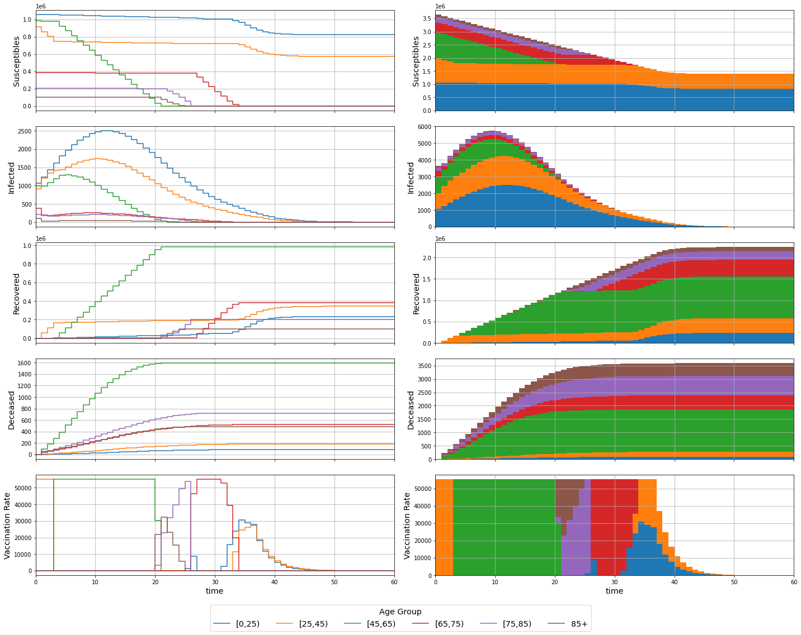

# MPC COVID-19

Modelling and simulation of a COVID-19 compartmental system.

## Modelling

### Variables

| Variable       | Description                                 |
|:--------------:|:-------------------------------------------:|
| $P_k$          | Total individuals in age group $k$          |
| $S_k$          | Susceptible individuals from age group $k$  |
| $I_k$          | Infected individuals from age group $k$     |
| $R_k$          | Recovered individuals from age group $k$    |
| $D_k$          | Deceased individuals from age group $k$     |
| $U_k$          | Vaccination rate for age group $k$          |
| $\lambda_k$    | Infection rate for age group $k$            |
| $C_{j,k}$      | Contact rate between age groups $j$ and $k$ |
| $\gamma_{R,k}$ | Recovery rate for age group $k$             |
| $\gamma_{D,k}$ | Decease rate for age group $k$              |
| $n_a$          | Number of age groups                        |
| $\Delta_t$     | Sampling Period                             |

### Continous Model

$$
\left\{\begin{aligned}
\frac{d S_k(t)}{dt} &= -\lambda_k \cdot S_k(t) \cdot \sum_{j=1}^{n_a} C_{j,k} \cdot I_j(t) - U_k(t)
\\
\frac{d I_k(t)}{dt} &= \lambda_k \cdot S_k(t) \cdot \sum_{j=1}^{n_a} C_{k,j} \cdot I_j(t) - (\gamma_{R,k} + \gamma_{D,k}) \cdot I_k(t)
\\
\frac{d R_k(t)}{dt} &= \gamma_{R,k} \cdot I_k(t) + U_k(t)
\\
\frac{d D_k(t)}{dt} &= \gamma_{D,k} \cdot I_k(t)
\end{aligned}\right.
, k = 1, \dotsc, n_a
$$

### Discrete Model

$$
\left\{\begin{aligned}
S_k(n+1) &= S_k(n) + \Delta_t \cdot \left( -\lambda_k \cdot S_k(n) \cdot \sum_{j=1}^{n_a} C_{j,k} \cdot I_j(n) - U_k(n) \right)
\\
I_k(n+1) &= I_k(n) + \Delta_t \cdot \left( \lambda_k \cdot S_k(n) \cdot \sum_{j=1}^{n_a} C_{k,j} \cdot I_j(n) - (\gamma_{R,k} + \gamma_{D,k}) \cdot I_k(n) \right)
\\
R_k(n+1) &= R_k(n) + \Delta_t \cdot \left( \gamma_{R,k} \cdot I_k(n) + U_k(n) \right)
\\
D_k(n+1) &= D_k(n) + \Delta_t \cdot \left( \gamma_{D,k} \cdot I_k(n) \right)
\end{aligned}\right.
, k = 1, \dotsc, n_a
$$
Considering $\Delta_t = 1$
$$
\left\{\begin{aligned}
S_k(n+1) &= S_k(n) - \lambda_k \cdot S_k(n) \cdot \sum_{j=1}^{n_a} C_{j,k} \cdot I_j(n) - U_k(n)
\\
I_k(n+1) &= I_k(n) + \lambda_k \cdot S_k(n) \, \sum_{j=1}^{n_a} C_{k,j} \cdot I_j(n) - (\gamma_{R,k} + \gamma_{D,k}) \cdot I_k(n)
\\
R_k(n+1) &= R_k(n) + \gamma_{R,k} \cdot I_k(n) + U_k(n)
\\
D_k(n+1) &= D_k(n) + \gamma_{D,k} \cdot I_k(n)
\end{aligned}\right.
, k = 1, \dotsc, n_a
$$

## Pre-Simulation

### Definitions


```python
import numpy as np
from helpers import *

P, S_0, I_0, R_0, D_0, l, C, g_R, g_D, u_max = definitions()
y_0 = wrap(S_0, I_0, R_0, D_0)
n_a = len(P)

t_span = [0, 80]

print(f'Population Total: {sum(P):.0f}')
```

    Population Total: 3645243


## Continous Simulation


```python
def system_continuous(t, y, u, u_max, l, C, g_R, g_D):
  S, I, R, D = unwrap(y)
  dSdt = - l * S * (C @ I) - u(t, y, u_max)
  dIdt = l * S * (C @ I) - (g_R + g_D) * I
  dRdt = g_R * I + u(t, y, u_max)
  dDdt = g_D * I
  return wrap(dSdt, dIdt, dRdt, dDdt)
```

### No Vaccination


```python
from scipy.integrate import solve_ivp

def control(t, y, max):
  return np.zeros(n_a)

sol = solve_ivp(system_continuous, t_span, y_0, args=(control, u_max, l, C, g_R, g_D))
assert(sol.success)

t = sol.t
y = sol.y
S, I, R, D = unwrap(y)
u = recover_control(t, y, control, u_max)

plot(t, y, u)
print(f'Deceased Total: {sum(D[:,-1]):.0f}')
```


    Deceased Total: 46089


### Vaccination of Older Groups with Exclusivity


```python
from scipy.integrate import solve_ivp

def control(t, y, u_max):
  S, I, R, D = unwrap(y)
  u = np.zeros(n_a)
  for i in reversed(range(n_a)):
    if S[i] > 0:
      u[i] = u_max
      break
  return u

sol = solve_ivp(system_continuous, t_span, y_0, args=(control, u_max, l, C, g_R, g_D))
assert(sol.success)

t = sol.t
y = sol.y
S, I, R, D = unwrap(y)
u = recover_control(t, y, control, u_max)

plot(t, y, u)
print(f'Deceased Total: {sum(D[:,-1]):.0f}')
```


    Deceased Total: 7633


### Vaccination of Older Groups with Intersection


```python
from scipy.integrate import solve_ivp

def control(t, y, u_max):
  S, I, R, D = unwrap(y)
  u = np.zeros(n_a)
  remaining = u_max
  for i in reversed(range(n_a)):
    u[i] = min([S[i], remaining])
    remaining = remaining - u[i]
  return u

sol = solve_ivp(system_continuous, t_span, y_0, args=(control, u_max, l, C, g_R, g_D))
assert(sol.success)

t = sol.t
y = sol.y
S, I, R, D = unwrap(y)
u = recover_control(t, y, control, u_max)

plot(t, y, u)
print(f'Deceased Total: {sum(D[:,-1]):.0f}')
```


    Deceased Total: 7616


## Discrete Simulation


```python
def system_discrete(t, y, u, u_max, l, C, g_R, g_D):
  S, I, R, D = unwrap(y)
  S_ = S - l * S * (C @ I) - u(t, y, u_max)
  I_ = I + l * S * (C @ I) - (g_R + g_D) * I
  R_ = R + g_R * I + u(t, y, u_max)
  D_ = D + g_D * I
  return wrap(S_, I_, R_, D_)
```

### No Vaccination


```python
def control(t, y, u_max):
  return np.zeros(n_a)

t, y = solve_ivp_discrete(system_discrete, t_span, y_0, args=(control, u_max, l, C, g_R, g_D))

S, I, R, D = unwrap(y)
u = recover_control(t, y, control, u_max)

plot(t, y, u, discrete=True)
print(f'Deceased Total: {sum(D[:,-1]):.0f}')
```


    Deceased Total: 47115


### Vaccination of Older Groups


```python
def control(t, y, u_max):
  S, I, R, D = unwrap(y)
  u = np.zeros(n_a)
  remaining = u_max
  for i in reversed(range(n_a)):
    u[i] = min([S[i], remaining])
    remaining = remaining - u[i]
  return u

t, y = solve_ivp_discrete(system_discrete, t_span, y_0, args=(control, u_max, l, C, g_R, g_D))

S, I, R, D = unwrap(y)
u = recover_control(t, y, control, u_max)

plot(t, y, u, discrete=True)
print(f'Deceased Total: {sum(D[:,-1]):.0f}')
```


    Deceased Total: 7593


## MPC

### Definitions


```python
import numpy as np
import casadi
from helpers import *

P, S_0, I_0, R_0, D_0, l, C, g_R, g_D, u_max = definitions()
X_0 = wrap(S_0, I_0, R_0, D_0)
n_a = len(P)

S = casadi.MX.sym('S', n_a)
I = casadi.MX.sym('I', n_a)
R = casadi.MX.sym('R', n_a)
D = casadi.MX.sym('D', n_a)
U = casadi.MX.sym('U', n_a)
X = wrap(S, I, R, D)

def system_discrete(X, U):
  S, I, R, D = unwrap(X)
  S_ = S - l * S * (C @ I) - U
  I_ = I + l * S * (C @ I) - (g_R + g_D) * I
  R_ = R + g_R * I + U
  D_ = D + g_D * I
  return wrap(S_, I_, R_, D_)

f = casadi.Function('f',[X, U],[system_discrete(X, U)],['X', 'U'],['X+'])
print(f)
```

    f:(X[24],U[6])->(X+[24]) MXFunction


### Optimization


```python
opti = casadi.Opti()

N = 60 # prediction horizon

s = opti.variable(n_a, N + 1)
i = opti.variable(n_a, N + 1)
r = opti.variable(n_a, N + 1)
d = opti.variable(n_a, N + 1)
u = opti.variable(n_a, N)
x = wrap(s, i, r, d)

s_0 = opti.parameter(n_a,1)
i_0 = opti.parameter(n_a,1)
r_0 = opti.parameter(n_a,1)
d_0 = opti.parameter(n_a,1)
x_0 = wrap(s_0, i_0, r_0, d_0)

opti.minimize(0.1*casadi.sumsqr(i) + 0.9*casadi.sumsqr(d))

opti.subject_to(x[:,0] == x_0) # initial conditions
for k in range(N):
  opti.subject_to(x[:,k + 1] == f(x[:,k], u[:,k])) # dynamics
  opti.subject_to(u[:,k] <= s[:,k]) # dynamic control bound
opti.subject_to(opti.bounded(0,u,u_max)) # individual control bounds
opti.subject_to(opti.bounded(0,casadi.sum1(u),u_max)) # joint control bounds

opti.set_value(x_0, X_0)

opti.solver('ipopt', {}, {
  'print_level': 0,
})

sol = opti.solve()

t_grid = range(N + 1)
x_grid = sol.value(x)
u_grid = np.hstack((sol.value(u), np.nan*np.ones((n_a,1))))
plot(t_grid, x_grid, u_grid, discrete=True)

print(f'Deceased Total: {sum(x_grid[3*n_a:4*n_a,-1]):.0f}')
```

    
    ******************************************************************************
    This program contains Ipopt, a library for large-scale nonlinear optimization.
     Ipopt is released as open source code under the Eclipse Public License (EPL).
             For more information visit https://github.com/coin-or/Ipopt
    ******************************************************************************
    
          solver  :   t_proc      (avg)   t_wall      (avg)    n_eval
           nlp_f  |  15.00ms ( 24.75us)   1.83ms (  3.02us)       606
           nlp_g  |  27.00ms ( 44.55us)  54.65ms ( 90.19us)       606
      nlp_grad_f  |        0 (       0)   4.30ms (  7.51us)       573
      nlp_hess_l  | 405.00ms (710.53us) 404.52ms (709.68us)       570
       nlp_jac_g  | 524.00ms (912.89us) 517.89ms (902.25us)       574
           total  |   8.59 s (  8.59 s)   8.59 s (  8.59 s)         1





    Deceased Total: 3590


### MPC


```python
O = opti.to_function('M',[x_0],[u[:,0]],['x_0'],['u'])
print(O)

M = 1 # control horizon [?]

x_ = X_0
x_log = np.empty((0, x_0.shape[0]))
u_log = np.empty((0, u.shape[0]))
for i in range(N):
  if i % M == 0:
    u_ = np.array(O(x_))[:,0]

  x_log = np.vstack((x_log, x_))
  u_log = np.vstack((u_log, u_))

  x_ = np.array(f(x_,u_))[:,0]

t_log = range(N)
x_log = x_log.T
u_log = u_log.T
plot(t_log, x_log, u_log, discrete=True)

print(f'Deceased Total: {sum(x_log[3*n_a:4*n_a,-1]):.0f}')
```
