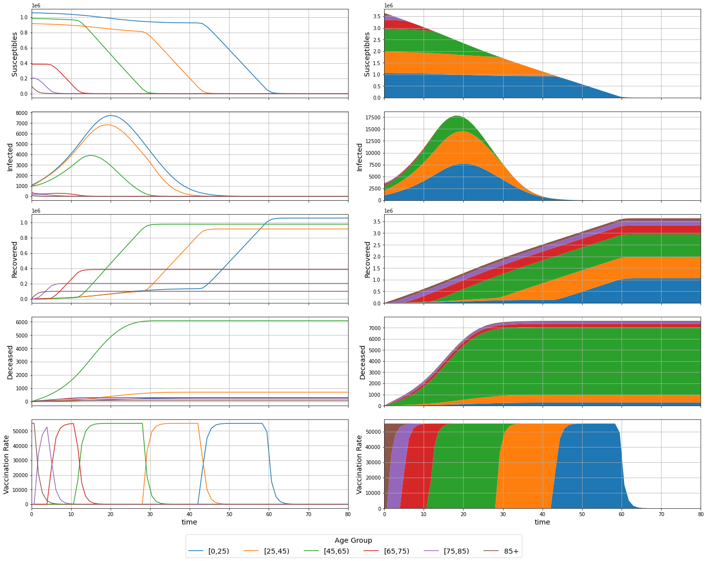

# MPC COVID-19

Modelling and simulation of a COVID-19 compartmental system.

## Modelling

### Variables

| Variable       | Description                                 |
|:--------------:|:-------------------------------------------:|
| $P_k$          | Total individuals in age group $k$          |
| $S_k$          | Susceptible individuals from age group $k$  |
| $I_k$          | Infected individuals from age group $k$     |
| $R_k$          | Recovered individuals from age group $k$    |
| $D_k$          | Deceased individuals from age group $k$     |
| $U_k$          | Vaccination rate for age group $k$          |
| $\lambda_k$    | Infection rate for age group $k$            |
| $C_{j,k}$      | Contact rate between age groups $j$ and $k$ |
| $\gamma_{R,k}$ | Recovery rate for age group $k$             |
| $\gamma_{D,k}$ | Decease rate for age group $k$              |
| $n_a$          | Number of age groups                        |
| $\Delta_t$     | Sampling Period                             |

### Continous Model

$$
\left\{\begin{aligned}
\frac{d S_k(t)}{dt} &= -\lambda_k \cdot S_k(t) \cdot \sum_{j=1}^{n_a} C_{j,k} \cdot I_j(t) - U_k(t)
\\
\frac{d I_k(t)}{dt} &= \lambda_k \cdot S_k(t) \cdot \sum_{j=1}^{n_a} C_{k,j} \cdot I_j(t) - (\gamma_{R,k} + \gamma_{D,k}) \cdot I_k(t)
\\
\frac{d R_k(t)}{dt} &= \gamma_{R,k} \cdot I_k(t) + U_k(t)
\\
\frac{d D_k(t)}{dt} &= \gamma_{D,k} \cdot I_k(t)
\end{aligned}\right.
, k = 1, \dotsc, n_a
$$

### Discrete Model

$$
\left\{\begin{aligned}
S_k(n+1) &= S_k(n) + \Delta_t \cdot \left( -\lambda_k \cdot S_k(n) \cdot \sum_{j=1}^{n_a} C_{j,k} \cdot I_j(n) - U_k(n) \right)
\\
I_k(n+1) &= I_k(n) + \Delta_t \cdot \left( \lambda_k \cdot S_k(n) \cdot \sum_{j=1}^{n_a} C_{k,j} \cdot I_j(n) - (\gamma_{R,k} + \gamma_{D,k}) \cdot I_k(n) \right)
\\
R_k(n+1) &= R_k(n) + \Delta_t \cdot \left( \gamma_{R,k} \cdot I_k(n) + U_k(n) \right)
\\
D_k(n+1) &= D_k(n) + \Delta_t \cdot \left( \gamma_{D,k} \cdot I_k(n) \right)
\end{aligned}\right.
, k = 1, \dotsc, n_a
$$
Considering $\Delta_t = 1$
$$
\left\{\begin{aligned}
S_k(n+1) &= S_k(n) - \lambda_k \cdot S_k(n) \cdot \sum_{j=1}^{n_a} C_{j,k} \cdot I_j(n) - U_k(n)
\\
I_k(n+1) &= I_k(n) + \lambda_k \cdot S_k(n) \, \sum_{j=1}^{n_a} C_{k,j} \cdot I_j(n) - (\gamma_{R,k} + \gamma_{D,k}) \cdot I_k(n)
\\
R_k(n+1) &= R_k(n) + \gamma_{R,k} \cdot I_k(n) + U_k(n)
\\
D_k(n+1) &= D_k(n) + \gamma_{D,k} \cdot I_k(n)
\end{aligned}\right.
, k = 1, \dotsc, n_a
$$

## Pre-Simulation

### Definitions


```python
import numpy as np
from helpers import *

P, S_0, I_0, R_0, D_0, l, C, g_R, g_D, u_max = definitions()
y_0 = wrap(S_0, I_0, R_0, D_0)
n_a = len(P)

t_span = [0, 80]

print(f'Population Total: {sum(P):.0f}')
```

    Population Total: 3645243


## Continous Simulation


```python
def system_continuous(t, y, u, u_max, l, C, g_R, g_D):
  S, I, R, D = unwrap(y)
  dSdt = - l * S * (C @ I) - u(t, y, u_max)
  dIdt = l * S * (C @ I) - (g_R + g_D) * I
  dRdt = g_R * I + u(t, y, u_max)
  dDdt = g_D * I
  return wrap(dSdt, dIdt, dRdt, dDdt)
```

### No Vaccination


```python
from scipy.integrate import solve_ivp

def control(t, y, max):
  return np.zeros(n_a)

sol = solve_ivp(system_continuous, t_span, y_0, args=(control, u_max, l, C, g_R, g_D))
assert(sol.success)

t = sol.t
y = sol.y
S, I, R, D = unwrap(y)
u = recover_control(t, y, control, u_max)

plot(t, y, u)
print(f'Deceased Total: {sum(D[:,-1]):.0f}')
```


    Deceased Total: 46089


### Vaccination of Older Groups with Exclusivity


```python
from scipy.integrate import solve_ivp

def control(t, y, u_max):
  S, I, R, D = unwrap(y)
  u = np.zeros(n_a)
  for i in reversed(range(n_a)):
    if S[i] > 0:
      u[i] = u_max
      break
  return u

sol = solve_ivp(system_continuous, t_span, y_0, args=(control, u_max, l, C, g_R, g_D))
assert(sol.success)

t = sol.t
y = sol.y
S, I, R, D = unwrap(y)
u = recover_control(t, y, control, u_max)

plot(t, y, u)
print(f'Deceased Total: {sum(D[:,-1]):.0f}')
```


    Deceased Total: 7633


### Vaccination of Older Groups with Intersection


```python
from scipy.integrate import solve_ivp

def control(t, y, u_max):
  S, I, R, D = unwrap(y)
  u = np.zeros(n_a)
  remaining = u_max
  for i in reversed(range(n_a)):
    u[i] = min([S[i], remaining])
    remaining = remaining - u[i]
  return u

sol = solve_ivp(system_continuous, t_span, y_0, args=(control, u_max, l, C, g_R, g_D))
assert(sol.success)

t = sol.t
y = sol.y
S, I, R, D = unwrap(y)
u = recover_control(t, y, control, u_max)

plot(t, y, u)
print(f'Deceased Total: {sum(D[:,-1]):.0f}')
```





    Deceased Total: 7616


## Discrete Simulation


```python
def system_discrete(t, y, u, u_max, l, C, g_R, g_D):
  S, I, R, D = unwrap(y)
  S_ = S - l * S * (C @ I) - u(t, y, u_max)
  I_ = I + l * S * (C @ I) - (g_R + g_D) * I
  R_ = R + g_R * I + u(t, y, u_max)
  D_ = D + g_D * I
  return wrap(S_, I_, R_, D_)
```

### No Vaccination


```python
def control(t, y, u_max):
  return np.zeros(n_a)

t, y = solve_ivp_discrete(system_discrete, t_span, y_0, args=(control, u_max, l, C, g_R, g_D))

S, I, R, D = unwrap(y)
u = recover_control(t, y, control, u_max)

plot(t, y, u, discrete=True)
print(f'Deceased Total: {sum(D[:,-1]):.0f}')
```


    Deceased Total: 47115


### Vaccination of Older Groups


```python
def control(t, y, u_max):
  S, I, R, D = unwrap(y)
  u = np.zeros(n_a)
  remaining = u_max
  for i in reversed(range(n_a)):
    u[i] = min([S[i], remaining])
    remaining = remaining - u[i]
  return u

t, y = solve_ivp_discrete(system_discrete, t_span, y_0, args=(control, u_max, l, C, g_R, g_D))

S, I, R, D = unwrap(y)
u = recover_control(t, y, control, u_max)

plot(t, y, u, discrete=True)
print(f'Deceased Total: {sum(D[:,-1]):.0f}')
```


    Deceased Total: 7593


## MPC

### Definitions


```python
from helpers import *
import casadi

P, S_0, I_0, R_0, D_0, l, C, g_R, g_D, u_max = definitions()
X_0 = wrap(S_0, I_0, R_0, D_0)
n_a = len(P)

S = casadi.MX.sym('S', n_a)
I = casadi.MX.sym('I', n_a)
R = casadi.MX.sym('R', n_a)
D = casadi.MX.sym('D', n_a)
U = casadi.MX.sym('U', n_a)
X = wrap(S, I, R, D)

def system_discrete(X, U):
  S, I, R, D = unwrap(X)
  S_ = S - l * S * (C @ I) - U
  I_ = I + l * S * (C @ I) - (g_R + g_D) * I
  R_ = R + g_R * I + U
  D_ = D + g_D * I
  return wrap(S_, I_, R_, D_)

f = casadi.Function('f',[X, U],[system_discrete(X, U)],['X', 'U'],['X+'])
print(f)
```

    f:(X[24],U[6])->(X+[24]) MXFunction


### Optimization


```python
opti = casadi.Opti()

N = 80

s = opti.variable(n_a, N + 1)
i = opti.variable(n_a, N + 1)
r = opti.variable(n_a, N + 1)
d = opti.variable(n_a, N + 1)
u = opti.variable(n_a, N)
x = wrap(s, i, r, d)

s_0 = opti.parameter(n_a,1)
i_0 = opti.parameter(n_a,1)
r_0 = opti.parameter(n_a,1)
d_0 = opti.parameter(n_a,1)
x_0 = wrap(s_0, i_0, r_0, d_0)

opti.minimize(0.1*casadi.sumsqr(i) + 0.9*casadi.sumsqr(d))

opti.subject_to(x[:,0] == x_0) # initial conditions
for k in range(N):
  opti.subject_to(x[:,k + 1] == f(x[:,k], u[:,k])) # dynamics
  opti.subject_to(u[:,k] <= s[:,k]) # control limit
opti.subject_to(opti.bounded(0,u,u_max)) # control limit
opti.subject_to(opti.bounded(0,casadi.sum1(u),u_max)) # control limit

opti.set_value(x_0, X_0)

opti.solver('ipopt')

sol = opti.solve()

t_grid = range(N + 1)
x_grid = sol.value(x)
u_grid = np.hstack((sol.value(u), np.nan*np.ones((n_a,1))))
plot(t_grid, x_grid, u_grid, discrete=True)

print(f'Deceased Total: {sum(x_grid[3*n_a:4*n_a,-1]):.0f}')
```

    
    ******************************************************************************
    This program contains Ipopt, a library for large-scale nonlinear optimization.
     Ipopt is released as open source code under the Eclipse Public License (EPL).
             For more information visit https://github.com/coin-or/Ipopt
    ******************************************************************************
    
    This is Ipopt version 3.14.11, running with linear solver MUMPS 5.4.1.
    
    Number of nonzeros in equality constraint Jacobian...:    11544
    Number of nonzeros in inequality constraint Jacobian.:     1920
    Number of nonzeros in Lagrangian Hessian.............:     3852
    
    Total number of variables............................:     2424
                         variables with only lower bounds:        0
                    variables with lower and upper bounds:        0
                         variables with only upper bounds:        0
    Total number of equality constraints.................:     1944
    Total number of inequality constraints...............:     1040
            inequality constraints with only lower bounds:        0
       inequality constraints with lower and upper bounds:      560
            inequality constraints with only upper bounds:      480
    
    iter    objective    inf_pr   inf_du lg(mu)  ||d||  lg(rg) alpha_du alpha_pr  ls
       0  0.0000000e+00 1.06e+06 9.06e-01  -1.0 0.00e+00    -  0.00e+00 0.00e+00   0
       1  1.1338929e-08 1.06e+06 7.24e+00  -1.0 1.14e+06    -  8.68e-09 8.01e-08f  1
       2  9.4656889e+02 1.03e+06 2.84e+05  -1.0 2.36e+06    -  4.25e-08 2.32e-02h  1
       3  1.3384713e+03 1.03e+06 2.83e+05  -1.0 2.38e+06    -  5.66e-03 4.35e-03h  1
       4  3.0928641e+03 1.01e+06 2.79e+05  -1.0 2.02e+06    -  6.74e-03 1.42e-02h  1
       5  5.2884423e+03 1.00e+06 2.76e+05  -1.0 2.26e+06    -  6.82e-03 1.27e-02h  1
       6  8.1936500e+03 9.88e+05 2.72e+05  -1.0 2.63e+06    -  5.37e-03 1.32e-02h  1
       7  1.1049598e+04 9.77e+05 2.69e+05  -1.0 2.87e+06    -  3.73e-03 1.07e-02h  1
       8  1.3453848e+04 9.69e+05 2.67e+05  -1.0 1.79e+06    -  3.64e-03 7.97e-03h  1
       9  1.7496031e+04 9.58e+05 2.64e+05  -1.0 2.76e+06    -  5.56e-03 1.19e-02h  1
    iter    objective    inf_pr   inf_du lg(mu)  ||d||  lg(rg) alpha_du alpha_pr  ls
      10  2.1813370e+04 9.47e+05 2.61e+05  -1.0 3.01e+06    -  2.34e-03 1.12e-02h  1
      11  2.4304370e+04 9.41e+05 2.59e+05  -1.0 2.01e+06    -  3.29e-03 5.93e-03h  1
      12  3.0240002e+04 9.29e+05 2.56e+05  -1.0 3.04e+06    -  2.46e-03 1.30e-02h  1
      13  3.2091052e+04 9.26e+05 2.55e+05  -1.0 1.71e+06    -  1.98e-03 3.74e-03h  1
      14  3.8640057e+04 9.14e+05 2.52e+05  -1.0 3.04e+06    -  2.40e-03 1.24e-02h  1
      15  4.0872934e+04 9.10e+05 2.51e+05  -1.0 1.84e+06    -  2.10e-03 3.96e-03h  1
      16  4.6829406e+04 9.01e+05 2.48e+05  -1.0 3.04e+06    -  1.83e-03 1.01e-02h  1
      17  5.0843699e+04 8.96e+05 2.47e+05  -1.0 2.65e+06    -  3.70e-03 6.40e-03h  1
      18  5.7114075e+04 8.87e+05 2.44e+05  -1.0 3.01e+06    -  1.05e-03 9.48e-03h  1
      19  5.7975691e+04 8.86e+05 2.44e+05  -1.0 2.85e+06    -  5.13e-03 1.25e-03h  1
    iter    objective    inf_pr   inf_du lg(mu)  ||d||  lg(rg) alpha_du alpha_pr  ls
      20  6.2317450e+04 8.80e+05 2.42e+05  -1.0 1.56e+06    -  5.68e-04 6.18e-03h  1
      21  7.4737403e+04 8.66e+05 2.38e+05  -1.0 2.62e+06    -  3.01e-03 1.65e-02h  1
      22  7.6003640e+04 8.65e+05 2.38e+05  -1.0 1.19e+06    -  8.67e-04 1.59e-03h  1
      23  8.2521680e+04 8.58e+05 2.36e+05  -1.0 2.86e+06    -  5.18e-04 7.97e-03h  1
      24  8.8268050e+04 8.52e+05 2.35e+05  -1.0 2.87e+06    -  7.26e-03 6.74e-03h  1
      25  8.8824231e+04 8.51e+05 2.34e+05  -1.0 1.55e+06    -  3.79e-04 6.36e-04h  1
      26  8.9245142e+04 8.51e+05 2.34e+05  -1.0 2.30e+06    -  3.59e-04 4.79e-04h  1
      27  9.0608482e+04 8.50e+05 2.34e+05  -1.0 2.52e+06    -  6.84e-04 1.54e-03h  1
      28  1.0797578e+05 8.34e+05 2.30e+05  -1.0 2.57e+06    -  1.77e-03 1.87e-02h  1
      29  1.0891426e+05 8.33e+05 2.29e+05  -1.0 1.64e+06    -  5.81e-04 9.54e-04h  1
    iter    objective    inf_pr   inf_du lg(mu)  ||d||  lg(rg) alpha_du alpha_pr  ls
      30  1.1333274e+05 8.29e+05 2.28e+05  -1.0 2.69e+06    -  2.43e-04 4.44e-03h  1
      31  1.2101993e+05 8.23e+05 2.27e+05  -1.0 2.82e+06    -  3.80e-03 7.49e-03h  1
      32  1.2406893e+05 8.21e+05 2.26e+05  -1.0 2.72e+06    -  3.26e-03 2.89e-03h  1
      33  1.2947574e+05 8.17e+05 2.25e+05  -1.0 1.67e+06    -  2.84e-04 5.02e-03h  1
      34  1.4124778e+05 8.08e+05 2.22e+05  -1.0 2.59e+06    -  1.74e-03 1.05e-02h  1
      35  1.4334424e+05 8.06e+05 2.22e+05  -1.0 2.54e+06    -  5.31e-03 1.82e-03h  1
      36  1.4788559e+05 8.03e+05 2.21e+05  -1.0 2.13e+06    -  3.27e-04 3.91e-03h  1
      37  1.5337503e+05 8.00e+05 2.20e+05  -1.0 2.24e+06    -  5.03e-04 4.64e-03h  1
      38  1.6944963e+05 7.89e+05 2.17e+05  -1.0 2.45e+06    -  4.05e-03 1.31e-02h  1
      39  1.7413141e+05 7.86e+05 2.16e+05  -1.0 2.18e+06    -  2.17e-03 3.66e-03h  1
    iter    objective    inf_pr   inf_du lg(mu)  ||d||  lg(rg) alpha_du alpha_pr  ls
      40  1.7533437e+05 7.86e+05 2.16e+05  -1.0 1.48e+06    -  1.36e-04 9.29e-04h  1
      41  1.7694229e+05 7.85e+05 2.16e+05  -1.0 2.51e+06    -  3.70e-04 1.24e-03h  1
      42  2.0315948e+05 7.69e+05 2.12e+05  -1.0 2.57e+06    -  1.49e-03 1.94e-02h  1
      43  2.0386685e+05 7.69e+05 2.12e+05  -1.0 1.00e+06    -  3.57e-04 4.98e-04h  1
      44  2.0665608e+05 7.67e+05 2.11e+05  -1.0 2.37e+06    -  7.13e-05 1.96e-03h  1
      45  2.1240684e+05 7.64e+05 2.10e+05  -1.0 2.63e+06    -  1.28e-03 3.99e-03h  1
      46  2.2599729e+05 7.57e+05 2.09e+05  -1.0 2.61e+06    -  4.63e-03 9.18e-03h  1
      47  2.3228697e+05 7.54e+05 2.08e+05  -1.0 2.54e+06    -  1.90e-03 4.12e-03h  1
      48  2.3904036e+05 7.51e+05 2.07e+05  -1.0 1.34e+06    -  1.20e-04 4.35e-03h  1
      49  2.5062309e+05 7.45e+05 2.05e+05  -1.0 2.58e+06    -  1.81e-03 7.30e-03h  1
    iter    objective    inf_pr   inf_du lg(mu)  ||d||  lg(rg) alpha_du alpha_pr  ls
      50  2.5881632e+05 7.42e+05 2.04e+05  -1.0 2.55e+06    -  6.00e-03 5.03e-03h  1
      51  2.6167834e+05 7.40e+05 2.04e+05  -1.0 2.45e+06    -  7.33e-04 1.73e-03h  1
      52  2.6197219e+05 7.40e+05 2.04e+05  -1.0 1.64e+06    -  1.20e-04 1.76e-04h  1
      53  2.6244038e+05 7.40e+05 2.04e+05  -1.0 1.75e+06    -  8.49e-05 2.81e-04h  1
      54  2.9421733e+05 7.26e+05 2.00e+05  -1.0 2.00e+06    -  3.21e-04 1.85e-02h  1
      55  2.9554763e+05 7.26e+05 2.00e+05  -1.0 2.27e+06    -  3.46e-03 7.38e-04h  1
      56  3.0814879e+05 7.21e+05 1.98e+05  -1.0 2.23e+06    -  1.66e-03 6.90e-03h  1
      57  3.1131935e+05 7.20e+05 1.98e+05  -1.0 2.02e+06    -  4.58e-05 1.70e-03h  1
      58  3.4223167e+05 7.08e+05 1.95e+05  -1.0 2.46e+06    -  1.10e-03 1.61e-02h  1
      59  3.4857597e+05 7.06e+05 1.94e+05  -1.0 2.41e+06    -  3.62e-03 3.17e-03h  1
    iter    objective    inf_pr   inf_du lg(mu)  ||d||  lg(rg) alpha_du alpha_pr  ls
      60  3.5322000e+05 7.04e+05 1.94e+05  -1.0 1.80e+06    -  8.03e-05 2.29e-03h  1
      61  3.7796025e+05 6.96e+05 1.92e+05  -1.0 2.42e+06    -  3.12e-04 1.19e-02h  1
      62  3.9169792e+05 6.91e+05 1.90e+05  -1.0 2.39e+06    -  6.81e-03 6.38e-03h  1
      63  3.9925547e+05 6.89e+05 1.90e+05  -1.0 2.29e+06    -  4.15e-04 3.44e-03h  1
      64  3.9979502e+05 6.89e+05 1.90e+05  -1.0 2.00e+06    -  7.73e-05 2.44e-04h  1
      65  4.0077262e+05 6.88e+05 1.90e+05  -1.0 2.27e+06    -  1.74e-04 4.41e-04h  1
      66  4.3279204e+05 6.79e+05 1.87e+05  -1.0 2.30e+06    -  5.72e-04 1.41e-02h  1
      67  4.3446959e+05 6.78e+05 1.87e+05  -1.0 2.28e+06    -  4.95e-03 7.20e-04h  1
      68  4.4601129e+05 6.75e+05 1.86e+05  -1.0 2.26e+06    -  1.15e-03 4.92e-03h  1
      69  4.5631263e+05 6.72e+05 1.85e+05  -1.0 1.84e+06    -  1.30e-04 4.32e-03h  1
    iter    objective    inf_pr   inf_du lg(mu)  ||d||  lg(rg) alpha_du alpha_pr  ls
      70  5.0857676e+05 6.58e+05 1.81e+05  -1.0 2.30e+06    -  4.91e-04 2.11e-02h  1
      71  5.1403911e+05 6.56e+05 1.81e+05  -1.0 2.24e+06    -  1.79e-03 2.10e-03h  1
      72  5.1539759e+05 6.56e+05 1.81e+05  -1.0 2.12e+06    -  1.72e-05 5.20e-04h  1
      73  5.4750144e+05 6.48e+05 1.78e+05  -1.0 2.25e+06    -  2.68e-04 1.21e-02h  1
      74  5.4786702e+05 6.48e+05 1.78e+05  -1.0 2.23e+06    -  7.22e-03 1.34e-04h  1
      75  5.4848534e+05 6.48e+05 1.78e+05  -1.0 2.22e+06    -  1.48e-03 2.26e-04h  1
      76  5.7148991e+05 6.43e+05 1.77e+05  -1.0 2.19e+06    -  1.99e-04 8.31e-03h  1
      77  5.7696286e+05 6.41e+05 1.77e+05  -1.0 1.57e+06    -  1.14e-04 1.94e-03h  1
      78  5.9247726e+05 6.38e+05 1.76e+05  -1.0 1.98e+06    -  1.07e-03 5.43e-03h  1
      79  6.0572790e+05 6.35e+05 1.75e+05  -1.0 2.01e+06    -  2.86e-03 4.55e-03h  1
    iter    objective    inf_pr   inf_du lg(mu)  ||d||  lg(rg) alpha_du alpha_pr  ls
      80  6.3170387e+05 6.29e+05 1.73e+05  -1.0 2.00e+06    -  3.07e-03 8.74e-03h  1
      81  6.4726771e+05 6.26e+05 1.72e+05  -1.0 1.91e+06    -  2.08e-03 5.10e-03h  1
      82  6.5716677e+05 6.24e+05 1.72e+05  -1.0 1.45e+06    -  8.23e-05 3.19e-03h  1
      83  7.1718534e+05 6.12e+05 1.69e+05  -1.0 2.12e+06    -  2.85e-04 1.88e-02h  1
      84  7.3684057e+05 6.09e+05 1.68e+05  -1.0 2.09e+06    -  5.31e-03 5.86e-03h  1
      85  7.4080116e+05 6.08e+05 1.67e+05  -1.0 1.61e+06    -  4.90e-05 1.16e-03h  1
      86  7.6037688e+05 6.05e+05 1.66e+05  -1.0 2.08e+06    -  1.14e-04 5.70e-03h  1
      87  7.7427502e+05 6.02e+05 1.66e+05  -1.0 2.08e+06    -  3.86e-03 3.97e-03h  1
      88  7.7926968e+05 6.01e+05 1.66e+05  -1.0 2.07e+06    -  5.14e-03 1.41e-03h  1
      89  8.0736126e+05 5.97e+05 1.64e+05  -1.0 2.06e+06    -  2.25e-03 7.84e-03h  1
    iter    objective    inf_pr   inf_du lg(mu)  ||d||  lg(rg) alpha_du alpha_pr  ls
      90  8.1129613e+05 5.96e+05 1.64e+05  -1.0 1.91e+06    -  1.94e-04 1.08e-03h  1
      91  8.2358022e+05 5.94e+05 1.64e+05  -1.0 1.05e+06    -  7.41e-05 3.35e-03h  1
      92  8.5643803e+05 5.89e+05 1.62e+05  -1.0 1.73e+06    -  1.17e-03 8.79e-03h  1
      93  9.1079275e+05 5.81e+05 1.60e+05  -1.0 1.79e+06    -  3.56e-03 1.40e-02h  1
      94  9.3311187e+05 5.77e+05 1.59e+05  -1.0 1.65e+06    -  3.31e-03 5.54e-03h  1
      95  9.3998681e+05 5.76e+05 1.59e+05  -1.0 1.06e+06    -  7.16e-05 1.68e-03h  1
      96  9.5816357e+05 5.74e+05 1.58e+05  -1.0 1.88e+06    -  1.29e-04 4.41e-03h  1
      97  9.5889719e+05 5.74e+05 1.58e+05  -1.0 1.94e+06    -  2.53e-03 1.76e-04h  1
      98  9.7002906e+05 5.72e+05 1.58e+05  -1.0 1.95e+06    -  1.79e-03 2.65e-03h  1
      99  1.0430679e+06 5.62e+05 1.55e+05  -1.0 1.94e+06    -  4.20e-03 1.70e-02h  1
    iter    objective    inf_pr   inf_du lg(mu)  ||d||  lg(rg) alpha_du alpha_pr  ls
     100  1.0464802e+06 5.62e+05 1.55e+05  -1.0 1.85e+06    -  1.13e-03 7.63e-04h  1
     101  1.0614789e+06 5.60e+05 1.54e+05  -1.0 1.63e+06    -  8.21e-05 3.34e-03h  1
     102  1.0670023e+06 5.59e+05 1.54e+05  -1.0 1.85e+06    -  2.07e-04 1.23e-03h  1
     103  1.0706148e+06 5.59e+05 1.54e+05  -1.0 1.88e+06    -  1.19e-03 8.04e-04h  1
     104  1.0941278e+06 5.56e+05 1.53e+05  -1.0 1.89e+06    -  1.22e-03 5.19e-03h  1
     105  1.1951304e+06 5.44e+05 1.50e+05  -1.0 1.88e+06    -  4.89e-03 2.15e-02h  1
     106  1.1969435e+06 5.44e+05 1.50e+05  -1.0 1.10e+06    -  1.33e-04 3.69e-04h  1
     107  1.2015017e+06 5.43e+05 1.50e+05  -1.0 1.72e+06    -  2.49e-05 9.25e-04h  1
     108  1.2489248e+06 5.38e+05 1.48e+05  -1.0 1.86e+06    -  4.29e-04 9.51e-03h  1
     109  1.2875759e+06 5.34e+05 1.47e+05  -1.0 1.84e+06    -  5.73e-03 7.53e-03h  1
    iter    objective    inf_pr   inf_du lg(mu)  ||d||  lg(rg) alpha_du alpha_pr  ls
     110  1.3091412e+06 5.32e+05 1.46e+05  -1.0 1.82e+06    -  4.31e-03 4.11e-03h  1
     111  1.3342323e+06 5.30e+05 1.46e+05  -1.0 1.72e+06    -  2.26e-04 4.72e-03h  1
     112  1.3579506e+06 5.27e+05 1.45e+05  -1.0 1.38e+06    -  1.53e-04 4.40e-03h  1
     113  1.3590801e+06 5.27e+05 1.45e+05  -1.0 1.68e+06    -  2.60e-03 2.07e-04h  1
     114  1.3801720e+06 5.25e+05 1.45e+05  -1.0 1.70e+06    -  1.83e-03 3.85e-03h  1
     115  1.4903284e+06 5.15e+05 1.42e+05  -1.0 1.69e+06    -  5.17e-03 1.95e-02h  1
     116  1.5232490e+06 5.12e+05 1.41e+05  -1.0 1.55e+06    -  1.55e-03 5.56e-03h  1
     117  1.5326136e+06 5.11e+05 1.41e+05  -1.0 1.39e+06    -  3.96e-05 1.56e-03h  1
     118  1.6042699e+06 5.05e+05 1.39e+05  -1.0 1.74e+06    -  6.51e-04 1.17e-02h  1
     119  1.6050710e+06 5.05e+05 1.39e+05  -1.0 1.73e+06    -  7.11e-03 1.28e-04h  1
    iter    objective    inf_pr   inf_du lg(mu)  ||d||  lg(rg) alpha_du alpha_pr  ls
     120  1.6067742e+06 5.05e+05 1.39e+05  -1.0 1.72e+06    -  4.06e-03 2.71e-04h  1
     121  1.6757523e+06 4.99e+05 1.38e+05  -1.0 1.71e+06    -  9.17e-04 1.08e-02h  1
     122  1.6891771e+06 4.98e+05 1.37e+05  -1.0 1.24e+06    -  1.56e-04 2.05e-03h  1
     123  1.7450528e+06 4.94e+05 1.36e+05  -1.0 1.36e+06    -  4.51e-04 8.43e-03h  1
     124  1.9110827e+06 4.82e+05 1.33e+05  -1.0 1.49e+06    -  3.58e-03 2.40e-02h  1
     125  1.9492425e+06 4.80e+05 1.32e+05  -1.0 1.32e+06    -  3.14e-03 5.19e-03h  1
     126  1.9576253e+06 4.79e+05 1.32e+05  -1.0 8.44e+05    -  3.83e-05 1.12e-03h  1
     127  2.0832742e+06 4.71e+05 1.30e+05  -1.0 1.62e+06    -  2.68e-04 1.66e-02h  1
     128  2.1595481e+06 4.67e+05 1.29e+05  -1.0 1.61e+06    -  8.30e-03 9.58e-03h  1
     129  2.1980739e+06 4.65e+05 1.28e+05  -1.0 1.57e+06    -  1.58e-03 4.71e-03h  1
    iter    objective    inf_pr   inf_du lg(mu)  ||d||  lg(rg) alpha_du alpha_pr  ls
     130  2.2367181e+06 4.63e+05 1.27e+05  -1.0 9.60e+05    -  1.02e-04 4.66e-03h  1
     131  2.3060266e+06 4.59e+05 1.26e+05  -1.0 1.58e+06    -  1.00e-03 8.20e-03h  1
     132  2.3160122e+06 4.58e+05 1.26e+05  -1.0 1.57e+06    -  6.16e-03 1.16e-03h  1
     133  2.4201755e+06 4.53e+05 1.25e+05  -1.0 1.56e+06    -  5.56e-03 1.19e-02h  1
     134  2.4379108e+06 4.52e+05 1.24e+05  -1.0 1.52e+06    -  1.61e-03 1.97e-03h  1
     135  2.4400548e+06 4.52e+05 1.24e+05  -1.0 1.32e+06    -  1.68e-04 2.37e-04h  1
     136  2.4506268e+06 4.51e+05 1.24e+05  -1.0 9.23e+05    -  7.00e-05 1.17e-03h  1
     137  2.5917238e+06 4.44e+05 1.22e+05  -1.0 1.12e+06    -  6.27e-04 1.53e-02h  1
     138  2.6017309e+06 4.44e+05 1.22e+05  -1.0 1.31e+06    -  2.46e-03 1.05e-03h  1
     139  2.6930378e+06 4.40e+05 1.21e+05  -1.0 1.32e+06    -  1.74e-03 9.46e-03h  1
    iter    objective    inf_pr   inf_du lg(mu)  ||d||  lg(rg) alpha_du alpha_pr  ls
     140  2.7211520e+06 4.38e+05 1.21e+05  -1.0 1.29e+06    -  6.79e-03 2.87e-03h  1
     141  2.8395458e+06 4.33e+05 1.19e+05  -1.0 1.26e+06    -  1.43e-03 1.19e-02h  1
     142  2.9007436e+06 4.31e+05 1.19e+05  -1.0 7.54e+05    -  2.30e-04 5.97e-03h  1
     143  3.1958214e+06 4.19e+05 1.15e+05  -1.0 1.45e+06    -  1.09e-03 2.77e-02h  1
     144  3.2934796e+06 4.15e+05 1.14e+05  -1.0 1.40e+06    -  6.63e-03 8.58e-03h  1
     145  3.3080544e+06 4.15e+05 1.14e+05  -1.0 1.21e+06    -  4.01e-05 1.26e-03h  1
     146  3.4310895e+06 4.10e+05 1.13e+05  -1.0 1.41e+06    -  5.48e-04 1.05e-02h  1
     147  3.4326453e+06 4.10e+05 1.13e+05  -1.0 1.40e+06    -  6.60e-03 1.30e-04h  1
     148  3.4468901e+06 4.10e+05 1.13e+05  -1.0 1.40e+06    -  4.31e-03 1.19e-03h  1
     149  3.7429276e+06 4.00e+05 1.10e+05  -1.0 1.39e+06    -  3.72e-03 2.40e-02h  1
    iter    objective    inf_pr   inf_du lg(mu)  ||d||  lg(rg) alpha_du alpha_pr  ls
     150  3.7860739e+06 3.98e+05 1.10e+05  -1.0 1.03e+06    -  3.06e-04 3.33e-03h  1
     151  3.8209392e+06 3.97e+05 1.09e+05  -1.0 1.35e+06    -  3.12e-04 2.67e-03h  1
     152  3.8242594e+06 3.97e+05 1.09e+05  -1.0 1.35e+06    -  2.81e-03 2.53e-04h  1
     153  3.9177752e+06 3.95e+05 1.09e+05  -1.0 1.35e+06    -  2.07e-03 7.07e-03h  1
     154  4.2497227e+06 3.85e+05 1.06e+05  -1.0 1.34e+06    -  5.46e-03 2.42e-02h  1
     155  4.3385263e+06 3.83e+05 1.05e+05  -1.0 1.27e+06    -  2.09e-03 6.17e-03h  1
     156  4.4044235e+06 3.81e+05 1.05e+05  -1.0 1.28e+06    -  9.14e-05 4.51e-03h  1
     157  4.5108201e+06 3.78e+05 1.04e+05  -1.0 1.30e+06    -  3.67e-03 7.18e-03h  1
     158  4.5122637e+06 3.78e+05 1.04e+05  -1.0 1.28e+06    -  6.89e-03 9.62e-05h  1
     159  4.5691645e+06 3.77e+05 1.04e+05  -1.0 1.28e+06    -  5.09e-03 3.77e-03h  1
    iter    objective    inf_pr   inf_du lg(mu)  ||d||  lg(rg) alpha_du alpha_pr  ls
     160  4.8192863e+06 3.71e+05 1.02e+05  -1.0 1.27e+06    -  3.49e-03 1.63e-02h  1
     161  4.9855619e+06 3.67e+05 1.01e+05  -1.0 9.01e+05    -  2.57e-04 1.04e-02h  1
     162  5.6410121e+06 3.52e+05 9.70e+04  -1.0 1.14e+06    -  2.63e-03 3.91e-02h  1
     163  5.7466720e+06 3.50e+05 9.64e+04  -1.0 1.13e+06    -  4.36e-03 5.91e-03h  1
     164  5.7696087e+06 3.50e+05 9.63e+04  -1.0 1.07e+06    -  6.05e-05 1.27e-03h  1
     165  5.7700641e+06 3.50e+05 9.63e+04  -1.0 1.18e+06    -  5.50e-04 2.52e-05h  1
     166  6.2666285e+06 3.40e+05 9.37e+04  -1.0 1.18e+06    -  5.16e-04 2.69e-02h  1
     167  6.2736091e+06 3.40e+05 9.37e+04  -1.0 1.15e+06    -  9.21e-03 3.63e-04h  1
     168  6.3408437e+06 3.39e+05 9.34e+04  -1.0 1.14e+06    -  3.33e-03 3.48e-03h  1
     169  6.6246777e+06 3.34e+05 9.20e+04  -1.0 1.04e+06    -  3.15e-04 1.45e-02h  1
    iter    objective    inf_pr   inf_du lg(mu)  ||d||  lg(rg) alpha_du alpha_pr  ls
     170  6.8698308e+06 3.30e+05 9.09e+04  -1.0 1.06e+06    -  8.57e-04 1.21e-02h  1
     171  7.0978619e+06 3.26e+05 8.99e+04  -1.0 1.08e+06    -  3.19e-03 1.10e-02h  1
     172  7.1004493e+06 3.26e+05 8.99e+04  -1.0 1.07e+06    -  1.23e-04 1.29e-04h  1
     173  7.1020844e+06 3.26e+05 8.99e+04  -1.0 1.07e+06    -  2.14e-04 8.28e-05h  1
     174  7.6317734e+06 3.18e+05 8.75e+04  -1.0 1.07e+06    -  9.63e-03 2.63e-02h  1
     175  7.6520849e+06 3.18e+05 8.74e+04  -1.0 9.65e+05    -  1.84e-04 9.73e-04h  1
     176  7.8361542e+06 3.15e+05 8.66e+04  -1.0 1.06e+06    -  1.91e-04 8.91e-03h  1
     177  8.0547548e+06 3.11e+05 8.57e+04  -1.0 1.06e+06    -  7.56e-03 1.05e-02h  1
     178  8.3084626e+06 3.08e+05 8.47e+04  -1.0 1.05e+06    -  9.88e-03 1.19e-02h  1
     179  8.7088142e+06 3.02e+05 8.32e+04  -1.0 1.03e+06    -  3.12e-03 1.85e-02h  1
    iter    objective    inf_pr   inf_du lg(mu)  ||d||  lg(rg) alpha_du alpha_pr  ls
     180  8.7125392e+06 3.02e+05 8.31e+04  -1.0 1.08e+06    -  2.50e-04 1.70e-04h  1
     181  8.7129015e+06 3.02e+05 8.31e+04  -1.0 1.08e+06    -  2.31e-04 1.66e-05h  1
     182  9.5116299e+06 2.91e+05 8.02e+04  -1.0 1.08e+06    -  2.42e-04 3.57e-02h  1
     183  9.5276622e+06 2.91e+05 8.01e+04  -1.0 1.07e+06    -  7.35e-03 6.80e-04h  1
     184  9.9955647e+06 2.85e+05 7.86e+04  -1.0 1.02e+06    -  4.33e-03 1.93e-02h  1
     185  9.9999289e+06 2.85e+05 7.86e+04  -1.0 9.64e+05    -  3.65e-04 1.70e-04h  1
     186  1.0000802e+07 2.85e+05 7.86e+04  -1.0 9.74e+05    -  1.17e-04 3.40e-05h  1
     187  1.0158762e+07 2.84e+05 7.81e+04  -1.0 9.80e+05    -  1.12e-04 6.13e-03h  1
     188  1.0164006e+07 2.83e+05 7.81e+04  -1.0 9.59e+05    -  2.48e-03 2.00e-04h  1
     189  1.0246010e+07 2.83e+05 7.78e+04  -1.0 9.39e+05    -  9.36e-04 3.10e-03h  1
    iter    objective    inf_pr   inf_du lg(mu)  ||d||  lg(rg) alpha_du alpha_pr  ls
     190  1.0422034e+07 2.81e+05 7.73e+04  -1.0 9.34e+05    -  4.04e-03 6.54e-03h  1
     191  1.0572242e+07 2.79e+05 7.69e+04  -1.0 9.27e+05    -  3.83e-03 5.38e-03h  1
     192  1.0829692e+07 2.77e+05 7.62e+04  -1.0 9.21e+05    -  9.11e-04 9.06e-03h  1
     193  1.1076990e+07 2.74e+05 7.55e+04  -1.0 9.07e+05    -  3.92e-04 8.62e-03h  1
     194  1.1174572e+07 2.73e+05 7.53e+04  -1.0 8.88e+05    -  7.63e-03 3.33e-03h  1
     195  1.1356554e+07 2.72e+05 7.48e+04  -1.0 8.44e+05    -  3.61e-04 6.10e-03h  1
     196  1.1523620e+07 2.70e+05 7.44e+04  -1.0 8.80e+05    -  1.38e-03 5.54e-03h  1
     197  1.1527048e+07 2.70e+05 7.44e+04  -1.0 8.84e+05    -  3.66e-03 1.13e-04h  1
     198  1.1774949e+07 2.68e+05 7.38e+04  -1.0 8.72e+05    -  1.46e-03 8.12e-03h  1
     199  1.1790233e+07 2.68e+05 7.38e+04  -1.0 1.02e+06    -  2.85e-05 5.84e-04h  1
    iter    objective    inf_pr   inf_du lg(mu)  ||d||  lg(rg) alpha_du alpha_pr  ls
     200  1.1857872e+07 2.67e+05 7.35e+04  -1.0 1.17e+06    -  3.22e-04 3.09e-03h  1
     201  1.1869066e+07 2.67e+05 7.35e+04  -1.0 1.03e+06    -  4.17e-03 4.32e-04h  1
     202  1.1872191e+07 2.67e+05 7.35e+04  -1.0 9.18e+05    -  2.53e-03 1.07e-04h  1
     203  1.2073425e+07 2.65e+05 7.30e+04  -1.0 9.05e+05    -  5.63e-05 6.82e-03h  1
     204  1.2136401e+07 2.65e+05 7.28e+04  -1.0 8.75e+05    -  5.02e-03 2.03e-03h  1
     205  1.2294088e+07 2.63e+05 7.25e+04  -1.0 8.59e+05    -  4.92e-05 5.04e-03h  1
     206  1.2424024e+07 2.62e+05 7.22e+04  -1.0 8.93e+05    -  1.70e-03 4.24e-03h  1
     207  1.2468066e+07 2.62e+05 7.21e+04  -1.0 8.59e+05    -  3.01e-03 1.39e-03h  1
     208  1.2603751e+07 2.61e+05 7.17e+04  -1.0 8.63e+05    -  5.36e-05 4.31e-03h  1
     209  1.2747213e+07 2.59e+05 7.14e+04  -1.0 8.80e+05    -  1.95e-03 4.59e-03h  1
    iter    objective    inf_pr   inf_du lg(mu)  ||d||  lg(rg) alpha_du alpha_pr  ls
     210  1.2837323e+07 2.59e+05 7.12e+04  -1.0 8.73e+05    -  2.21e-03 2.84e-03h  1
     211  1.2896916e+07 2.58e+05 7.11e+04  -1.0 8.79e+05    -  5.31e-04 1.85e-03h  1
     212  1.2967014e+07 2.58e+05 7.09e+04  -1.0 8.90e+05    -  1.93e-03 2.18e-03h  1
     213  1.3043932e+07 2.57e+05 7.08e+04  -1.0 8.97e+05    -  9.66e-04 2.40e-03h  1
     214  1.3080514e+07 2.57e+05 7.07e+04  -1.0 9.81e+05    -  1.20e-04 1.16e-03h  1
     215  1.3090791e+07 2.57e+05 7.07e+04  -1.0 9.85e+05    -  1.85e-03 3.27e-04h  1
     216  1.3300274e+07 2.55e+05 7.02e+04  -1.0 9.85e+05    -  4.31e-03 6.66e-03h  1
     217  1.3364503e+07 2.54e+05 7.00e+04  -1.0 1.01e+06    -  7.48e-03 2.08e-03h  1
     218  1.3366075e+07 2.54e+05 7.00e+04  -1.0 9.43e+05    -  1.77e-03 5.12e-05h  1
     219  1.3407044e+07 2.54e+05 6.99e+04  -1.0 8.97e+05    -  6.01e-04 1.32e-03h  1
    iter    objective    inf_pr   inf_du lg(mu)  ||d||  lg(rg) alpha_du alpha_pr  ls
     220  1.3610276e+07 2.52e+05 6.95e+04  -1.0 9.73e+05    -  2.84e-05 6.70e-03h  1
     221  1.3621608e+07 2.52e+05 6.94e+04  -1.0 1.01e+06    -  3.88e-03 3.83e-04h  1
     222  1.3723731e+07 2.51e+05 6.92e+04  -1.0 1.02e+06    -  7.42e-05 3.50e-03h  1
     223  1.3731043e+07 2.51e+05 6.92e+04  -1.0 1.05e+06    -  2.33e-03 2.55e-04h  1
     224  1.3749659e+07 2.51e+05 6.91e+04  -1.0 1.04e+06    -  8.86e-03 6.54e-04h  1
     225  1.3836614e+07 2.50e+05 6.89e+04  -1.0 1.05e+06    -  2.43e-03 3.17e-03h  1
     226  1.3840053e+07 2.50e+05 6.89e+04  -1.0 1.00e+06    -  5.10e-04 1.26e-04h  1
     227  1.3855357e+07 2.50e+05 6.89e+04  -1.0 9.84e+05    -  2.23e-04 5.57e-04h  1
     228  1.3893953e+07 2.50e+05 6.88e+04  -1.0 9.87e+05    -  3.65e-04 1.41e-03h  1
     229  1.3937413e+07 2.49e+05 6.87e+04  -1.0 9.91e+05    -  1.09e-03 1.59e-03h  1
    iter    objective    inf_pr   inf_du lg(mu)  ||d||  lg(rg) alpha_du alpha_pr  ls
     230  1.4026341e+07 2.49e+05 6.84e+04  -1.0 9.95e+05    -  1.27e-04 3.29e-03h  1
     231  1.4029202e+07 2.49e+05 6.84e+04  -1.0 9.94e+05    -  1.71e-03 1.07e-04h  1
     232  1.4042812e+07 2.48e+05 6.84e+04  -1.0 9.84e+05    -  1.01e-03 5.08e-04h  1
     233  1.4080505e+07 2.48e+05 6.83e+04  -1.0 9.77e+05    -  2.87e-03 1.41e-03h  1
     234  1.4100444e+07 2.48e+05 6.83e+04  -1.0 9.58e+05    -  2.39e-03 7.48e-04h  1
     235  1.4186461e+07 2.47e+05 6.80e+04  -1.0 9.57e+05    -  4.74e-05 3.24e-03h  1
     236  1.4257075e+07 2.46e+05 6.79e+04  -1.0 9.59e+05    -  3.70e-03 2.67e-03h  1
     237  1.4319438e+07 2.46e+05 6.77e+04  -1.0 9.42e+05    -  3.33e-04 2.35e-03h  1
     238  1.4321897e+07 2.46e+05 6.77e+04  -1.0 9.29e+05    -  8.56e-04 9.26e-05h  1
     239  1.4368787e+07 2.45e+05 6.76e+04  -1.0 9.23e+05    -  9.20e-03 1.76e-03h  1
    iter    objective    inf_pr   inf_du lg(mu)  ||d||  lg(rg) alpha_du alpha_pr  ls
     240  1.4381611e+07 2.45e+05 6.75e+04  -1.0 8.42e+05    -  6.94e-04 4.71e-04h  1
     241  1.4442979e+07 2.45e+05 6.74e+04  -1.0 8.35e+05    -  4.94e-04 2.25e-03h  1
     242  1.4462985e+07 2.45e+05 6.73e+04  -1.0 8.24e+05    -  4.89e-03 7.29e-04h  1
     243  1.4511691e+07 2.44e+05 6.72e+04  -1.0 7.94e+05    -  1.74e-03 1.75e-03h  1
     244  1.4645959e+07 2.43e+05 6.69e+04  -1.0 7.82e+05    -  7.63e-03 4.79e-03h  1
     245  1.4700755e+07 2.42e+05 6.68e+04  -1.0 7.38e+05    -  1.69e-04 1.90e-03h  1
     246  1.4705977e+07 2.42e+05 6.68e+04  -1.0 7.26e+05    -  5.98e-04 1.81e-04h  1
     247  1.4857218e+07 2.41e+05 6.64e+04  -1.0 7.23e+05    -  4.37e-04 5.21e-03h  1
     248  1.4860337e+07 2.41e+05 6.64e+04  -1.0 7.04e+05    -  2.30e-03 1.06e-04h  1
     249  1.4906330e+07 2.41e+05 6.63e+04  -1.0 6.87e+05    -  2.29e-04 1.55e-03h  1
    iter    objective    inf_pr   inf_du lg(mu)  ||d||  lg(rg) alpha_du alpha_pr  ls
     250  1.5031681e+07 2.40e+05 6.60e+04  -1.0 6.83e+05    -  3.79e-03 4.20e-03h  1
     251  1.5125992e+07 2.39e+05 6.58e+04  -1.0 6.59e+05    -  3.34e-03 3.09e-03h  1
     252  1.5168031e+07 2.39e+05 6.57e+04  -1.0 6.37e+05    -  5.43e-04 1.35e-03h  1
     253  1.5171029e+07 2.39e+05 6.57e+04  -1.0 6.27e+05    -  3.86e-04 9.60e-05h  1
     254  1.5235215e+07 2.38e+05 6.56e+04  -1.0 6.27e+05    -  3.83e-04 2.05e-03h  1
     255  1.5260608e+07 2.38e+05 6.55e+04  -1.0 6.30e+05    -  1.15e-03 8.05e-04h  1
     256  1.5301700e+07 2.38e+05 6.54e+04  -1.0 6.38e+05    -  1.40e-03 1.30e-03h  1
     257  1.5304904e+07 2.38e+05 6.54e+04  -1.0 6.74e+05    -  3.40e-03 1.00e-04h  1
     258  1.5382135e+07 2.37e+05 6.53e+04  -1.0 6.93e+05    -  1.25e-04 2.40e-03h  1
     259  1.5387084e+07 2.37e+05 6.53e+04  -1.0 5.84e+05    -  6.67e-03 1.52e-04h  1
    iter    objective    inf_pr   inf_du lg(mu)  ||d||  lg(rg) alpha_du alpha_pr  ls
     260  1.5523358e+07 2.36e+05 6.50e+04  -1.0 5.61e+05    -  1.48e-03 4.12e-03h  1
     261  1.5525564e+07 2.36e+05 6.50e+04  -1.0 5.53e+05    -  5.90e-04 6.60e-05h  1
     262  1.5952708e+07 2.33e+05 6.42e+04  -1.0 5.51e+05    -  2.30e-03 1.27e-02h  1
     263  1.5970364e+07 2.33e+05 6.41e+04  -1.0 5.55e+05    -  1.42e-03 5.07e-04h  1
     264  1.6062768e+07 2.32e+05 6.40e+04  -1.0 5.59e+05    -  1.59e-05 2.72e-03h  1
     265  1.6063930e+07 2.32e+05 6.40e+04  -1.0 6.31e+05    -  3.14e-04 4.51e-05h  1
     266  1.6119741e+07 2.32e+05 6.38e+04  -1.0 6.12e+05    -  2.60e-03 2.15e-03h  1
     267  1.6185756e+07 2.31e+05 6.37e+04  -1.0 5.80e+05    -  2.73e-04 2.45e-03h  1
     268  1.6248876e+07 2.31e+05 6.35e+04  -1.0 5.62e+05    -  2.31e-03 2.28e-03h  1
     269  1.6252000e+07 2.31e+05 6.35e+04  -1.0 5.20e+05    -  4.87e-04 1.08e-04h  1
    iter    objective    inf_pr   inf_du lg(mu)  ||d||  lg(rg) alpha_du alpha_pr  ls
     270  1.6313067e+07 2.30e+05 6.34e+04  -1.0 5.13e+05    -  4.69e-03 2.09e-03h  1
     271  1.6391722e+07 2.30e+05 6.32e+04  -1.0 4.90e+05    -  3.63e-04 2.58e-03h  1
     272  1.6402607e+07 2.30e+05 6.32e+04  -1.0 4.83e+05    -  2.74e-03 3.53e-04h  1
     273  1.6812759e+07 2.27e+05 6.24e+04  -1.0 4.79e+05    -  1.31e-03 1.32e-02h  1
     274  1.6908676e+07 2.26e+05 6.22e+04  -1.0 4.79e+05    -  1.79e-02 3.05e-03h  1
     275  1.7250314e+07 2.23e+05 6.14e+04  -1.0 5.68e+05    -  1.93e-04 1.24e-02h  1
     276  1.7254091e+07 2.23e+05 6.14e+04  -1.0 6.11e+05    -  2.39e-03 1.45e-04h  1
     277  1.7277643e+07 2.23e+05 6.13e+04  -1.0 6.17e+05    -  4.12e-04 9.14e-04h  1
     278  1.7598753e+07 2.20e+05 6.06e+04  -1.0 6.19e+05    -  5.84e-04 1.24e-02h  1
     279  1.7604692e+07 2.20e+05 6.06e+04  -1.0 6.21e+05    -  6.90e-03 2.35e-04h  1
    iter    objective    inf_pr   inf_du lg(mu)  ||d||  lg(rg) alpha_du alpha_pr  ls
     280  1.7715722e+07 2.19e+05 6.03e+04  -1.0 6.20e+05    -  1.31e-03 4.39e-03h  1
     281  1.7923160e+07 2.17e+05 5.98e+04  -1.0 6.16e+05    -  1.15e-02 8.15e-03h  1
     282  1.7929929e+07 2.17e+05 5.98e+04  -1.0 5.79e+05    -  1.54e-03 2.58e-04h  1
     283  1.7960285e+07 2.17e+05 5.97e+04  -1.0 5.70e+05    -  1.28e-03 1.15e-03h  1
     284  1.9145223e+07 2.07e+05 5.71e+04  -1.0 5.66e+05    -  1.83e-04 4.36e-02h  1
     285  1.9279302e+07 2.07e+05 5.69e+04  -1.0 4.02e+05    -  1.18e-02 3.79e-03h  1
     286  1.9900378e+07 2.03e+05 5.60e+04  -1.0 4.03e+05    -  1.14e-03 1.63e-02h  1
     287  1.9906992e+07 2.03e+05 5.60e+04  -1.0 4.04e+05    -  1.12e-02 1.63e-04h  1
     288  1.9945787e+07 2.03e+05 5.59e+04  -1.0 3.73e+05    -  1.10e-03 9.40e-04h  1
     289  2.0923400e+07 1.98e+05 5.46e+04  -1.0 3.75e+05    -  4.61e-04 2.33e-02h  1
    iter    objective    inf_pr   inf_du lg(mu)  ||d||  lg(rg) alpha_du alpha_pr  ls
     290  2.0934966e+07 1.98e+05 5.46e+04  -1.0 4.54e+05    -  2.88e-03 2.64e-04h  1
     291  2.0940606e+07 1.98e+05 5.46e+04  -1.0 4.66e+05    -  2.88e-03 1.28e-04h  1
     292  2.1335077e+07 1.96e+05 5.41e+04  -1.0 4.66e+05    -  3.68e-03 8.93e-03h  1
     293  2.1776634e+07 1.95e+05 5.36e+04  -1.0 4.57e+05    -  2.14e-02 9.81e-03h  1
     294  2.2121951e+07 1.93e+05 5.32e+04  -1.0 4.41e+05    -  2.07e-04 7.51e-03h  1
     295  2.2126274e+07 1.93e+05 5.32e+04  -1.0 4.39e+05    -  6.91e-06 1.37e-04h  1
     296  2.2503171e+07 1.90e+05 5.24e+04  -1.0 5.13e+05    -  1.12e-04 1.46e-02h  1
     297  2.2517417e+07 1.90e+05 5.24e+04  -1.0 4.25e+05    -  6.79e-03 4.13e-04h  1
     298  2.2637861e+07 1.89e+05 5.22e+04  -1.0 4.32e+05    -  1.67e-03 3.67e-03h  1
     299  2.3103002e+07 1.87e+05 5.14e+04  -1.0 4.28e+05    -  5.75e-03 1.47e-02h  1
    iter    objective    inf_pr   inf_du lg(mu)  ||d||  lg(rg) alpha_du alpha_pr  ls
     300  2.3603744e+07 1.83e+05 5.05e+04  -1.0 4.69e+05    -  7.61e-03 1.79e-02h  1
     301  2.4171407e+07 1.79e+05 4.94e+04  -1.0 5.10e+05    -  9.61e-04 2.18e-02h  1
     302  2.4176949e+07 1.79e+05 4.94e+04  -1.0 4.99e+05    -  3.23e-03 2.12e-04h  1
     303  2.4187632e+07 1.79e+05 4.93e+04  -1.0 4.97e+05    -  3.24e-03 4.06e-04h  1
     304  2.4599717e+07 1.76e+05 4.86e+04  -1.0 4.93e+05    -  3.97e-03 1.54e-02h  1
     305  2.4816428e+07 1.75e+05 4.82e+04  -1.0 4.54e+05    -  2.98e-02 7.58e-03h  1
     306  2.5810427e+07 1.70e+05 4.68e+04  -1.0 4.20e+05    -  1.39e-03 2.94e-02h  1
     307  2.5860039e+07 1.70e+05 4.68e+04  -1.0 3.97e+05    -  9.72e-03 1.09e-03h  1
     308  2.6204856e+07 1.69e+05 4.64e+04  -1.0 3.89e+05    -  6.11e-03 7.33e-03h  1
     309  2.6501422e+07 1.68e+05 4.61e+04  -1.0 3.71e+05    -  1.19e-03 6.13e-03h  1
    iter    objective    inf_pr   inf_du lg(mu)  ||d||  lg(rg) alpha_du alpha_pr  ls
     310  2.6505244e+07 1.68e+05 4.61e+04  -1.0 3.69e+05    -  7.60e-04 7.82e-05h  1
     311  2.6526700e+07 1.67e+05 4.61e+04  -1.0 3.28e+05    -  5.48e-04 4.38e-04h  1
     312  2.7472031e+07 1.64e+05 4.52e+04  -1.0 3.52e+05    -  8.52e-04 1.91e-02h  1
     313  2.7490699e+07 1.64e+05 4.52e+04  -1.0 3.48e+05    -  1.20e-02 3.67e-04h  1
     314  2.7767958e+07 1.63e+05 4.50e+04  -1.0 3.45e+05    -  2.53e-04 5.41e-03h  1
     315  2.8456820e+07 1.61e+05 4.44e+04  -1.0 3.42e+05    -  1.29e-02 1.33e-02h  1
     316  2.9017874e+07 1.59e+05 4.39e+04  -1.0 3.31e+05    -  2.28e-04 1.06e-02h  1
     317  2.9024893e+07 1.59e+05 4.39e+04  -1.0 3.30e+05    -  1.93e-02 1.32e-04h  1
     318  2.9976139e+07 1.57e+05 4.31e+04  -1.0 3.51e+05    -  1.96e-04 1.77e-02h  1
     319  2.9979490e+07 1.57e+05 4.31e+04  -1.0 4.06e+05    -  1.01e-05 1.18e-04h  1
    iter    objective    inf_pr   inf_du lg(mu)  ||d||  lg(rg) alpha_du alpha_pr  ls
     320  2.9979863e+07 1.57e+05 4.31e+04  -1.0 4.80e+05    -  1.12e-04 1.65e-05h  1
     321  3.0102724e+07 1.56e+05 4.29e+04  -1.0 4.80e+05    -  5.78e-03 5.41e-03h  1
     322  3.0104793e+07 1.56e+05 4.29e+04  -1.0 4.83e+05    -  1.03e-04 9.23e-05h  1
     323  3.0166969e+07 1.55e+05 4.27e+04  -1.0 4.84e+05    -  1.02e-04 2.78e-03h  1
     324  3.0169528e+07 1.55e+05 4.27e+04  -1.0 4.83e+05    -  4.47e-03 1.15e-04h  1
     325  3.0187850e+07 1.55e+05 4.27e+04  -1.0 4.85e+05    -  2.02e-03 8.22e-04h  1
     326  3.0192234e+07 1.55e+05 4.27e+04  -1.0 4.84e+05    -  3.93e-03 1.95e-04h  1
     327  3.0365750e+07 1.54e+05 4.24e+04  -1.0 4.86e+05    -  5.27e-05 7.71e-03h  1
     328  3.0366476e+07 1.54e+05 4.24e+04  -1.0 4.84e+05    -  3.90e-03 3.24e-05h  1
     329  3.0459387e+07 1.53e+05 4.22e+04  -1.0 4.84e+05    -  4.85e-04 4.10e-03h  1
    iter    objective    inf_pr   inf_du lg(mu)  ||d||  lg(rg) alpha_du alpha_pr  ls
     330  3.0931789e+07 1.50e+05 4.13e+04  -1.0 4.83e+05    -  1.30e-03 2.04e-02h  1
     331  3.1029366e+07 1.50e+05 4.12e+04  -1.0 4.72e+05    -  1.10e-02 4.13e-03h  1
     332  3.1143796e+07 1.49e+05 4.10e+04  -1.0 4.69e+05    -  1.48e-04 4.80e-03h  1
     333  3.1144752e+07 1.49e+05 4.10e+04  -1.0 4.65e+05    -  6.74e-03 3.97e-05h  1
     334  3.1642690e+07 1.46e+05 4.01e+04  -1.0 4.63e+05    -  1.10e-02 2.02e-02h  1
     335  3.1644849e+07 1.46e+05 4.01e+04  -1.0 3.98e+05    -  1.80e-03 7.29e-05h  1
     336  3.1688481e+07 1.46e+05 4.01e+04  -1.0 3.98e+05    -  6.08e-03 1.43e-03h  1
     337  3.1792597e+07 1.45e+05 3.99e+04  -1.0 4.02e+05    -  5.58e-05 3.35e-03h  1
     338  3.1816338e+07 1.45e+05 3.99e+04  -1.0 4.17e+05    -  1.66e-05 7.85e-04h  1
     339r 3.1816338e+07 1.45e+05 9.99e+02   5.2 0.00e+00    -  0.00e+00 2.69e-07R  6
    iter    objective    inf_pr   inf_du lg(mu)  ||d||  lg(rg) alpha_du alpha_pr  ls
     340r 3.2377686e+07 1.39e+05 9.99e+02   5.2 3.15e+07    -  2.10e-04 2.10e-04f  1
     341r 3.5543905e+07 1.26e+05 9.98e+02   3.1 2.56e+07    -  9.04e-04 1.24e-03f  1
     342  3.5545707e+07 1.26e+05 1.10e+03  -1.0 4.23e+05    -  6.35e-04 5.63e-05h  1
     343  3.5548280e+07 1.26e+05 1.10e+03  -1.0 4.19e+05    -  2.85e-03 7.96e-05h  1
     344  3.5590095e+07 1.26e+05 1.10e+03  -1.0 4.12e+05    -  8.52e-04 1.27e-03h  1
     345  3.5606172e+07 1.26e+05 1.10e+03  -1.0 3.89e+05    -  1.11e-03 4.62e-04h  1
     346  3.5678563e+07 1.26e+05 1.10e+03  -1.0 3.88e+05    -  2.96e-04 2.07e-03h  1
     347  3.5925313e+07 1.25e+05 1.09e+03  -1.0 3.90e+05    -  5.49e-04 7.05e-03h  1
     348  3.5926621e+07 1.25e+05 1.09e+03  -1.0 3.82e+05    -  6.07e-03 3.68e-05h  1
     349  3.5945168e+07 1.25e+05 1.09e+03  -1.0 3.72e+05    -  4.16e-03 5.10e-04h  1
    iter    objective    inf_pr   inf_du lg(mu)  ||d||  lg(rg) alpha_du alpha_pr  ls
     350  3.6022992e+07 1.25e+05 1.08e+03  -1.0 3.74e+05    -  1.47e-03 2.14e-03h  1
     351  3.6024002e+07 1.25e+05 1.08e+03  -1.0 3.66e+05    -  5.22e-03 2.73e-05h  1
     352  3.6103754e+07 1.24e+05 1.08e+03  -1.0 3.54e+05    -  1.87e-03 2.09e-03h  1
     353  3.6582772e+07 1.23e+05 1.07e+03  -1.0 3.52e+05    -  4.06e-03 1.23e-02h  1
     354  3.6586549e+07 1.23e+05 1.07e+03  -1.0 3.44e+05    -  1.18e-02 8.92e-05h  1
     355  3.6619898e+07 1.23e+05 1.07e+03  -1.0 3.41e+05    -  2.07e-02 7.38e-04h  1
     356  3.6938385e+07 1.22e+05 1.06e+03  -1.0 3.35e+05    -  3.51e-03 6.45e-03h  1
     357  3.6945874e+07 1.22e+05 1.06e+03  -1.0 3.32e+05    -  1.48e-03 1.46e-04h  1
     358  3.7125601e+07 1.22e+05 1.06e+03  -1.0 3.32e+05    -  1.23e-03 3.47e-03h  1
     359  3.8202177e+07 1.19e+05 1.04e+03  -1.0 3.29e+05    -  6.02e-03 2.03e-02h  1
    iter    objective    inf_pr   inf_du lg(mu)  ||d||  lg(rg) alpha_du alpha_pr  ls
     360  3.8225306e+07 1.19e+05 1.04e+03  -1.0 3.05e+05    -  9.04e-03 3.96e-04h  1
     361  3.8551650e+07 1.18e+05 1.03e+03  -1.0 1.95e+05    -  4.98e-04 5.46e-03h  1
     362  3.8655681e+07 1.18e+05 1.03e+03  -1.0 2.19e+05    -  4.02e-03 1.72e-03h  1
     363  3.8988642e+07 1.18e+05 1.02e+03  -1.0 2.28e+05    -  3.55e-03 5.43e-03h  1
     364  4.1985497e+07 1.12e+05 9.74e+02  -1.0 2.26e+05    -  1.89e-02 4.73e-02h  1
     365  4.2772114e+07 1.11e+05 9.63e+02  -1.0 2.07e+05    -  6.16e-02 1.14e-02h  1
     366  4.2794130e+07 1.11e+05 9.63e+02  -1.0 2.18e+05    -  9.89e-03 3.17e-04h  1
     367  4.3780627e+07 1.09e+05 9.49e+02  -1.0 2.24e+05    -  3.08e-03 1.41e-02h  1
     368  4.5669147e+07 1.06e+05 9.24e+02  -1.0 2.22e+05    -  6.74e-03 2.66e-02h  1
     369  4.6983359e+07 1.04e+05 9.07e+02  -1.0 2.33e+05    -  1.13e-02 1.82e-02h  1
    iter    objective    inf_pr   inf_du lg(mu)  ||d||  lg(rg) alpha_du alpha_pr  ls
     370  4.6988601e+07 1.04e+05 9.07e+02  -1.0 2.50e+05    -  4.59e-03 7.25e-05h  1
     371  4.7885304e+07 1.03e+05 8.96e+02  -1.0 2.49e+05    -  5.04e-03 1.23e-02h  1
     372  4.8734865e+07 1.02e+05 8.85e+02  -1.0 2.54e+05    -  4.64e-03 1.16e-02h  1
     373  4.9435719e+07 1.01e+05 8.77e+02  -1.0 2.57e+05    -  2.36e-02 9.48e-03h  1
     374  4.9447529e+07 1.01e+05 8.77e+02  -1.0 2.65e+05    -  2.49e-02 1.59e-04h  1
     375  5.0507963e+07 9.93e+04 8.64e+02  -1.0 2.72e+05    -  3.85e-03 1.42e-02h  1
     376  5.1411104e+07 9.81e+04 8.54e+02  -1.0 2.81e+05    -  3.11e-02 1.20e-02h  1
     377  5.1443318e+07 9.81e+04 8.54e+02  -1.0 3.01e+05    -  5.29e-04 4.29e-04h  1
     378  5.1460121e+07 9.81e+04 8.53e+02  -1.0 2.91e+05    -  9.61e-03 2.23e-04h  1
     379  5.3021086e+07 9.61e+04 8.36e+02  -1.0 2.92e+05    -  1.40e-02 2.05e-02h  1
    iter    objective    inf_pr   inf_du lg(mu)  ||d||  lg(rg) alpha_du alpha_pr  ls
     380  5.5565680e+07 9.29e+04 8.08e+02  -1.0 2.98e+05    -  2.21e-02 3.29e-02h  1
     381  6.0469432e+07 8.72e+04 7.59e+02  -1.0 3.08e+05    -  7.45e-04 6.16e-02h  1
     382  6.2466407e+07 8.50e+04 7.40e+02  -1.0 3.32e+05    -  2.46e-02 2.47e-02h  1
     383  6.2506813e+07 8.50e+04 7.39e+02  -1.0 3.83e+05    -  1.60e-02 4.98e-04h  1
     384  6.2569960e+07 8.49e+04 7.39e+02  -1.0 3.82e+05    -  3.83e-04 7.85e-04h  1
     385  6.2592011e+07 8.49e+04 7.39e+02  -1.0 3.97e+05    -  7.03e-04 2.76e-04h  1
     386  6.2595004e+07 8.49e+04 7.39e+02  -1.0 4.00e+05    -  7.97e-03 3.69e-05h  1
     387  6.4021256e+07 8.34e+04 7.26e+02  -1.0 4.08e+05    -  3.45e-02 1.74e-02h  1
     388  6.4039221e+07 8.34e+04 7.26e+02  -1.0 4.32e+05    -  4.30e-02 2.19e-04h  1
     389  6.5004180e+07 8.24e+04 7.17e+02  -1.0 4.31e+05    -  1.43e-02 1.17e-02h  1
    iter    objective    inf_pr   inf_du lg(mu)  ||d||  lg(rg) alpha_du alpha_pr  ls
     390  6.8174614e+07 7.93e+04 6.90e+02  -1.0 4.48e+05    -  4.10e-02 3.80e-02h  1
     391  6.8224004e+07 7.92e+04 6.89e+02  -1.0 4.88e+05    -  6.32e-04 5.92e-04h  1
     392  6.8241276e+07 7.92e+04 6.89e+02  -1.0 5.08e+05    -  1.35e-02 2.07e-04h  1
     393  7.0380560e+07 7.72e+04 6.72e+02  -1.0 5.13e+05    -  2.12e-03 2.54e-02h  1
     394  7.1145856e+07 7.65e+04 6.66e+02  -1.0 5.43e+05    -  2.45e-02 9.06e-03h  1
     395  7.4392793e+07 7.36e+04 6.40e+02  -1.0 5.57e+05    -  1.57e-02 3.80e-02h  1
     396  7.4439863e+07 7.36e+04 6.40e+02  -1.0 6.12e+05    -  2.18e-02 5.51e-04h  1
     397  7.7835710e+07 7.07e+04 6.15e+02  -1.0 6.07e+05    -  3.16e-02 3.93e-02h  1
     398  7.7981550e+07 7.06e+04 6.14e+02  -1.0 6.39e+05    -  1.19e-01 1.69e-03h  1
     399  7.8894904e+07 6.98e+04 6.07e+02  -1.0 5.58e+05    -  1.47e-03 1.06e-02h  1
    iter    objective    inf_pr   inf_du lg(mu)  ||d||  lg(rg) alpha_du alpha_pr  ls
     400  7.8973846e+07 6.97e+04 6.07e+02  -1.0 5.39e+05    -  1.36e-03 9.12e-04h  1
     401  7.9054400e+07 6.97e+04 6.06e+02  -1.0 5.56e+05    -  2.92e-02 9.31e-04h  1
     402  8.0928053e+07 6.82e+04 5.93e+02  -1.0 5.29e+05    -  2.43e-03 2.15e-02h  1
     403  8.2925431e+07 6.66e+04 5.80e+02  -1.0 5.28e+05    -  1.61e-02 2.28e-02h  1
     404  8.3002477e+07 6.66e+04 5.79e+02  -1.0 4.92e+05    -  4.06e-02 8.83e-04h  1
     405  8.4470814e+07 6.55e+04 5.69e+02  -1.0 4.25e+05    -  2.05e-02 1.67e-02h  1
     406  8.5144279e+07 6.49e+04 5.65e+02  -1.0 3.70e+05    -  8.33e-03 7.68e-03h  1
     407  8.7192436e+07 6.34e+04 5.52e+02  -1.0 3.50e+05    -  6.00e-03 2.32e-02h  1
     408  8.8266256e+07 6.27e+04 5.45e+02  -1.0 3.10e+05    -  6.88e-03 1.22e-02h  1
     409  8.9290358e+07 6.19e+04 5.39e+02  -1.0 2.99e+05    -  9.09e-04 1.20e-02h  1
    iter    objective    inf_pr   inf_du lg(mu)  ||d||  lg(rg) alpha_du alpha_pr  ls
     410  8.9908653e+07 6.15e+04 5.35e+02  -1.0 3.15e+05    -  1.18e-02 7.26e-03h  1
     411  8.9916669e+07 6.15e+04 5.35e+02  -1.0 3.07e+05    -  3.30e-03 9.43e-05h  1
     412  8.9995451e+07 6.14e+04 5.34e+02  -1.0 3.34e+05    -  1.34e-03 9.25e-04h  1
     413  9.1352764e+07 6.04e+04 5.26e+02  -1.0 3.33e+05    -  2.80e-02 1.59e-02h  1
     414  9.2547778e+07 5.96e+04 5.18e+02  -1.0 3.10e+05    -  1.87e-02 1.40e-02h  1
     415  9.2563714e+07 5.96e+04 5.18e+02  -1.0 2.71e+05    -  9.29e-02 1.87e-04h  1
     416  9.5217359e+07 5.78e+04 5.03e+02  -1.0 1.87e+05    -  5.06e-04 3.05e-02h  1
     417  9.5287029e+07 5.77e+04 5.02e+02  -1.0 3.30e+05    -  1.31e-03 8.18e-04h  1
     418  9.5294551e+07 5.77e+04 5.02e+02  -1.0 2.47e+05    -  5.74e-04 8.57e-05h  1
     419  9.5363664e+07 5.77e+04 5.02e+02  -1.0 2.48e+05    -  1.40e-04 7.91e-04h  1
    iter    objective    inf_pr   inf_du lg(mu)  ||d||  lg(rg) alpha_du alpha_pr  ls
     420  9.6969758e+07 5.66e+04 4.92e+02  -1.0 3.06e+05    -  2.71e-04 1.87e-02h  1
     421  9.6996860e+07 5.66e+04 4.92e+02  -1.0 3.34e+05    -  1.72e-02 3.20e-04h  1
     422  9.7848408e+07 5.60e+04 4.87e+02  -1.0 3.59e+05    -  2.07e-02 1.00e-02h  1
     423  9.9643262e+07 5.48e+04 4.77e+02  -1.0 3.63e+05    -  5.06e-03 2.11e-02h  1
     424  9.9668795e+07 5.48e+04 4.77e+02  -1.0 3.63e+05    -  2.32e-02 3.05e-04h  1
     425  1.0032516e+08 5.44e+04 4.73e+02  -1.0 3.58e+05    -  9.50e-04 7.81e-03h  1
     426  1.0033220e+08 5.44e+04 4.73e+02  -1.0 3.37e+05    -  1.45e-04 8.42e-05h  1
     427  1.0033382e+08 5.44e+04 4.73e+02  -1.0 3.06e+05    -  4.73e-03 1.92e-05h  1
     428  1.0167970e+08 5.35e+04 4.65e+02  -1.0 3.19e+05    -  2.70e-04 1.59e-02h  1
     429  1.0169536e+08 5.35e+04 4.65e+02  -1.0 3.23e+05    -  1.91e-02 1.87e-04h  1
    iter    objective    inf_pr   inf_du lg(mu)  ||d||  lg(rg) alpha_du alpha_pr  ls
     430  1.0255208e+08 5.29e+04 4.61e+02  -1.0 3.22e+05    -  2.36e-02 1.02e-02h  1
     431  1.0939509e+08 4.87e+04 4.24e+02  -1.0 3.19e+05    -  8.31e-03 8.03e-02h  1
     432  1.0979304e+08 4.85e+04 4.22e+02  -1.0 1.57e+05    -  5.74e-04 4.75e-03h  1
     433  1.0979933e+08 4.84e+04 4.22e+02  -1.0 1.57e+05    -  4.65e-02 7.51e-05h  1
     434  1.1003800e+08 4.83e+04 4.20e+02  -1.0 1.58e+05    -  2.23e-03 2.84e-03h  1
     435  1.1006596e+08 4.83e+04 4.20e+02  -1.0 1.57e+05    -  2.31e-03 3.34e-04h  1
     436  1.1345334e+08 4.64e+04 4.03e+02  -1.0 1.56e+05    -  3.43e-02 4.01e-02h  1
     437  1.1387078e+08 4.61e+04 4.01e+02  -1.0 1.47e+05    -  5.31e-02 5.01e-03h  1
     438  1.1448554e+08 4.58e+04 3.98e+02  -1.0 1.30e+05    -  1.42e-01 7.38e-03h  1
     439  1.1516697e+08 4.54e+04 3.95e+02  -1.0 1.34e+05    -  1.87e-03 8.19e-03h  1
    iter    objective    inf_pr   inf_du lg(mu)  ||d||  lg(rg) alpha_du alpha_pr  ls
     440  1.1517109e+08 4.54e+04 3.95e+02  -1.0 1.26e+05    -  1.63e-03 4.96e-05h  1
     441  1.1522247e+08 4.54e+04 3.95e+02  -1.0 1.55e+05    -  5.95e-03 6.20e-04h  1
     442  1.1534003e+08 4.53e+04 3.94e+02  -1.0 1.50e+05    -  5.04e-04 1.42e-03h  1
     443  1.1809283e+08 4.38e+04 3.81e+02  -1.0 1.81e+05    -  6.70e-06 3.29e-02h  1
     444  1.2027185e+08 4.27e+04 3.71e+02  -1.0 1.70e+05    -  3.04e-02 2.64e-02h  1
     445  1.2186234e+08 4.18e+04 3.64e+02  -1.0 1.32e+05    -  1.39e-02 1.94e-02h  1
     446  1.2205577e+08 4.17e+04 3.63e+02  -1.0 1.11e+05    -  3.10e-02 2.38e-03h  1
     447  1.2310318e+08 4.12e+04 3.58e+02  -1.0 1.11e+05    -  1.84e-02 1.29e-02h  1
     448  1.2329570e+08 4.11e+04 3.58e+02  -1.0 1.24e+05    -  2.24e-04 2.37e-03h  1
     449  1.2419052e+08 4.07e+04 3.54e+02  -1.0 2.76e+05    -  4.55e-04 1.10e-02h  1
    iter    objective    inf_pr   inf_du lg(mu)  ||d||  lg(rg) alpha_du alpha_pr  ls
     450  1.2426286e+08 4.06e+04 3.53e+02  -1.0 2.82e+05    -  1.09e-02 8.91e-04h  1
     451  1.2426569e+08 4.06e+04 3.53e+02  -1.0 2.09e+05    -  2.27e-02 3.50e-05h  1
     452  1.2772310e+08 3.89e+04 3.38e+02  -1.0 2.23e+05    -  3.90e-02 4.23e-02h  1
     453  1.2866560e+08 3.84e+04 3.34e+02  -1.0 2.57e+05    -  4.30e-03 1.18e-02h  1
     454  1.3704388e+08 3.45e+04 3.00e+02  -1.0 2.60e+05    -  3.84e-03 1.03e-01h  1
     455  1.3709313e+08 3.44e+04 3.00e+02  -1.0 2.54e+05    -  2.20e-03 6.57e-04h  1
     456  1.3709485e+08 3.44e+04 3.00e+02  -1.0 2.46e+05    -  9.57e-03 2.30e-05h  1
     457  1.3913691e+08 3.35e+04 2.92e+02  -1.0 2.34e+05    -  2.22e-02 2.71e-02h  1
     458  1.3946043e+08 3.34e+04 2.90e+02  -1.0 7.72e+04    -  3.60e-03 4.37e-03h  1
     459  1.3946210e+08 3.34e+04 2.90e+02  -1.0 7.52e+04    -  2.04e-03 2.26e-05h  1
    iter    objective    inf_pr   inf_du lg(mu)  ||d||  lg(rg) alpha_du alpha_pr  ls
     460  1.3946731e+08 3.34e+04 2.90e+02  -1.0 8.39e+04    -  6.85e-03 7.05e-05h  1
     461  1.3988753e+08 3.32e+04 2.89e+02  -1.0 1.10e+05    -  2.54e-04 5.68e-03h  1
     462  1.4001221e+08 3.31e+04 2.88e+02  -1.0 2.95e+05    -  1.36e-03 1.69e-03h  1
     463  1.4215100e+08 3.22e+04 2.80e+02  -1.0 2.97e+05    -  3.34e-03 2.89e-02h  1
     464  1.4220860e+08 3.21e+04 2.80e+02  -1.0 2.62e+05    -  4.92e-02 7.97e-04h  1
     465  1.4243800e+08 3.20e+04 2.79e+02  -1.0 2.06e+05    -  7.81e-04 3.17e-03h  1
     466  1.4245614e+08 3.20e+04 2.79e+02  -1.0 1.85e+05    -  6.93e-02 2.51e-04h  1
     467  1.4275298e+08 3.19e+04 2.77e+02  -1.0 1.12e+05    -  4.80e-02 4.11e-03h  1
     468  1.4463189e+08 3.11e+04 2.70e+02  -1.0 8.29e+04    -  5.35e-02 2.59e-02h  1
     469  1.5349155e+08 2.73e+04 2.37e+02  -1.0 8.05e+04    -  4.57e-04 1.22e-01h  1
    iter    objective    inf_pr   inf_du lg(mu)  ||d||  lg(rg) alpha_du alpha_pr  ls
     470  1.5660415e+08 2.60e+04 2.26e+02  -1.0 1.53e+05    -  5.41e-05 4.62e-02h  1
     471  1.5676679e+08 2.59e+04 2.26e+02  -1.0 1.10e+05    -  3.91e-03 2.50e-03h  1
     472  1.5874522e+08 2.52e+04 2.19e+02  -1.0 1.01e+05    -  1.80e-03 3.03e-02h  1
     473  1.6021971e+08 2.46e+04 2.14e+02  -1.0 5.84e+04    -  1.48e-01 2.29e-02h  1
     474  1.6542481e+08 2.26e+04 1.96e+02  -1.0 6.06e+04    -  2.26e-02 8.15e-02h  1
     475  1.6554039e+08 2.25e+04 1.96e+02  -1.0 6.24e+04    -  1.74e-03 1.92e-03h  1
     476  1.6573930e+08 2.25e+04 1.95e+02  -1.0 6.68e+04    -  8.01e-02 3.30e-03h  1
     477  1.7309309e+08 1.97e+04 1.72e+02  -1.0 6.76e+04    -  2.71e-01 1.21e-01h  1
     478  1.7989696e+08 1.73e+04 1.51e+02  -1.0 6.27e+04    -  3.77e-03 1.21e-01h  1
     479  1.8759309e+08 1.48e+04 1.28e+02  -1.0 5.43e+04    -  4.08e-01 1.49e-01h  1
    iter    objective    inf_pr   inf_du lg(mu)  ||d||  lg(rg) alpha_du alpha_pr  ls
     480  1.8981412e+08 1.40e+04 1.22e+02  -1.0 5.97e+04    -  6.91e-02 4.87e-02h  1
     481  1.8993021e+08 1.40e+04 1.25e+02  -1.0 7.17e+04    -  4.07e-02 2.65e-03h  1
     482  2.0989595e+08 7.78e+03 1.16e+02  -1.0 7.61e+04    -  2.67e-02 4.44e-01h  1
     483  2.1041807e+08 7.63e+03 1.14e+02  -1.0 4.89e+04    -  2.82e-02 1.88e-02h  1
     484  2.1185340e+08 7.23e+03 1.08e+02  -1.0 6.89e+04    -  5.30e-04 5.28e-02h  1
     485  2.1392375e+08 6.65e+03 1.00e+02  -1.0 8.52e+04    -  6.84e-03 8.00e-02h  1
     486  2.1394495e+08 6.64e+03 1.00e+02  -1.0 7.61e+04    -  7.76e-03 8.88e-04h  1
     487  2.1394548e+08 6.64e+03 1.00e+02  -1.0 4.31e+04    -  1.81e-02 2.22e-05h  1
     488  2.1506144e+08 6.34e+03 9.57e+01  -1.0 4.29e+04    -  4.29e-02 4.62e-02h  1
     489  2.1774512e+08 5.60e+03 8.56e+01  -1.0 4.31e+04    -  6.62e-03 1.16e-01h  1
    iter    objective    inf_pr   inf_du lg(mu)  ||d||  lg(rg) alpha_du alpha_pr  ls
     490  2.2125590e+08 4.66e+03 7.29e+01  -1.0 4.08e+04    -  1.20e-02 1.68e-01h  1
     491  2.2203620e+08 4.45e+03 6.98e+01  -1.0 3.86e+04    -  3.68e-03 4.46e-02h  1
     492  2.2204548e+08 4.45e+03 6.97e+01  -1.0 9.30e+04    -  1.10e-02 5.68e-04h  1
     493  2.2204679e+08 4.45e+03 6.97e+01  -1.0 3.82e+04    -  1.23e-03 7.83e-05h  1
     494  2.2266452e+08 4.29e+03 6.72e+01  -1.0 3.74e+04    -  2.26e-02 3.68e-02h  1
     495  2.2323550e+08 4.13e+03 6.49e+01  -1.0 4.38e+04    -  1.28e-02 3.55e-02h  1
     496  2.2545661e+08 3.54e+03 5.63e+01  -1.0 5.90e+04    -  4.05e-02 1.43e-01h  1
     497  2.2547243e+08 3.54e+03 5.63e+01  -1.0 7.40e+04    -  1.24e-01 1.20e-03h  1
     498  2.2549312e+08 3.53e+03 5.62e+01  -1.0 7.41e+04    -  1.24e-01 1.57e-03h  1
     499  2.2770930e+08 2.95e+03 4.76e+01  -1.0 7.43e+04    -  9.18e-03 1.66e-01h  1
    iter    objective    inf_pr   inf_du lg(mu)  ||d||  lg(rg) alpha_du alpha_pr  ls
     500  2.2779892e+08 2.92e+03 4.72e+01  -1.0 3.54e+04    -  7.67e-02 7.96e-03h  1
     501  2.2807916e+08 2.85e+03 4.61e+01  -1.0 3.87e+04    -  3.09e-01 2.49e-02h  1
     502  2.2856381e+08 2.72e+03 4.41e+01  -1.0 4.62e+03  -4.0 6.04e-04 4.41e-02h  1
     503  2.2860638e+08 2.71e+03 4.39e+01  -1.0 4.45e+03  -4.5 1.32e-01 4.04e-03h  1
     504  2.3235411e+08 1.75e+03 3.01e+01  -1.0 4.44e+03  -5.0 8.06e-02 3.56e-01h  1
     505  2.3505860e+08 1.07e+03 2.84e+01  -1.0 3.57e+03  -5.4 1.83e-02 3.91e-01h  1
     506  2.3512507e+08 1.05e+03 2.87e+01  -1.0 7.46e+03  -5.9 5.60e-04 1.56e-02h  1
     507  2.3516587e+08 1.04e+03 2.85e+01  -1.0 2.07e+04  -6.4 8.50e-03 9.79e-03h  1
     508  2.3519068e+08 1.03e+03 2.84e+01  -1.0 2.57e+04  -6.9 4.20e-03 6.03e-03h  1
     509  2.3544355e+08 9.69e+02 2.86e+01  -1.0 2.30e+04  -6.4 1.37e-02 6.17e-02h  1
    iter    objective    inf_pr   inf_du lg(mu)  ||d||  lg(rg) alpha_du alpha_pr  ls
     510  2.3732340e+08 5.03e+02 2.86e+01  -1.0 2.83e+04  -6.9 1.09e-01 4.81e-01h  1
     511  2.3763382e+08 4.24e+02 8.17e+00  -1.0 1.58e+04  -6.5 6.39e-01 1.57e-01h  1
     512  2.3829955e+08 2.55e+02 4.99e+00  -1.0 9.36e+03  -6.1 4.81e-01 3.97e-01h  1
     513  2.3869183e+08 1.56e+02 3.08e+00  -1.0 1.89e+04  -6.5 6.00e-01 3.89e-01h  1
     514  2.3904719e+08 6.54e+01 3.38e+00  -1.0 7.21e+03  -6.1 2.51e-01 5.81e-01h  1
     515  2.3907073e+08 5.92e+01 1.33e+01  -1.0 2.36e+04  -6.6 6.19e-01 9.51e-02h  1
     516  2.3908364e+08 5.58e+01 1.87e+01  -1.0 3.82e+04  -7.1 5.66e-01 5.80e-02h  1
     517  2.3909049e+08 5.39e+01 1.84e+01  -1.0 2.31e+05  -7.5 1.90e-01 3.33e-02h  1
     518  2.3910260e+08 5.07e+01 1.75e+01  -1.0 3.70e+05    -  1.22e-01 6.00e-02h  1
     519  2.3912727e+08 4.42e+01 1.55e+01  -1.0 3.81e+05    -  1.79e-01 1.29e-01h  1
    iter    objective    inf_pr   inf_du lg(mu)  ||d||  lg(rg) alpha_du alpha_pr  ls
     520  2.3915961e+08 3.57e+01 1.25e+01  -1.0 3.89e+05    -  2.00e-01 1.92e-01h  1
     521  2.3917560e+08 3.16e+01 1.23e+01  -1.0 3.41e+05    -  4.35e-01 1.16e-01h  1
     522  2.3920368e+08 2.43e+01 1.34e+01  -1.0 2.50e+05    -  4.37e-01 2.30e-01h  1
     523  2.3921685e+08 2.09e+01 1.60e+01  -1.0 1.34e+05    -  3.37e-01 1.40e-01h  1
     524  2.3922790e+08 1.81e+01 1.72e+01  -1.0 8.84e+04    -  2.79e-01 1.36e-01h  1
     525  2.3924341e+08 1.41e+01 1.53e+01  -1.0 6.08e+04    -  3.06e-01 2.21e-01h  1
     526  2.3926119e+08 9.52e+00 1.15e+01  -1.0 4.62e+04    -  3.75e-01 3.24e-01h  1
     527  2.3927573e+08 5.78e+00 1.05e+01  -1.0 6.05e+04    -  5.78e-01 3.92e-01h  1
     528  2.3928669e+08 2.97e+00 4.32e+00  -1.0 7.46e+04    -  3.85e-01 4.86e-01h  1
     529  2.3928762e+08 2.73e+00 4.49e+00  -1.0 1.05e+05    -  1.59e-01 8.07e-02h  1
    iter    objective    inf_pr   inf_du lg(mu)  ||d||  lg(rg) alpha_du alpha_pr  ls
     530  2.3929216e+08 1.57e+00 2.73e+01  -1.0 7.09e+03  -8.0 1.00e+00 4.27e-01h  1
     531  2.3929499e+08 8.40e-01 1.57e+01  -1.0 7.47e+04    -  2.46e-01 4.63e-01h  1
     532  2.3929826e+08 1.21e-04 9.39e-03  -1.0 5.20e+04    -  1.00e+00 1.00e+00h  1
     533  2.3929820e+08 1.45e-03 1.11e+00  -1.7 2.19e+04    -  5.25e-01 1.00e+00f  1
     534  2.3929819e+08 5.25e-06 2.76e-05  -2.5 1.49e+03  -8.5 1.00e+00 1.00e+00f  1
     535  2.3929819e+08 1.95e-05 9.63e-02  -3.8 3.99e+03  -9.0 9.45e-01 7.12e-01f  1
     536  2.3929819e+08 3.56e-05 7.72e-01  -3.8 7.01e+03  -9.5 1.00e+00 4.08e-01f  1
     537  2.3929819e+08 4.78e-05 1.92e+00  -3.8 1.41e+04  -9.9 1.00e+00 1.70e-01f  1
     538  2.3929819e+08 4.90e-05 2.90e+00  -3.8 2.07e+04 -10.4 1.00e+00 1.04e-01f  1
     539  2.3929819e+08 2.56e-05 2.03e+00  -3.8 3.83e+03 -10.0 1.00e+00 4.84e-01f  1
    iter    objective    inf_pr   inf_du lg(mu)  ||d||  lg(rg) alpha_du alpha_pr  ls
     540  2.3929819e+08 1.63e-07 4.64e-06  -3.8 1.23e+03  -9.6 1.00e+00 1.00e+00f  1
     541  2.3929819e+08 7.12e-07 8.60e-03  -5.7 3.18e+03 -10.0 9.49e-01 9.81e-01f  1
     542  2.3929819e+08 1.06e-07 4.19e-06  -5.7 1.19e+03  -9.6 1.00e+00 1.00e+00f  1
     543  2.3929819e+08 1.09e-07 4.82e+01  -8.6 3.54e+03 -10.1 1.45e-02 3.79e-02f  1
    In iteration 543, 1 Slack too small, adjusting variable bound
     544  2.3929819e+08 8.41e-08 2.38e+01  -8.6 1.33e+03  -9.7 9.76e-01 5.07e-01f  1
     545  2.3929819e+08 1.60e-07 2.52e+01  -8.6 3.98e+03 -10.1 4.85e-01 2.94e-01f  1
    In iteration 545, 1 Slack too small, adjusting variable bound
     546  2.3929819e+08 1.46e-07 3.51e+01  -8.6 1.49e+03  -9.7 8.14e-01 9.52e-02f  1
    In iteration 546, 1 Slack too small, adjusting variable bound
     547  2.3929819e+08 8.19e-08 2.33e+01  -8.6 5.61e+02  -9.3 9.03e-01 4.75e-01f  1
    In iteration 547, 1 Slack too small, adjusting variable bound
     548  2.3929819e+08 4.62e-08 1.53e+01  -8.6 3.33e+00  -7.1 6.61e-01 4.35e-01h  1
    In iteration 548, 1 Slack too small, adjusting variable bound
     549  2.3929819e+08 3.85e-08 1.74e+01  -8.6 1.26e+00  -6.6 4.02e-01 1.67e-01h  1
    iter    objective    inf_pr   inf_du lg(mu)  ||d||  lg(rg) alpha_du alpha_pr  ls
     550  2.3929819e+08 2.19e-08 7.22e+00  -8.6 3.72e+00  -7.1 1.94e-01 4.32e-01h  1
    In iteration 550, 1 Slack too small, adjusting variable bound
     551  2.3929819e+08 1.93e-08 1.17e+01  -8.6 1.40e+00  -6.7 6.94e-01 1.22e-01f  1
    In iteration 551, 1 Slack too small, adjusting variable bound
     552  2.3929819e+08 2.44e-08 2.82e+01  -8.6 4.17e+00  -7.2 4.35e-01 1.70e-01h  1
     553  2.3929819e+08 7.42e-09 1.04e+01  -8.6 1.25e+01  -7.6 5.86e-01 6.38e-01h  1
     554  2.3929819e+08 1.38e-08 1.53e+01  -8.6 3.74e+01  -8.1 5.28e-01 1.87e-01f  1
     555  2.3929819e+08 2.29e-08 8.32e+00  -8.6 1.12e+02  -8.6 5.65e-01 5.25e-01f  1
    In iteration 555, 1 Slack too small, adjusting variable bound
     556  2.3929819e+08 7.20e-09 2.42e+00  -8.6 6.59e-01  -6.4 7.82e-01 7.62e-01f  1
    In iteration 556, 4 Slacks too small, adjusting variable bounds
     557  2.3929819e+08 4.51e-08 2.93e-07  -8.6 1.97e+00  -6.8 1.00e+00 1.00e+00f  1
    In iteration 557, 4 Slacks too small, adjusting variable bounds
     558  2.3929819e+08 9.24e-09 1.02e+01  -8.6 5.92e+00  -7.3 5.30e-01 1.00e+00h  1
    In iteration 558, 4 Slacks too small, adjusting variable bounds
     559  2.3929819e+08 8.95e-10 2.93e-07  -8.6 1.78e+01  -7.8 1.00e+00 1.00e+00h  1
    In iteration 559, 4 Slacks too small, adjusting variable bounds
    iter    objective    inf_pr   inf_du lg(mu)  ||d||  lg(rg) alpha_du alpha_pr  ls
     560  2.3929819e+08 2.09e-10 2.93e-07  -8.6 5.33e+01  -8.3 1.00e+00 1.00e+00h  1
    
    Number of Iterations....: 560
    
                                       (scaled)                 (unscaled)
    Objective...............:   2.3929818767720824e+08    2.3929818767720824e+08
    Dual infeasibility......:   2.9250222463790366e-07    2.9250222463790366e-07
    Constraint violation....:   2.0866179617495817e-10    2.0866179617495817e-10
    Variable bound violation:   0.0000000000000000e+00    0.0000000000000000e+00
    Complementarity.........:   4.7943250691424516e-09    4.7943250691424516e-09
    Overall NLP error.......:   4.7943250691424516e-09    2.9250222463790366e-07
    
    
    Number of objective function evaluations             = 567
    Number of objective gradient evaluations             = 560
    Number of equality constraint evaluations            = 567
    Number of inequality constraint evaluations          = 567
    Number of equality constraint Jacobian evaluations   = 562
    Number of inequality constraint Jacobian evaluations = 562
    Number of Lagrangian Hessian evaluations             = 560
    Total seconds in IPOPT                               = 20.158
    
    EXIT: Optimal Solution Found.
          solver  :   t_proc      (avg)   t_wall      (avg)    n_eval
           nlp_f  |        0 (       0)   2.67ms (  4.71us)       567
           nlp_g  |  82.00ms (144.62us) 100.13ms (176.60us)       567
      nlp_grad_f  |        0 (       0)   7.67ms ( 13.68us)       561
      nlp_hess_l  | 896.00ms (  1.60ms) 878.79ms (  1.57ms)       559
       nlp_jac_g  |   1.14 s (  2.03ms)   1.10 s (  1.96ms)       563
           total  |  20.16 s ( 20.16 s)  20.16 s ( 20.16 s)         1


    Deceased Total: 3591

