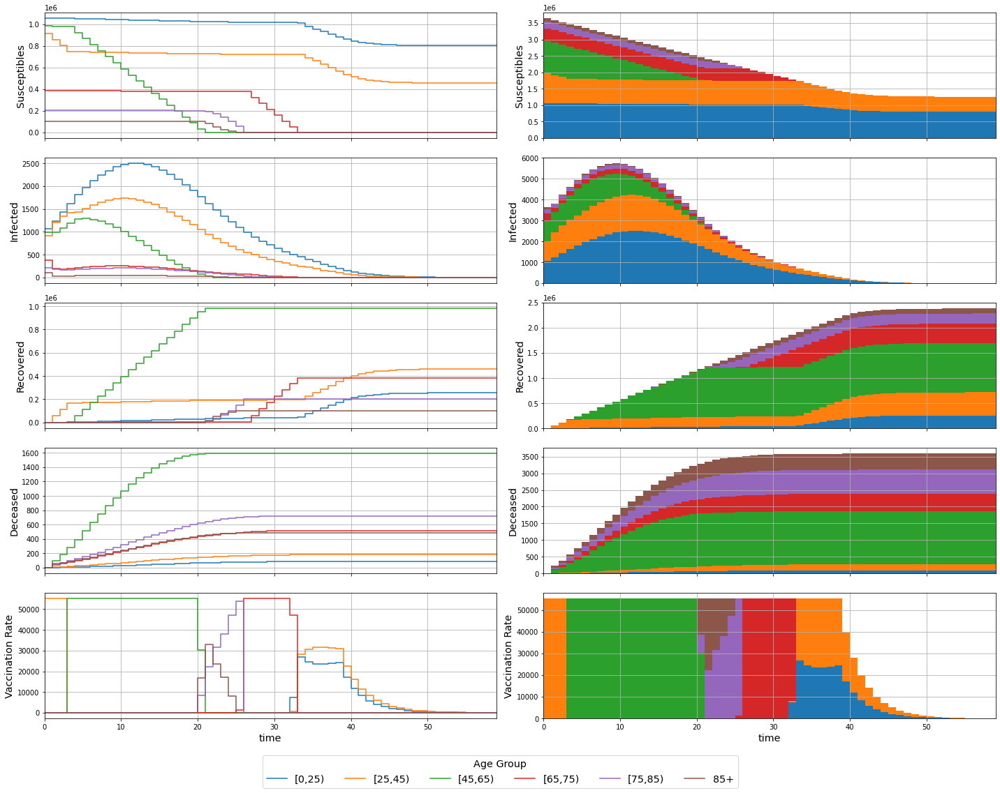

# MPC COVID-19

Modelling and simulation of a COVID-19 compartmental system.

## Modelling

### Variables

| Variable       | Description                                 |
|:--------------:|:-------------------------------------------:|
| $P_k$          | Total individuals in age group $k$          |
| $S_k$          | Susceptible individuals from age group $k$  |
| $I_k$          | Infected individuals from age group $k$     |
| $R_k$          | Recovered individuals from age group $k$    |
| $D_k$          | Deceased individuals from age group $k$     |
| $U_k$          | Vaccination rate for age group $k$          |
| $\lambda_k$    | Infection rate for age group $k$            |
| $C_{j,k}$      | Contact rate between age groups $j$ and $k$ |
| $\gamma_{R,k}$ | Recovery rate for age group $k$             |
| $\gamma_{D,k}$ | Decease rate for age group $k$              |
| $n_a$          | Number of age groups                        |
| $\Delta_t$     | Sampling Period                             |

### Continous Model

$$
\left\{\begin{aligned}
\frac{d S_k(t)}{dt} &= -\lambda_k \cdot S_k(t) \cdot \sum_{j=1}^{n_a} C_{j,k} \cdot I_j(t) - U_k(t)
\\
\frac{d I_k(t)}{dt} &= \lambda_k \cdot S_k(t) \cdot \sum_{j=1}^{n_a} C_{k,j} \cdot I_j(t) - (\gamma_{R,k} + \gamma_{D,k}) \cdot I_k(t)
\\
\frac{d R_k(t)}{dt} &= \gamma_{R,k} \cdot I_k(t) + U_k(t)
\\
\frac{d D_k(t)}{dt} &= \gamma_{D,k} \cdot I_k(t)
\end{aligned}\right.
, k = 1, \dotsc, n_a
$$

### Discrete Model

$$
\left\{\begin{aligned}
S_k(n+1) &= S_k(n) + \Delta_t \cdot \left( -\lambda_k \cdot S_k(n) \cdot \sum_{j=1}^{n_a} C_{j,k} \cdot I_j(n) - U_k(n) \right)
\\
I_k(n+1) &= I_k(n) + \Delta_t \cdot \left( \lambda_k \cdot S_k(n) \cdot \sum_{j=1}^{n_a} C_{k,j} \cdot I_j(n) - (\gamma_{R,k} + \gamma_{D,k}) \cdot I_k(n) \right)
\\
R_k(n+1) &= R_k(n) + \Delta_t \cdot \left( \gamma_{R,k} \cdot I_k(n) + U_k(n) \right)
\\
D_k(n+1) &= D_k(n) + \Delta_t \cdot \left( \gamma_{D,k} \cdot I_k(n) \right)
\end{aligned}\right.
, k = 1, \dotsc, n_a
$$
Considering $\Delta_t = 1$
$$
\left\{\begin{aligned}
S_k(n+1) &= S_k(n) - \lambda_k \cdot S_k(n) \cdot \sum_{j=1}^{n_a} C_{j,k} \cdot I_j(n) - U_k(n)
\\
I_k(n+1) &= I_k(n) + \lambda_k \cdot S_k(n) \, \sum_{j=1}^{n_a} C_{k,j} \cdot I_j(n) - (\gamma_{R,k} + \gamma_{D,k}) \cdot I_k(n)
\\
R_k(n+1) &= R_k(n) + \gamma_{R,k} \cdot I_k(n) + U_k(n)
\\
D_k(n+1) &= D_k(n) + \gamma_{D,k} \cdot I_k(n)
\end{aligned}\right.
, k = 1, \dotsc, n_a
$$

## Pre-Simulation

### Definitions


```python
import numpy as np
from helpers import *

P, S_0, I_0, R_0, D_0, l, C, g_R, g_D, u_max = definitions()
y_0 = wrap(S_0, I_0, R_0, D_0)
n_a = len(P)

t_span = [0, 80]

print(f'Population Total: {sum(P):.0f}')
```

    Population Total: 3645243


## Continous Simulation


```python
def system_continuous(t, y, u, u_max, l, C, g_R, g_D):
  S, I, R, D = unwrap(y)
  dSdt = - l * S * (C @ I) - u(t, y, u_max)
  dIdt = l * S * (C @ I) - (g_R + g_D) * I
  dRdt = g_R * I + u(t, y, u_max)
  dDdt = g_D * I
  return wrap(dSdt, dIdt, dRdt, dDdt)
```

### No Vaccination


```python
from scipy.integrate import solve_ivp

def control(t, y, max):
  return np.zeros(n_a)

sol = solve_ivp(system_continuous, t_span, y_0, args=(control, u_max, l, C, g_R, g_D))
assert(sol.success)

t = sol.t
y = sol.y
S, I, R, D = unwrap(y)
u = recover_control(t, y, control, u_max)

plot(t, y, u)
print(f'Deceased Total: {sum(D[:,-1]):.0f}')
```


    Deceased Total: 46089


### Vaccination of Older Groups with Exclusivity


```python
from scipy.integrate import solve_ivp

def control(t, y, u_max):
  S, I, R, D = unwrap(y)
  u = np.zeros(n_a)
  for i in reversed(range(n_a)):
    if S[i] > 0:
      u[i] = u_max
      break
  return u

sol = solve_ivp(system_continuous, t_span, y_0, args=(control, u_max, l, C, g_R, g_D))
assert(sol.success)

t = sol.t
y = sol.y
S, I, R, D = unwrap(y)
u = recover_control(t, y, control, u_max)

plot(t, y, u)
print(f'Deceased Total: {sum(D[:,-1]):.0f}')
```


    Deceased Total: 7633


### Vaccination of Older Groups with Intersection


```python
from scipy.integrate import solve_ivp

def control(t, y, u_max):
  S, I, R, D = unwrap(y)
  u = np.zeros(n_a)
  remaining = u_max
  for i in reversed(range(n_a)):
    u[i] = min([S[i], remaining])
    remaining = remaining - u[i]
  return u

sol = solve_ivp(system_continuous, t_span, y_0, args=(control, u_max, l, C, g_R, g_D))
assert(sol.success)

t = sol.t
y = sol.y
S, I, R, D = unwrap(y)
u = recover_control(t, y, control, u_max)

plot(t, y, u)
print(f'Deceased Total: {sum(D[:,-1]):.0f}')
```


    Deceased Total: 7616


## Discrete Simulation


```python
def system_discrete(t, y, u, u_max, l, C, g_R, g_D):
  S, I, R, D = unwrap(y)
  S_ = S - l * S * (C @ I) - u(t, y, u_max)
  I_ = I + l * S * (C @ I) - (g_R + g_D) * I
  R_ = R + g_R * I + u(t, y, u_max)
  D_ = D + g_D * I
  return wrap(S_, I_, R_, D_)
```

### No Vaccination


```python
def control(t, y, u_max):
  return np.zeros(n_a)

t, y = solve_ivp_discrete(system_discrete, t_span, y_0, args=(control, u_max, l, C, g_R, g_D))

S, I, R, D = unwrap(y)
u = recover_control(t, y, control, u_max)

plot(t, y, u, discrete=True)
print(f'Deceased Total: {sum(D[:,-1]):.0f}')
```


    Deceased Total: 47115


### Vaccination of Older Groups


```python
def control(t, y, u_max):
  S, I, R, D = unwrap(y)
  u = np.zeros(n_a)
  remaining = u_max
  for i in reversed(range(n_a)):
    u[i] = min([S[i], remaining])
    remaining = remaining - u[i]
  return u

t, y = solve_ivp_discrete(system_discrete, t_span, y_0, args=(control, u_max, l, C, g_R, g_D))

S, I, R, D = unwrap(y)
u = recover_control(t, y, control, u_max)

plot(t, y, u, discrete=True)
print(f'Deceased Total: {sum(D[:,-1]):.0f}')
```


    Deceased Total: 7593


## MPC

### Definitions


```python
import numpy as np
import casadi
from helpers import *

P, S_0, I_0, R_0, D_0, l, C, g_R, g_D, u_max = definitions()
X_0 = wrap(S_0, I_0, R_0, D_0)
n_a = len(P)

S = casadi.MX.sym('S', n_a)
I = casadi.MX.sym('I', n_a)
R = casadi.MX.sym('R', n_a)
D = casadi.MX.sym('D', n_a)
U = casadi.MX.sym('U', n_a)
X = wrap(S, I, R, D)

def system_discrete(X, U):
  S, I, R, D = unwrap(X)
  S_ = S - l * S * (C @ I) - U
  I_ = I + l * S * (C @ I) - (g_R + g_D) * I
  R_ = R + g_R * I + U
  D_ = D + g_D * I
  return wrap(S_, I_, R_, D_)

f = casadi.Function('f',[X, U],[system_discrete(X, U)],['X', 'U'],['X+'])
print(f)
```

    f:(X[24],U[6])->(X+[24]) MXFunction


### Optimization


```python
opti = casadi.Opti()

N = 60 # prediction horizon

s = opti.variable(n_a, N + 1)
i = opti.variable(n_a, N + 1)
r = opti.variable(n_a, N + 1)
d = opti.variable(n_a, N + 1)
u = opti.variable(n_a, N)
x = wrap(s, i, r, d)

s_0 = opti.parameter(n_a,1)
i_0 = opti.parameter(n_a,1)
r_0 = opti.parameter(n_a,1)
d_0 = opti.parameter(n_a,1)
x_0 = wrap(s_0, i_0, r_0, d_0)

opti.minimize(0.1*casadi.sumsqr(i) + 0.9*casadi.sumsqr(d) + 1e-6*casadi.sumsqr(u))

opti.subject_to(x[:,0] == x_0) # initial conditions
for k in range(N):
  opti.subject_to(x[:,k + 1] == f(x[:,k], u[:,k])) # dynamics
  opti.subject_to(u[:,k] <= s[:,k]) # dynamic control bound
opti.subject_to(opti.bounded(0,u,u_max)) # individual control bounds
opti.subject_to(opti.bounded(0,casadi.sum1(u),u_max)) # joint control bounds

opti.set_value(x_0, X_0)

opti.solver('ipopt', {}, {
  'print_level': 0,
})

sol = opti.solve()

t_grid = range(N + 1)
x_grid = sol.value(x)
u_grid = np.hstack((sol.value(u), np.nan*np.ones((n_a,1))))
plot(t_grid, x_grid, u_grid, discrete=True)

print(f'Deceased Total: {sum(x_grid[3*n_a:4*n_a,-1]):.0f}')
```

          solver  :   t_proc      (avg)   t_wall      (avg)    n_eval
           nlp_f  |   1.00ms (  1.83us)   2.34ms (  4.27us)       547
           nlp_g  |  43.00ms ( 78.61us)  52.05ms ( 95.15us)       547
      nlp_grad_f  |   4.00ms (  7.37us)   5.23ms (  9.63us)       543
      nlp_hess_l  | 419.00ms (775.93us) 419.63ms (777.10us)       540
       nlp_jac_g  | 547.00ms (  1.01ms) 543.39ms (998.88us)       544
           total  |   7.93 s (  7.93 s)   7.93 s (  7.93 s)         1


    Deceased Total: 3591


### MPC


```python
O = opti.to_function('M',[x_0],[u[:,0]],['x_0'],['u'])
print(O)

M = 1 # control horizon

x_ = X_0
x_log = np.empty((0, x_0.shape[0]))
u_log = np.empty((0, u.shape[0]))
for i in range(N):
  if i % M == 0:
    u_ = np.array(O(x_))[:,0]

  x_log = np.vstack((x_log, x_))
  u_log = np.vstack((u_log, u_))

  x_ = np.array(f(x_,u_))[:,0]

t_log = range(N)
x_log = x_log.T
u_log = u_log.T
plot(t_log, x_log, u_log, discrete=True)

print(f'Deceased Total: {sum(x_log[3*n_a:4*n_a,-1]):.0f}')
```

    M:(x_0[24])->(u[6]) MXFunction
          solver  :   t_proc      (avg)   t_wall      (avg)    n_eval
           nlp_f  |   6.00ms ( 10.97us)   2.42ms (  4.43us)       547
           nlp_g  |  42.00ms ( 76.78us)  52.87ms ( 96.65us)       547
      nlp_grad_f  |   9.00ms ( 16.57us)   5.15ms (  9.48us)       543
      nlp_hess_l  | 423.00ms (783.33us) 406.51ms (752.81us)       540
       nlp_jac_g  | 544.00ms (  1.00ms) 537.58ms (988.19us)       544
           total  |   8.04 s (  8.04 s)   8.04 s (  8.04 s)         1
          solver  :   t_proc      (avg)   t_wall      (avg)    n_eval
           nlp_f  |   7.00ms (  6.64us)   4.56ms (  4.33us)      1054
           nlp_g  |  89.00ms ( 84.44us) 101.62ms ( 96.41us)      1054
        nlp_grad  |        0 (       0) 227.00us (227.00us)         1
      nlp_grad_f  |  12.00ms ( 11.47us)   9.96ms (  9.52us)      1046
      nlp_hess_l  | 806.00ms (774.26us) 775.76ms (745.21us)      1041
       nlp_jac_g  |   1.06 s (  1.01ms)   1.04 s (991.77us)      1049
           total  |   7.30 s (  7.30 s)   7.30 s (  7.30 s)         1
          solver  :   t_proc      (avg)   t_wall      (avg)    n_eval
           nlp_f  |   8.00ms (  5.28us)   6.56ms (  4.33us)      1515
           nlp_g  | 127.00ms ( 83.83us) 147.84ms ( 97.58us)      1515
        nlp_grad  |        0 (       0) 384.00us (192.00us)         2
      nlp_grad_f  |  18.00ms ( 11.94us)  14.60ms (  9.68us)      1508
      nlp_hess_l  |   1.15 s (765.49us)   1.12 s (746.05us)      1501
       nlp_jac_g  |   1.53 s (  1.01ms)   1.50 s (994.96us)      1511
           total  |   6.83 s (  6.83 s)   6.84 s (  6.84 s)         1
          solver  :   t_proc      (avg)   t_wall      (avg)    n_eval
           nlp_f  |   9.00ms (  4.65us)   8.41ms (  4.35us)      1934
           nlp_g  | 179.00ms ( 92.55us) 187.67ms ( 97.04us)      1934
        nlp_grad  |        0 (       0) 586.00us (195.33us)         3
      nlp_grad_f  |  23.00ms ( 11.94us)  18.62ms (  9.67us)      1926
      nlp_hess_l  |   1.48 s (771.52us)   1.43 s (745.87us)      1917
       nlp_jac_g  |   1.93 s (  1.00ms)   1.91 s (989.91us)      1929
           total  |   6.12 s (  6.12 s)   6.12 s (  6.12 s)         1
          solver  :   t_proc      (avg)   t_wall      (avg)    n_eval
           nlp_f  |  11.00ms (  4.66us)  10.26ms (  4.35us)      2361
           nlp_g  | 212.00ms ( 89.79us) 228.25ms ( 96.68us)      2361
        nlp_grad  |        0 (       0) 739.00us (184.75us)         4
      nlp_grad_f  |  26.00ms ( 11.05us)  22.69ms (  9.64us)      2354
      nlp_hess_l  |   1.79 s (763.55us)   1.74 s (742.21us)      2343
       nlp_jac_g  |   2.35 s (995.33us)   2.32 s (984.58us)      2357
           total  |   6.21 s (  6.21 s)   6.21 s (  6.21 s)         1
          solver  :   t_proc      (avg)   t_wall      (avg)    n_eval
           nlp_f  |  11.00ms (  3.88us)  12.41ms (  4.37us)      2838
           nlp_g  | 253.00ms ( 89.15us) 274.44ms ( 96.70us)      2838
        nlp_grad  |        0 (       0) 940.00us (188.00us)         5
      nlp_grad_f  |  33.00ms ( 11.73us)  27.19ms (  9.67us)      2813
      nlp_hess_l  |   2.13 s (760.24us)   2.09 s (744.10us)      2807
       nlp_jac_g  |   2.82 s (996.11us)   2.80 s (991.15us)      2827
           total  |   6.98 s (  6.98 s)   6.98 s (  6.98 s)         1
          solver  :   t_proc      (avg)   t_wall      (avg)    n_eval
           nlp_f  |  11.00ms (  3.39us)  14.88ms (  4.58us)      3248
           nlp_g  | 314.00ms ( 96.67us) 333.77ms (102.76us)      3248
        nlp_grad  |   1.00ms (166.67us)   1.12ms (187.33us)         6
      nlp_grad_f  |  42.00ms ( 13.05us)  32.93ms ( 10.23us)      3219
      nlp_hess_l  |   2.62 s (815.32us)   2.57 s (798.89us)      3211
       nlp_jac_g  |   3.42 s (  1.06ms)   3.42 s (  1.06ms)      3235
           total  |   9.27 s (  9.27 s)   9.26 s (  9.26 s)         1
          solver  :   t_proc      (avg)   t_wall      (avg)    n_eval
           nlp_f  |  14.00ms (  3.83us)  17.65ms (  4.83us)      3652
           nlp_g  | 384.00ms (105.15us) 400.48ms (109.66us)      3652
        nlp_grad  |   1.00ms (142.86us)   1.51ms (216.43us)         7
      nlp_grad_f  |  48.00ms ( 13.25us)  39.64ms ( 10.94us)      3624
      nlp_hess_l  |   3.17 s (877.42us)   3.12 s (861.99us)      3614
       nlp_jac_g  |   4.16 s (  1.14ms)   4.16 s (  1.14ms)      3640
           total  |  11.03 s ( 11.03 s)  11.03 s ( 11.03 s)         1
          solver  :   t_proc      (avg)   t_wall      (avg)    n_eval
           nlp_f  |  16.00ms (  3.97us)  20.15ms (  5.00us)      4034
           nlp_g  | 441.00ms (109.32us) 461.51ms (114.41us)      4034
        nlp_grad  |   1.00ms (125.00us)   1.70ms (212.12us)         8
      nlp_grad_f  |  60.00ms ( 14.98us)  45.81ms ( 11.44us)      4006
      nlp_hess_l  |   3.71 s (928.89us)   3.64 s (910.99us)      3994
       nlp_jac_g  |   4.83 s (  1.20ms)   4.84 s (  1.20ms)      4022
           total  |  10.15 s ( 10.15 s)  10.15 s ( 10.15 s)         1
          solver  :   t_proc      (avg)   t_wall      (avg)    n_eval
           nlp_f  |  18.00ms (  4.10us)  22.44ms (  5.12us)      4387
           nlp_g  | 469.00ms (106.91us) 517.41ms (117.94us)      4387
        nlp_grad  |   1.00ms (111.11us)   1.96ms (217.67us)         9
      nlp_grad_f  |  71.00ms ( 16.28us)  51.26ms ( 11.76us)      4360
      nlp_hess_l  |   4.18 s (961.80us)   4.10 s (943.19us)      4346
       nlp_jac_g  |   5.47 s (  1.25ms)   5.46 s (  1.25ms)      4376
           total  |   8.91 s (  8.91 s)   8.91 s (  8.91 s)         1
          solver  :   t_proc      (avg)   t_wall      (avg)    n_eval
           nlp_f  |  18.00ms (  3.79us)  25.06ms (  5.28us)      4746
           nlp_g  | 503.00ms (105.98us) 575.32ms (121.22us)      4746
        nlp_grad  |   1.00ms (100.00us)   2.43ms (243.50us)        10
      nlp_grad_f  |  71.00ms ( 15.04us)  57.05ms ( 12.09us)      4720
      nlp_hess_l  |   4.74 s (  1.01ms)   4.60 s (977.03us)      4704
       nlp_jac_g  |   6.13 s (  1.29ms)   6.11 s (  1.29ms)      4736
           total  |   9.70 s (  9.70 s)   9.69 s (  9.69 s)         1
          solver  :   t_proc      (avg)   t_wall      (avg)    n_eval
           nlp_f  |  19.00ms (  3.73us)  26.67ms (  5.24us)      5094
           nlp_g  | 537.00ms (105.42us) 612.30ms (120.20us)      5094
        nlp_grad  |   1.00ms ( 90.91us)   2.89ms (263.09us)        11
      nlp_grad_f  |  78.00ms ( 15.39us)  60.91ms ( 12.02us)      5069
      nlp_hess_l  |   5.01 s (991.09us)   4.90 s (969.65us)      5051
       nlp_jac_g  |   6.56 s (  1.29ms)   6.51 s (  1.28ms)      5085
           total  |   6.06 s (  6.06 s)   6.06 s (  6.06 s)         1
          solver  :   t_proc      (avg)   t_wall      (avg)    n_eval
           nlp_f  |  20.00ms (  3.69us)  28.01ms (  5.17us)      5414
           nlp_g  | 568.00ms (104.91us) 643.47ms (118.85us)      5414
        nlp_grad  |   1.00ms ( 83.33us)   3.11ms (259.58us)        12
      nlp_grad_f  |  84.00ms ( 15.58us)  64.06ms ( 11.88us)      5390
      nlp_hess_l  |   5.25 s (976.91us)   5.13 s (956.12us)      5370
       nlp_jac_g  |   6.87 s (  1.27ms)   6.82 s (  1.26ms)      5406
           total  |   4.79 s (  4.79 s)   4.79 s (  4.79 s)         1
          solver  :   t_proc      (avg)   t_wall      (avg)    n_eval
           nlp_f  |  23.00ms (  4.02us)  29.72ms (  5.19us)      5724
           nlp_g  | 610.00ms (106.57us) 679.03ms (118.63us)      5724
        nlp_grad  |   1.00ms ( 76.92us)   3.26ms (251.15us)        13
      nlp_grad_f  |  87.00ms ( 15.26us)  67.54ms ( 11.85us)      5701
      nlp_hess_l  |   5.50 s (967.95us)   5.39 s (949.94us)      5679
       nlp_jac_g  |   7.22 s (  1.26ms)   7.17 s (  1.25ms)      5717
           total  |   5.07 s (  5.07 s)   5.07 s (  5.07 s)         1
          solver  :   t_proc      (avg)   t_wall      (avg)    n_eval
           nlp_f  |  23.00ms (  3.82us)  31.72ms (  5.27us)      6023
           nlp_g  | 664.00ms (110.24us) 728.35ms (120.93us)      6023
        nlp_grad  |   1.00ms ( 71.43us)   3.50ms (249.79us)        14
      nlp_grad_f  |  88.00ms ( 14.68us)  72.27ms ( 12.06us)      5995
      nlp_hess_l  |   5.90 s (988.11us)   5.81 s (972.78us)      5970
       nlp_jac_g  |   7.66 s (  1.27ms)   7.71 s (  1.28ms)      6012
           total  |   7.89 s (  7.89 s)   7.90 s (  7.90 s)         1
          solver  :   t_proc      (avg)   t_wall      (avg)    n_eval
           nlp_f  |  23.00ms (  3.64us)  33.72ms (  5.34us)      6313
           nlp_g  | 714.00ms (113.10us) 775.94ms (122.91us)      6313
        nlp_grad  |   1.00ms ( 66.67us)   3.95ms (263.67us)        15
      nlp_grad_f  |  97.00ms ( 15.43us)  77.09ms ( 12.26us)      6286
      nlp_hess_l  |   6.38 s (  1.02ms)   6.20 s (990.58us)      6259
       nlp_jac_g  |   8.12 s (  1.29ms)   8.22 s (  1.30ms)      6303
           total  |   7.66 s (  7.66 s)   7.66 s (  7.66 s)         1
          solver  :   t_proc      (avg)   t_wall      (avg)    n_eval
           nlp_f  |  26.00ms (  3.94us)  35.87ms (  5.44us)      6591
           nlp_g  | 739.00ms (112.12us) 820.16ms (124.44us)      6591
        nlp_grad  |   1.00ms ( 62.50us)   4.43ms (277.06us)        16
      nlp_grad_f  | 100.00ms ( 15.23us)  81.56ms ( 12.42us)      6565
      nlp_hess_l  |   6.74 s (  1.03ms)   6.56 s (  1.00ms)      6536
       nlp_jac_g  |   8.64 s (  1.31ms)   8.70 s (  1.32ms)      6582
           total  |   6.93 s (  6.93 s)   6.93 s (  6.93 s)         1
          solver  :   t_proc      (avg)   t_wall      (avg)    n_eval
           nlp_f  |  27.00ms (  3.94us)  37.72ms (  5.50us)      6858
           nlp_g  | 777.00ms (113.30us) 863.38ms (125.89us)      6858
        nlp_grad  |   1.00ms ( 58.82us)   4.89ms (287.53us)        17
      nlp_grad_f  | 107.00ms ( 15.66us)  85.89ms ( 12.57us)      6833
      nlp_hess_l  |   7.06 s (  1.04ms)   6.92 s (  1.02ms)      6802
       nlp_jac_g  |   9.09 s (  1.33ms)   9.17 s (  1.34ms)      6850
           total  |   6.88 s (  6.88 s)   6.88 s (  6.88 s)         1
          solver  :   t_proc      (avg)   t_wall      (avg)    n_eval
           nlp_f  |  27.00ms (  3.80us)  39.28ms (  5.52us)      7113
           nlp_g  | 817.00ms (114.86us) 902.48ms (126.88us)      7113
        nlp_grad  |   1.00ms ( 55.56us)   5.10ms (283.28us)        18
      nlp_grad_f  | 107.00ms ( 15.09us)  89.70ms ( 12.65us)      7089
      nlp_hess_l  |   7.40 s (  1.05ms)   7.25 s (  1.03ms)      7056
       nlp_jac_g  |   9.49 s (  1.34ms)   9.60 s (  1.35ms)      7106
           total  |   6.22 s (  6.22 s)   6.22 s (  6.22 s)         1
          solver  :   t_proc      (avg)   t_wall      (avg)    n_eval
           nlp_f  |  29.00ms (  3.94us)  40.83ms (  5.55us)      7358
           nlp_g  | 856.00ms (116.34us) 941.20ms (127.92us)      7358
        nlp_grad  |   2.00ms (105.26us)   5.82ms (306.58us)        19
      nlp_grad_f  | 113.00ms ( 15.41us)  93.68ms ( 12.77us)      7335
      nlp_hess_l  |   7.74 s (  1.06ms)   7.58 s (  1.04ms)      7300
       nlp_jac_g  |   9.90 s (  1.35ms)  10.01 s (  1.36ms)      7352
           total  |   6.05 s (  6.05 s)   6.05 s (  6.05 s)         1
          solver  :   t_proc      (avg)   t_wall      (avg)    n_eval
           nlp_f  |  32.00ms (  4.21us)  42.38ms (  5.58us)      7594
           nlp_g  | 890.00ms (117.20us) 976.88ms (128.64us)      7594
        nlp_grad  |   2.00ms (100.00us)   6.17ms (308.65us)        20
      nlp_grad_f  | 123.00ms ( 16.25us)  97.22ms ( 12.84us)      7570
      nlp_hess_l  |   8.06 s (  1.07ms)   7.88 s (  1.05ms)      7533
       nlp_jac_g  |  10.31 s (  1.36ms)  10.41 s (  1.37ms)      7587
           total  |   5.78 s (  5.78 s)   5.79 s (  5.79 s)         1
          solver  :   t_proc      (avg)   t_wall      (avg)    n_eval
           nlp_f  |  32.00ms (  3.95us)  45.13ms (  5.58us)      8094
           nlp_g  | 995.00ms (122.93us)   1.05 s (129.51us)      8094
        nlp_grad  |   2.00ms ( 95.24us)   6.32ms (301.14us)        21
      nlp_grad_f  | 134.00ms ( 16.90us) 102.72ms ( 12.96us)      7927
      nlp_hess_l  |   8.49 s (  1.08ms)   8.35 s (  1.06ms)      7888
       nlp_jac_g  |  10.93 s (  1.38ms)  11.01 s (  1.39ms)      7944
           total  |  11.98 s ( 11.98 s)  11.98 s ( 11.98 s)         1
          solver  :   t_proc      (avg)   t_wall      (avg)    n_eval
           nlp_f  |  35.00ms (  3.87us)  48.37ms (  5.35us)      9033
           nlp_g  |   1.06 s (117.90us)   1.13 s (124.65us)      9033
        nlp_grad  |   2.00ms ( 90.91us)   6.50ms (295.59us)        22
      nlp_grad_f  | 139.00ms ( 16.56us) 107.34ms ( 12.79us)      8394
      nlp_hess_l  |   8.85 s (  1.06ms)   8.71 s (  1.04ms)      8353
       nlp_jac_g  |  11.42 s (  1.36ms)  11.49 s (  1.37ms)      8411
           total  |  10.93 s ( 10.93 s)  10.93 s ( 10.93 s)         1
          solver  :   t_proc      (avg)   t_wall      (avg)    n_eval
           nlp_f  |  37.00ms (  3.98us)  49.50ms (  5.33us)      9292
           nlp_g  |   1.09 s (117.63us)   1.15 s (123.99us)      9292
        nlp_grad  |   2.00ms ( 86.96us)   6.66ms (289.57us)        23
      nlp_grad_f  | 144.00ms ( 16.64us) 109.88ms ( 12.70us)      8654
      nlp_hess_l  |   9.05 s (  1.05ms)   8.91 s (  1.03ms)      8611
       nlp_jac_g  |  11.67 s (  1.35ms)  11.75 s (  1.36ms)      8671
           total  |   4.36 s (  4.36 s)   4.36 s (  4.36 s)         1
          solver  :   t_proc      (avg)   t_wall      (avg)    n_eval
           nlp_f  |  41.00ms (  4.16us)  51.59ms (  5.23us)      9857
           nlp_g  |   1.15 s (116.67us)   1.20 s (121.93us)      9857
        nlp_grad  |   2.00ms ( 83.33us)   6.80ms (283.46us)        24
      nlp_grad_f  | 146.00ms ( 16.32us) 112.85ms ( 12.61us)      8948
      nlp_hess_l  |   9.34 s (  1.04ms)   9.19 s (  1.02ms)      8983
       nlp_jac_g  |  12.04 s (  1.33ms)  12.14 s (  1.34ms)      9051
           total  |   7.52 s (  7.52 s)   7.52 s (  7.52 s)         1
          solver  :   t_proc      (avg)   t_wall      (avg)    n_eval
           nlp_f  |  41.00ms (  4.04us)  52.68ms (  5.20us)     10136
           nlp_g  |   1.18 s (116.32us)   1.23 s (121.18us)     10136
        nlp_grad  |   2.00ms ( 80.00us)   7.02ms (280.64us)        25
      nlp_grad_f  | 150.00ms ( 16.32us) 115.51ms ( 12.57us)      9192
      nlp_hess_l  |   9.52 s (  1.03ms)   9.39 s (  1.02ms)      9225
       nlp_jac_g  |  12.30 s (  1.32ms)  12.40 s (  1.33ms)      9295
           total  |   4.43 s (  4.43 s)   4.43 s (  4.43 s)         1
          solver  :   t_proc      (avg)   t_wall      (avg)    n_eval
           nlp_f  |  42.00ms (  4.01us)  53.87ms (  5.15us)     10465
           nlp_g  |   1.21 s (116.01us)   1.26 s (120.08us)     10465
        nlp_grad  |   2.00ms ( 76.92us)   7.19ms (276.54us)        26
      nlp_grad_f  | 153.00ms ( 16.21us) 117.99ms ( 12.50us)      9436
      nlp_hess_l  |   9.71 s (  1.03ms)   9.57 s (  1.01ms)      9467
       nlp_jac_g  |  12.53 s (  1.31ms)  12.64 s (  1.32ms)      9539
           total  |   4.65 s (  4.65 s)   4.65 s (  4.65 s)         1
          solver  :   t_proc      (avg)   t_wall      (avg)    n_eval
           nlp_f  |  45.00ms (  4.19us)  54.96ms (  5.12us)     10739
           nlp_g  |   1.24 s (115.75us)   1.28 s (119.47us)     10739
        nlp_grad  |   2.00ms ( 74.07us)   7.33ms (271.48us)        27
      nlp_grad_f  | 160.00ms ( 16.53us) 120.37ms ( 12.44us)      9678
      nlp_hess_l  |   9.89 s (  1.02ms)   9.75 s (  1.00ms)      9707
       nlp_jac_g  |  12.76 s (  1.30ms)  12.88 s (  1.32ms)      9781
           total  |   4.66 s (  4.66 s)   4.66 s (  4.66 s)         1
          solver  :   t_proc      (avg)   t_wall      (avg)    n_eval
           nlp_f  |  45.00ms (  4.11us)  55.92ms (  5.11us)     10946
           nlp_g  |   1.26 s (115.48us)   1.30 s (119.10us)     10946
        nlp_grad  |   2.00ms ( 71.43us)   7.53ms (268.86us)        28
      nlp_grad_f  | 162.00ms ( 16.40us) 122.36ms ( 12.38us)      9881
      nlp_hess_l  |  10.04 s (  1.01ms)   9.90 s (999.33us)      9908
       nlp_jac_g  |  12.95 s (  1.30ms)  13.08 s (  1.31ms)      9984
           total  |   3.65 s (  3.65 s)   3.65 s (  3.65 s)         1
          solver  :   t_proc      (avg)   t_wall      (avg)    n_eval
           nlp_f  |  46.00ms (  4.12us)  56.87ms (  5.09us)     11175
           nlp_g  |   1.28 s (114.72us)   1.33 s (118.58us)     11175
        nlp_grad  |   2.00ms ( 68.97us)   7.68ms (264.79us)        29
      nlp_grad_f  | 163.00ms ( 16.15us) 124.43ms ( 12.33us)     10092
      nlp_hess_l  |  10.19 s (  1.01ms)  10.05 s (993.74us)     10117
       nlp_jac_g  |  13.15 s (  1.29ms)  13.28 s (  1.30ms)     10195
           total  |   3.91 s (  3.91 s)   3.91 s (  3.91 s)         1
          solver  :   t_proc      (avg)   t_wall      (avg)    n_eval
           nlp_f  |  48.00ms (  4.17us)  58.35ms (  5.06us)     11523
           nlp_g  |   1.30 s (112.99us)   1.36 s (117.71us)     11523
        nlp_grad  |   2.00ms ( 66.67us)   7.86ms (261.90us)        30
      nlp_grad_f  | 164.00ms ( 15.87us) 126.76ms ( 12.27us)     10332
      nlp_hess_l  |  10.40 s (  1.00ms)  10.26 s (987.18us)     10393
       nlp_jac_g  |  13.45 s (  1.28ms)  13.58 s (  1.30ms)     10477
           total  |   5.43 s (  5.43 s)   5.43 s (  5.43 s)         1
          solver  :   t_proc      (avg)   t_wall      (avg)    n_eval
           nlp_f  |  48.00ms (  4.08us)  59.33ms (  5.04us)     11767
           nlp_g  |   1.32 s (112.35us)   1.38 s (117.13us)     11767
        nlp_grad  |   3.00ms ( 96.77us)   8.07ms (260.19us)        31
      nlp_grad_f  | 165.00ms ( 15.73us) 128.43ms ( 12.24us)     10492
      nlp_hess_l  |  10.54 s (996.88us)  10.40 s (983.82us)     10572
       nlp_jac_g  |  13.64 s (  1.28ms)  13.77 s (  1.29ms)     10662
           total  |   3.46 s (  3.46 s)   3.46 s (  3.46 s)         1
          solver  :   t_proc      (avg)   t_wall      (avg)    n_eval
           nlp_f  |  51.00ms (  4.22us)  60.56ms (  5.01us)     12094
           nlp_g  |   1.36 s (112.20us)   1.41 s (116.33us)     12094
        nlp_grad  |   3.00ms ( 93.75us)   8.33ms (260.44us)        32
      nlp_grad_f  | 167.00ms ( 15.59us) 130.72ms ( 12.20us)     10711
      nlp_hess_l  |  10.74 s (995.55us)  10.60 s (982.75us)     10789
       nlp_jac_g  |  13.84 s (  1.27ms)  13.98 s (  1.28ms)     10881
           total  |   4.67 s (  4.67 s)   4.68 s (  4.68 s)         1
          solver  :   t_proc      (avg)   t_wall      (avg)    n_eval
           nlp_f  |  52.00ms (  4.15us)  62.16ms (  4.96us)     12535
           nlp_g  |   1.40 s (111.37us)   1.45 s (115.30us)     12535
        nlp_grad  |   3.00ms ( 90.91us)   8.51ms (257.97us)        33
      nlp_grad_f  | 173.00ms ( 15.79us) 133.15ms ( 12.15us)     10957
      nlp_hess_l  |  10.93 s (990.66us)  10.79 s (978.41us)     11032
       nlp_jac_g  |  14.11 s (  1.27ms)  14.24 s (  1.28ms)     11128
           total  |   5.64 s (  5.64 s)   5.64 s (  5.64 s)         1
          solver  :   t_proc      (avg)   t_wall      (avg)    n_eval
           nlp_f  |  53.00ms (  4.17us)  63.05ms (  4.96us)     12713
           nlp_g  |   1.41 s (111.30us)   1.46 s (115.23us)     12713
        nlp_grad  |   3.00ms ( 88.24us)   8.76ms (257.65us)        34
      nlp_grad_f  | 173.00ms ( 15.55us) 134.96ms ( 12.13us)     11128
      nlp_hess_l  |  11.07 s (988.66us)  10.93 s (976.20us)     11201
       nlp_jac_g  |  14.30 s (  1.27ms)  14.43 s (  1.28ms)     11299
           total  |   3.86 s (  3.86 s)   3.86 s (  3.86 s)         1
          solver  :   t_proc      (avg)   t_wall      (avg)    n_eval
           nlp_f  |  55.00ms (  4.16us)  64.80ms (  4.90us)     13224
           nlp_g  |   1.45 s (110.03us)   1.51 s (114.05us)     13224
        nlp_grad  |   4.00ms (114.29us)   9.11ms (260.40us)        35
      nlp_grad_f  | 178.00ms ( 15.63us) 137.58ms ( 12.08us)     11392
      nlp_hess_l  |  11.26 s (982.64us)  11.14 s (971.47us)     11463
       nlp_jac_g  |  14.57 s (  1.26ms)  14.70 s (  1.27ms)     11563
           total  |   6.65 s (  6.65 s)   6.65 s (  6.65 s)         1
          solver  :   t_proc      (avg)   t_wall      (avg)    n_eval
           nlp_f  |  58.00ms (  4.30us)  65.85ms (  4.88us)     13495
           nlp_g  |   1.48 s (109.45us)   1.53 s (113.38us)     13495
        nlp_grad  |   4.00ms (111.11us)   9.27ms (257.44us)        36
      nlp_grad_f  | 178.00ms ( 15.38us) 139.24ms ( 12.03us)     11572
      nlp_hess_l  |  11.40 s (979.30us)  11.27 s (967.75us)     11641
       nlp_jac_g  |  14.75 s (  1.26ms)  14.87 s (  1.27ms)     11743
           total  |   3.82 s (  3.82 s)   3.82 s (  3.82 s)         1
          solver  :   t_proc      (avg)   t_wall      (avg)    n_eval
           nlp_f  |  60.00ms (  4.39us)  66.60ms (  4.87us)     13664
           nlp_g  |   1.48 s (108.68us)   1.55 s (113.19us)     13664
        nlp_grad  |   4.00ms (108.11us)   9.45ms (255.30us)        37
      nlp_grad_f  | 181.00ms ( 15.42us) 141.00ms ( 12.01us)     11737
      nlp_hess_l  |  11.53 s (976.53us)  11.39 s (964.64us)     11803
       nlp_jac_g  |  14.91 s (  1.25ms)  15.03 s (  1.26ms)     11909
           total  |   3.20 s (  3.20 s)   3.20 s (  3.20 s)         1
          solver  :   t_proc      (avg)   t_wall      (avg)    n_eval
           nlp_f  |  62.00ms (  4.41us)  67.97ms (  4.84us)     14046
           nlp_g  |   1.52 s (107.93us)   1.58 s (112.35us)     14046
        nlp_grad  |   4.00ms (105.26us)   9.60ms (252.68us)        38
      nlp_grad_f  | 186.00ms ( 15.55us) 143.27ms ( 11.98us)     11963
      nlp_hess_l  |  11.68 s (971.48us)  11.55 s (960.58us)     12026
       nlp_jac_g  |  15.15 s (  1.25ms)  15.26 s (  1.26ms)     12138
           total  |   5.14 s (  5.14 s)   5.14 s (  5.14 s)         1
          solver  :   t_proc      (avg)   t_wall      (avg)    n_eval
           nlp_f  |  63.00ms (  4.38us)  69.06ms (  4.80us)     14394
           nlp_g  |   1.53 s (106.64us)   1.61 s (111.52us)     14394
        nlp_grad  |   4.00ms (102.56us)   9.78ms (250.85us)        39
      nlp_grad_f  | 187.00ms ( 15.39us) 145.01ms ( 11.94us)     12148
      nlp_hess_l  |  11.81 s (967.32us)  11.68 s (957.01us)     12208
       nlp_jac_g  |  15.33 s (  1.24ms)  15.44 s (  1.25ms)     12326
           total  |   4.18 s (  4.18 s)   4.18 s (  4.18 s)         1
          solver  :   t_proc      (avg)   t_wall      (avg)    n_eval
           nlp_f  |  65.00ms (  4.39us)  70.40ms (  4.76us)     14795
           nlp_g  |   1.56 s (105.31us)   1.64 s (110.59us)     14795
        nlp_grad  |   4.00ms (100.00us)   9.95ms (248.82us)        40
      nlp_grad_f  | 189.00ms ( 15.30us) 146.77ms ( 11.88us)     12351
      nlp_hess_l  |  11.96 s (963.90us)  11.83 s (953.19us)     12409
       nlp_jac_g  |  15.52 s (  1.24ms)  15.63 s (  1.25ms)     12529
           total  |   4.72 s (  4.72 s)   4.72 s (  4.72 s)         1
          solver  :   t_proc      (avg)   t_wall      (avg)    n_eval
           nlp_f  |  65.00ms (  4.33us)  71.26ms (  4.75us)     15013
           nlp_g  |   1.57 s (104.71us)   1.65 s (110.23us)     15013
        nlp_grad  |   4.00ms ( 97.56us)  10.10ms (246.46us)        41
      nlp_grad_f  | 190.00ms ( 15.19us) 148.31ms ( 11.85us)     12511
      nlp_hess_l  |  12.08 s (961.17us)  11.95 s (950.97us)     12567
       nlp_jac_g  |  15.67 s (  1.24ms)  15.79 s (  1.24ms)     12689
           total  |   3.39 s (  3.39 s)   3.39 s (  3.39 s)         1
          solver  :   t_proc      (avg)   t_wall      (avg)    n_eval
           nlp_f  |  65.00ms (  4.25us)  72.24ms (  4.73us)     15287
           nlp_g  |   1.59 s (103.88us)   1.68 s (109.70us)     15287
        nlp_grad  |   5.00ms (119.05us)  10.37ms (247.00us)        42
      nlp_grad_f  | 191.00ms ( 15.06us) 149.93ms ( 11.82us)     12682
      nlp_hess_l  |  12.21 s (959.01us)  12.08 s (948.18us)     12736
       nlp_jac_g  |  15.84 s (  1.23ms)  15.95 s (  1.24ms)     12862
           total  |   3.77 s (  3.77 s)   3.77 s (  3.77 s)         1
          solver  :   t_proc      (avg)   t_wall      (avg)    n_eval
           nlp_f  |  65.00ms (  4.18us)  73.30ms (  4.72us)     15545
           nlp_g  |   1.62 s (103.96us)   1.70 s (109.42us)     15545
        nlp_grad  |   5.00ms (116.28us)  10.56ms (245.53us)        43
      nlp_grad_f  | 192.00ms ( 14.95us) 151.67ms ( 11.81us)     12844
      nlp_hess_l  |  12.35 s (957.35us)  12.20 s (946.15us)     12896
       nlp_jac_g  |  16.01 s (  1.23ms)  16.12 s (  1.24ms)     13024
           total  |   3.84 s (  3.84 s)   3.84 s (  3.84 s)         1
          solver  :   t_proc      (avg)   t_wall      (avg)    n_eval
           nlp_f  |  68.00ms (  4.26us)  74.97ms (  4.70us)     15949
           nlp_g  |   1.66 s (103.96us)   1.74 s (108.85us)     15949
        nlp_grad  |   5.00ms (113.64us)  10.70ms (243.23us)        44
      nlp_grad_f  | 193.00ms ( 14.76us) 153.87ms ( 11.77us)     13078
      nlp_hess_l  |  12.53 s (954.37us)  12.38 s (942.66us)     13128
       nlp_jac_g  |  16.23 s (  1.22ms)  16.35 s (  1.23ms)     13259
           total  |   5.99 s (  5.99 s)   5.99 s (  5.99 s)         1
          solver  :   t_proc      (avg)   t_wall      (avg)    n_eval
           nlp_f  |  69.00ms (  4.26us)  75.96ms (  4.69us)     16201
           nlp_g  |   1.68 s (103.94us)   1.76 s (108.69us)     16201
        nlp_grad  |   5.00ms (111.11us)  10.92ms (242.71us)        45
      nlp_grad_f  | 193.00ms ( 14.55us) 155.76ms ( 11.74us)     13265
      nlp_hess_l  |  12.69 s (952.90us)  12.52 s (940.51us)     13313
       nlp_jac_g  |  16.42 s (  1.22ms)  16.55 s (  1.23ms)     13448
           total  |   4.44 s (  4.44 s)   4.44 s (  4.44 s)         1
          solver  :   t_proc      (avg)   t_wall      (avg)    n_eval
           nlp_f  |  70.00ms (  4.28us)  76.70ms (  4.69us)     16367
           nlp_g  |   1.70 s (103.99us)   1.78 s (108.55us)     16367
        nlp_grad  |   5.00ms (108.70us)  11.06ms (240.54us)        46
      nlp_grad_f  | 194.00ms ( 14.47us) 157.31ms ( 11.73us)     13406
      nlp_hess_l  |  12.80 s (951.23us)  12.63 s (938.54us)     13452
       nlp_jac_g  |  16.56 s (  1.22ms)  16.69 s (  1.23ms)     13589
           total  |   2.89 s (  2.89 s)   2.89 s (  2.89 s)         1
          solver  :   t_proc      (avg)   t_wall      (avg)    n_eval
           nlp_f  |  71.00ms (  4.26us)  77.72ms (  4.67us)     16656
           nlp_g  |   1.74 s (104.59us)   1.80 s (108.23us)     16656
        nlp_grad  |   5.00ms (106.38us)  11.28ms (239.91us)        47
      nlp_grad_f  | 194.00ms ( 14.27us) 159.21ms ( 11.71us)     13594
      nlp_hess_l  |  12.95 s (949.62us)  12.77 s (936.57us)     13637
       nlp_jac_g  |  16.76 s (  1.22ms)  16.89 s (  1.23ms)     13778
           total  |   4.47 s (  4.47 s)   4.47 s (  4.47 s)         1
          solver  :   t_proc      (avg)   t_wall      (avg)    n_eval
           nlp_f  |  72.00ms (  4.26us)  78.64ms (  4.66us)     16893
           nlp_g  |   1.76 s (104.07us)   1.82 s (107.90us)     16893
        nlp_grad  |   5.00ms (104.17us)  11.43ms (238.12us)        48
      nlp_grad_f  | 196.00ms ( 14.24us) 160.78ms ( 11.68us)     13761
      nlp_hess_l  |  13.08 s (947.54us)  12.89 s (933.94us)     13802
       nlp_jac_g  |  16.92 s (  1.21ms)  17.05 s (  1.22ms)     13945
           total  |   3.74 s (  3.74 s)   3.74 s (  3.74 s)         1
          solver  :   t_proc      (avg)   t_wall      (avg)    n_eval
           nlp_f  |  83.00ms (  4.36us)  86.23ms (  4.53us)     19050
           nlp_g  |   1.93 s (101.57us)   2.00 s (105.19us)     19050
        nlp_grad  |   5.00ms (102.04us)  11.58ms (236.29us)        49
      nlp_grad_f  | 201.00ms ( 13.66us) 170.21ms ( 11.57us)     14715
      nlp_hess_l  |  13.84 s (937.72us)  13.64 s (924.10us)     14755
       nlp_jac_g  |  17.91 s (  1.20ms)  18.03 s (  1.21ms)     14903
           total  |  29.76 s ( 29.76 s)  29.76 s ( 29.76 s)         1
          solver  :   t_proc      (avg)   t_wall      (avg)    n_eval
           nlp_f  |  91.00ms (  4.22us)  95.05ms (  4.41us)     21568
           nlp_g  |   2.13 s ( 98.80us)   2.21 s (102.56us)     21568
        nlp_grad  |   5.00ms (100.00us)  11.82ms (236.48us)        50
      nlp_grad_f  | 213.00ms ( 13.22us) 183.34ms ( 11.38us)     16109
      nlp_hess_l  |  14.88 s (919.42us)  14.67 s (906.77us)     16182
       nlp_jac_g  |  19.27 s (  1.18ms)  19.39 s (  1.19ms)     16337
           total  |  43.10 s ( 43.10 s)  43.10 s ( 43.10 s)         1
          solver  :   t_proc      (avg)   t_wall      (avg)    n_eval
           nlp_f  | 101.00ms (  4.02us) 103.88ms (  4.14us)     25116
           nlp_g  |   2.37 s ( 94.28us)   2.44 s ( 97.02us)     25116
        nlp_grad  |   5.00ms ( 98.04us)  11.97ms (234.67us)        51
      nlp_grad_f  | 223.00ms ( 13.14us) 191.24ms ( 11.27us)     16965
      nlp_hess_l  |  15.50 s (905.66us)  15.34 s (895.85us)     17119
       nlp_jac_g  |  20.19 s (  1.17ms)  20.30 s (  1.17ms)     17314
           total  |  24.61 s ( 24.61 s)  24.62 s ( 24.62 s)         1
          solver  :   t_proc      (avg)   t_wall      (avg)    n_eval
           nlp_f  | 107.00ms (  3.89us) 110.12ms (  4.01us)     27478
           nlp_g  |   2.51 s ( 91.53us)   2.59 s ( 94.38us)     27478
        nlp_grad  |   5.00ms ( 96.15us)  12.11ms (232.85us)        52
      nlp_grad_f  | 230.00ms ( 13.01us) 197.72ms ( 11.18us)     17678
      nlp_hess_l  |  15.98 s (896.37us)  15.84 s (888.32us)     17832
       nlp_jac_g  |  20.89 s (  1.16ms)  20.98 s (  1.16ms)     18041
           total  |  19.05 s ( 19.05 s)  19.05 s ( 19.05 s)         1
          solver  :   t_proc      (avg)   t_wall      (avg)    n_eval
           nlp_f  | 108.00ms (  3.83us) 112.32ms (  3.98us)     28202
           nlp_g  |   2.57 s ( 91.23us)   2.65 s ( 93.85us)     28202
        nlp_grad  |   5.00ms ( 94.34us)  12.29ms (231.98us)        53
      nlp_grad_f  | 231.00ms ( 12.84us) 200.68ms ( 11.16us)     17987
      nlp_hess_l  |  16.22 s (893.92us)  16.07 s (885.61us)     18146
       nlp_jac_g  |  21.19 s (  1.15ms)  21.28 s (  1.16ms)     18363
           total  |   7.98 s (  7.98 s)   7.98 s (  7.98 s)         1
          solver  :   t_proc      (avg)   t_wall      (avg)    n_eval
           nlp_f  | 112.00ms (  3.88us) 114.61ms (  3.97us)     28880
           nlp_g  |   2.64 s ( 91.34us)   2.70 s ( 93.48us)     28880
        nlp_grad  |   6.00ms (111.11us)  12.50ms (231.52us)        54
      nlp_grad_f  | 236.00ms ( 12.87us) 203.91ms ( 11.12us)     18342
      nlp_hess_l  |  16.46 s (889.62us)  16.32 s (882.27us)     18499
       nlp_jac_g  |  21.52 s (  1.15ms)  21.62 s (  1.15ms)     18718
           total  |   9.56 s (  9.56 s)   9.56 s (  9.56 s)         1
          solver  :   t_proc      (avg)   t_wall      (avg)    n_eval
           nlp_f  | 114.00ms (  3.76us) 119.23ms (  3.93us)     30336
           nlp_g  |   2.77 s ( 91.34us)   2.81 s ( 92.64us)     30336
        nlp_grad  |   6.00ms (109.09us)  12.68ms (230.64us)        55
      nlp_grad_f  | 241.00ms ( 12.68us) 209.98ms ( 11.05us)     19002
      nlp_hess_l  |  16.91 s (882.75us)  16.78 s (876.00us)     19156
       nlp_jac_g  |  22.11 s (  1.14ms)  22.23 s (  1.15ms)     19379
           total  |  18.94 s ( 18.94 s)  18.94 s ( 18.94 s)         1
          solver  :   t_proc      (avg)   t_wall      (avg)    n_eval
           nlp_f  | 118.00ms (  3.84us) 120.48ms (  3.92us)     30724
           nlp_g  |   2.80 s ( 91.23us)   2.84 s ( 92.46us)     30724
        nlp_grad  |   6.00ms (107.14us)  12.89ms (230.23us)        56
      nlp_grad_f  | 242.00ms ( 12.59us) 212.01ms ( 11.03us)     19229
      nlp_hess_l  |  17.07 s (880.86us)  16.94 s (873.86us)     19381
       nlp_jac_g  |  22.32 s (  1.14ms)  22.43 s (  1.14ms)     19606
           total  |   5.52 s (  5.52 s)   5.52 s (  5.52 s)         1
          solver  :   t_proc      (avg)   t_wall      (avg)    n_eval
           nlp_f  | 119.00ms (  3.83us) 121.79ms (  3.92us)     31087
           nlp_g  |   2.84 s ( 91.42us)   2.87 s ( 92.41us)     31087
        nlp_grad  |   6.00ms (105.26us)  13.04ms (228.70us)        57
      nlp_grad_f  | 243.00ms ( 12.49us) 214.11ms ( 11.01us)     19448
      nlp_hess_l  |  17.24 s (879.72us)  17.09 s (872.19us)     19596
       nlp_jac_g  |  22.54 s (  1.14ms)  22.65 s (  1.14ms)     19827
           total  |   5.07 s (  5.07 s)   5.06 s (  5.06 s)         1
          solver  :   t_proc      (avg)   t_wall      (avg)    n_eval
           nlp_f  | 120.00ms (  3.80us) 123.65ms (  3.92us)     31576
           nlp_g  |   2.88 s ( 91.30us)   2.91 s ( 92.31us)     31576
        nlp_grad  |   8.00ms (137.93us)  13.25ms (228.47us)        58
      nlp_grad_f  | 243.00ms ( 12.30us) 217.04ms ( 10.99us)     19752
      nlp_hess_l  |  17.46 s (877.68us)  17.30 s (869.52us)     19898
       nlp_jac_g  |  22.82 s (  1.13ms)  22.93 s (  1.14ms)     20132
           total  |   7.80 s (  7.80 s)   7.80 s (  7.80 s)         1
          solver  :   t_proc      (avg)   t_wall      (avg)    n_eval
           nlp_f  | 121.00ms (  3.79us) 124.95ms (  3.91us)     31927
           nlp_g  |   2.92 s ( 91.36us)   2.94 s ( 92.22us)     31927
        nlp_grad  |   8.00ms (135.59us)  13.44ms (227.73us)        59
      nlp_grad_f  | 246.00ms ( 12.31us) 219.23ms ( 10.97us)     19983
      nlp_hess_l  |  17.62 s (875.73us)  17.47 s (867.94us)     20125
       nlp_jac_g  |  23.04 s (  1.13ms)  23.15 s (  1.14ms)     20365
           total  |   5.44 s (  5.44 s)   5.44 s (  5.44 s)         1





    Deceased Total: 3591

